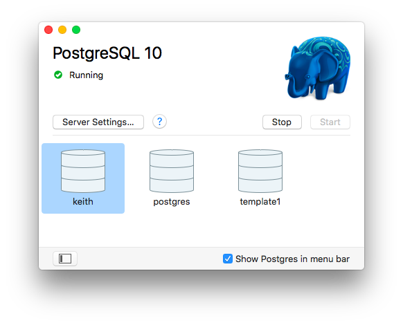

## Let's Get Started

We shall be using PostgreSQL - a widely used relational database. It's open-source and free to use. If you haven't already installed it then follow the instructions below:

- If you use Ubuntu then see [here](#ubuntu).
- If you have Mac-OS then see [here](#macos).

If you get stuck at any stage please post a message requesting help on your class channel.

If you don't use any of the above operating systems then please talk to a mentor about how to proceed.

---

## Ubuntu

### Install

If you have Ubuntu as your operating system you can install PostgreSQL using the following commands in the terminal (note: the `$` is the system prompt):

```cmd
$ sudo apt-get install postgresql postgresql-contrib
```

Enter your ubuntu password when asked for it (it's needed for the `sudo` command).

For this command you must confirm that you are happy to install the packages and any needed dependencies that the package manager identifies. Generally just type `Y` or `y` to proceed.

To verify your installation enter the following commands:

```cmd
$ sudo -u postgres psql --version
```

Again, enter your Ubuntu user password when prompted. The command should display something like this:

    psql (PostgreSQL) 12.2 (Ubuntu 12.2.4)

### Create Your User and Database

Create the database user with the same name as your Ubuntu username (this makes logging in a bit easier):

```
$ sudo -u postgres createuser -P --createdb <username>
```

This will ask for your Ubuntu login password to run the sudo command. The other parts of the line are:

    -u postgres       tells sudo to run createuser as user postgres (set up when you installed postgres)

    createuser        the shell command to create a PostgeSQL user

    -P                (upper case) tells createuser to ask for the new user's password

    --createdb        grants the user the privileges to create databases

    <username>        the new username (hint: make it the same as your o/s username)

You'll be asked for the new database user's password (twice) - you'll need this later for when we connect to the database from Node.

Remember the new username and password details - you will need them later.

### Creating a new database

In a terminal, create a new database named `cyf_hotels` with the following command:

```
$ createdb cyf_hotels
```

Then connect to your database with:

```
$ psql cyf_hotels
```

Note that if you chose to use your Ubuntu username for the database you don't need it (or the password) to log in to `psql`. If you used a different username then you'll need to log in with:

```
$ psql -U <username> cyf_hotels
```

and you'll be prompted for the password.

The output from this command should look something like this:

```
    psql (12.2 (Ubuntu 12.2.4))
    Type "help" for help.

    cyf_hotels=>
```

The last line (`cyf_hotels=>`) is the `psql` command prompt, made up of your database name plus '=>'.

Note that to exit psql back to the terminal prompt use the command `\q`.

**Ubuntu Install Complete**

---

## MacOS

With the Apple Mac you can choose either a graphical installation or a command line method. The graphical method mostly involves dragging and dropping icons with a little bit of command line to configure the tools we need. The command line method uses only command line but is fairly simple.

### Graphical Installation

**Note that you must be logged in as a user with Administrator privileges on OSX for all these steps.**

From the Macintosh OSX system you can install PostgreSQL from the Postgres.app package. Download this from https://postgresapp.com but make sure you choose PostgreSQL version 12 and the appropriate platform for your Mac. Once you have downloaded Postgres you can open the disk image from your Downloads folder. Drag the Postgres icon to the Applications folder.


Open Applications in the Finder and start Postgres. When you receive the alert **"Postgres" is an application downloaded from the internet...** then click on the Open button. You may be prompted for other options (e.g. auto update, ...) and you can choose your own preference.

When the PostgreSQL window appears then click on the Initialise button to create your local PostgreSQL database and user - they will both have the same name as your OSX username.


PostgreSQL initialises itself, creating the initial databases (`template1`, `postgres` and `<your user name>`) along with corresponding users. These should then be displayed in the PostgreSQL window, as below:



### Configure the Command Line Interface (CLI)

To use the PostgreSQL command line tools you need to add the directory to your path (used to find commands in the terminal). There are several ways to do this but the simplest is to create a file containing the directory path name. Open the terminal and enter the appropriate commands from the list below (note: you may not need to create the directory):

```
    # First check the destination directory exists:
    ls /etc/paths.d/
    # If the directory doesn't exist then create it:
    sudo mkdir /etc/paths.d
    # Create the path entry for Postgres:
    echo /Applications/Postgres.app/Contents/Versions/latest/bin | sudo tee /etc/paths.d/postgresapp
```

From the terminal you can now type the simple command:

```
    psql
```

and this should produce something like the following:

```
    psql (12.4)
    Type "help" for help.

    keith=#
```

The final line is the psql command prompt, waiting for you to enter a command. It comprises your database name (created with the same name as your username, in the example this is 'keith') followed by '=#'.

You are going to rename the database to `cyf_hotels` for the purposes of this course, so from the psql prompt (as above) first disconnect from your database by connecting to database `postgres`:

```
keith=# \connect postgres
```

Now, still at the psql prompt, rename the database:

```
keith=# alter database keith rename to cyf_hotels;
```

Clearly, you'll use your own name as the name of the database to be renamed.

Note that to exit psql back to the terminal prompt use the command `\q`.

**MacOS Graphical Install Complete**

### MacOS Command Line Installation

You need Homebrew installed on your Mac to use this approach. If you don't yet have it then you should probably use the graphical method. If you already have Homebrew installed then the following command installs PostgreSQL:

```bash
brew install postgresql
```

This will install the software, set up the postgres user and a user with the same name as your Mac OS user and create some databases. It should leave the PostgreSQL server running on your Mac but if you power off the machine you'll need to restart it. To restart the server, type:

```bash
brew services start postgresql
```

This starts the server and ensures that it will be started each time you power up your Mac. Note you can stop the server at any time by using:

```bash
brew services stop postgresql
```

**MacOS Command Line Installation Complete**
