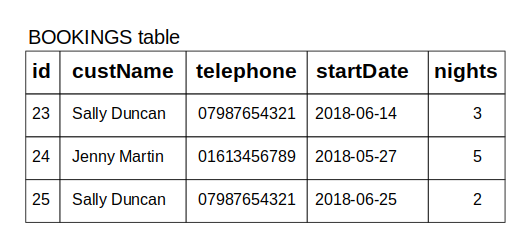

import Feedback from "@theme/Feedback";

## What will we learn today?

- [Introduction to databases](#introduction-to-databases)
  - Why do we need them?
  - Different types of database
- [Introduction to PostgreSQL](#introduction-to-postgresql)
  - What is SQL?
  - What is a RDBMS?
  - What characterises a relational database?
  - Database modeling exercise
  - Check your PostgreSQL installation
- [Communicating with the database using SQL](#communicating-with-the-database-using-sql)
  - Creating a new database
  - Creating a table
  - Inserting data
  - Retrieving data
  - Retrieving data with conditions
- [Coursework](#coursework)

---

## Learning Objectives

By the end of this lesson trainees should be able to

- Explain why databases are needed in Web Development
- Define what SQL is and what it is used for
- Describe what `table`, `rows` and `columns` are used for in a relational database
- Install and create a database using PostgreSQL
- Create a table in a database using PostgreSQL
- Insert data into a table using PostgreSQL
- Retrieve data from a table using PostgreSQL
- Retrieve data from a table using conditionals in PostgreSQL
- List the different kinds of data that can be held in a PostgreSQL database

---

## Before you start

Before you arrive at class you **must** have completed the following setup work.

[PostgreSQL Preparation](../prep)

_If you are a teacher reading this, please check the [Instructor Notes](./instructors)_

## Introduction to databases

A database is a structured set of data held in a computer. It provides ways to store, retrieve and organize information.

### Why do we need them?

In the past few weeks, you stored and retrieved data using files. This is fine for simple data but it can quickly become an issue as your application becomes more complex and needs to store and manipulate more complicated data. For example, imagine you want to develop the next biggest hotel booking application. You will need to store the list of hotels available for booking somewhere, and as you add more features, you will need to save users information, the reviews they post for each hotel, but also the bookings each user makes. You can see that the data you need to handle can become very complicated, especially when you need to consider that data are not static, as they can be updated or deleted. To work more effectively with data, we can then use a database, which present the following benefits:

- A database defines a structure for your data and the relationships between entities
- A database provides convenient and performant ways to safely store and retrieve data
- A database provides a mechanism to check the validity of your data

### Different types of database

There are many different kinds of database and different implementations. Sometimes, a database type is a better fit to certain use case or certain problems. The most well-known database types include relational database, key/value database, graph database and document database (also known as NoSQL). For this class, we will focus specifically on relational database as they are the most widely used and supported. You can consult [DB-Engines](https://db-engines.com/en/ranking) to see a ranking of the most used database, as you can see, there is a lot of them!

## Introduction to PostgreSQL

_"PostgreSQL is a powerful, open source object-relational database system that uses and extends the SQL language combined with many features that safely store and scale the most complicated data workloads. The origins of PostgreSQL date back to 1986 as part of the POSTGRES project at the University of California at Berkeley and has more than 30 years of active development on the core platform."_ (source: [postgresql.org](https://www.postgresql.org/about/))

### What is SQL?

- Pronounced S-Q-L or sequel
- Stands for Structured Query Language
- SQL is the standard language used to communicate with relational database
- SQL statements are used to query, create, update, delete records in a database
- SQL statements are executed by a RDBMS.

### What is a RDBMS?

- Stands for Relational Database Management System
- It is a program that processes SQL statements to manage a relational database
- PostgreSQL is a RDBMS.

### What characterizes a relational database?

As mentioned previously, a relational database is a specific type of database. Data is stored in _tables_ of _rows_ and _columns_ as per the example below:

<!--  -->
<p align="center">
  
</p>

**How about storing everything in one big table as shown below? Why isn't it a good idea?**

A customer could have several bookings. If the customer changes their telephone number, you would have to update every single rows for this customer with their new number, which is more prone to errors. As a general rule, try to avoid duplication of data, and instead design your system in a way that you have a single source of truth for each piece of data. The example below is **NOT** a good solution.

<!--  -->
<p align="center">
  
</p>

### Database modeling exercise

**Scenario:** You've been hired to create a database for a new company which wants to revolutionize the hotel booking market. The first task you've been given is to model how the company would store its data in a database. Here are your requirements:

- The company wants to store in the database all the hotels available on their website
- For each hotel, the company wants to record the name and the number of rooms. Also each hotel can have several room types and each room type has a specific price.
- The company also needs to store the information of customers who registered on their website with a name, an email and an address.
- Customers need to be able to record their bank details which consist of an account number and a sort code. Each customer can register several bank accounts if they want.
- Finally, as customers can book a room in an hotel starting on a specific date for a specific number of nights, the company wants to store the bookings.

With mentors help, model the database for this company. In particular, show the different entities, fields and relationships between each entity.

### Check your PostgreSQL installation

Open a terminal in your laptop and verify the command `psql -V` returns the version of PostgreSQL. In psql, you can type use the command `help` to show the help menu. Within the command prompt, you can enter SQL statements and run them against PostgreSQL. To quit psql, enter the command `\q`.

## Communicating with the database using SQL

All commands in the following need to be entered in a psql command prompt. However, sometimes it's easier to write the code in a file and then load the file with psql. For example, if you write your SQL code in a file called `test.sql`, you can then execute it with `psql -d DATABASE_NAME -f test.sql`.

### Creating a new database

In a terminal, create a new database named `cyf_hotels` with the following command:

```sql
createdb cyf_hotels
```

Then connect to your database with:

```sql
psql cyf_hotels
```

### Creating a table

Data are stored in tables. Let's first create a `customers` table to hold the details of customers.

```sql
CREATE TABLE customers (
  id        SERIAL PRIMARY KEY,
  name      VARCHAR(30) NOT NULL,
  email     VARCHAR(120) NOT NULL,
  address   VARCHAR(120),
  city      VARCHAR(30),
  postcode  VARCHAR(12),
  country   VARCHAR(20)
);
```

Few things to mention from the SQL statement above:

- `SERIAL PRIMARY KEY` defines the column `id` as a unique identifier for each row. Moreover, this identifier will automatically incremented every time data is inserted. `id` is called the primary key of the table `customers`.
- `VARCHAR(20)` defines the column to hold text data with a maximum length of 20 characters
- `NOT NULL` defines the column as not nullable, which means that you must set a value.
- Other useful types include `INT`, `TEXT`, `BOOLEAN` and `DATE`.
- The database will reject any values which don't match the type.

#### Exercise 1

:::note Exercise

- Create the `customers` table in the `cyf_hotels` database.
- Verify that the table `customers` is created with the psql command `\dt` which lists the existing tables.
- Display the table `customers` definition with the command `\d customers` and verify that it matches what you expect.
- Create a new table `hotels` in the `cyf_hotels` database with the following columns: an `id`, a `name`, the number of `rooms` and the hotel `postcode`. Use the commands above to verify that the table is correctly created.

Now that we have a table to store `customers` and a table to store `hotels`, we can create a table to hold the bookings of customers for an hotel with the checkin date and the number of nights they intend to stay:

```sql
CREATE TABLE bookings (
  id               SERIAL PRIMARY KEY,
  customer_id      INT REFERENCES customers(id),
  hotel_id         INT REFERENCES hotels(id),
  checkin_date     DATE NOT NULL,
  nights           INT NOT NULL
);
```

In the above, `customer_id` and `hotel_id` are called **foreign keys** as they reference an id from a different table. This set a very strong constraint as you will not be able to create a booking for a customer id which does not exist in the customers table!

:::

#### Exercise 2

:::note Exercise

- Create the table `bookings` in your `cyf_hotels` database and verify that it is correctly created.

:::

### Inserting data

Once your `customers`, `hotels` and `bookings` table are created, you can insert data with the following SQL statements:

```sql
INSERT INTO customers (name, email, address, city, postcode, country) VALUES ('John Smith','j.smith@johnsmith.org','11 New Road','Liverpool','L10 2AB','UK');
INSERT INTO hotels (name, rooms, postcode) VALUES ('Triple Point Hotel', 10, 'CM194JS');
INSERT INTO bookings (customer_id, hotel_id, checkin_date, nights) VALUES (1, 1, '2019-10-01', 2);
```

The data you insert should be of the same type with your table definition. For example, the following insert statement will **fail**:

```sql
INSERT INTO bookings (customer_id, hotel_id, checkin_date, nights) VALUES (1, 1, '2019-14-01', 2);
```

#### Exercise 3

:::note Exercise

- Run the 3 SQL statements above.
- Insert yourself in the `customers` table.
- Insert the following 3 hotels in the `hotels` table:
  - The `Triple Point Hotel` has 10 rooms, its postcode is `CM194JS`
  - The `Royal Cosmos Hotel` has 5 rooms, its postcode is `TR209AX`
  - The `Pacific Petal Motel` has 15 rooms, its postcode is `BN180TG`
- Try to insert a booking for a customer id which does not exist in the `customers` table (for example ID `100`). What is happening and why?

:::

### Retrieving data

Previously, you have inserted data in your tables. How do you make sure these data have been inserted correctly? The following SQL statement is used to request data from a specific table:

```sql
SELECT * FROM customers;
```

#### Exercise 4

:::note Exercise

- Use the above SQL statement to display all the data inserted in the `customers` table.
- Use the above SQL statement to display all the data inserted in the `hotels` table.
- Use the above SQL statement to display all the data inserted in the `bookings` table.

:::

### Retrieving data with conditions

Actually, the `SELECT` statement is very powerful and you will see you can request a lot of different things with it. Have you seen the `*` character in the SQL statement above? It means that you want to see the data for all the columns of the table. What if you want to only return specific columns? For example, to retrieve all customers `name` and `address` from the table `customers`:

```sql
SELECT name,address FROM customers;
```

Sometimes, you want to retrieve only data which verify a specific condition. In this case, you can use a `WHERE` clause. For example, to retrieve all hotels having more than 7 rooms:

```sql
SELECT * FROM hotels WHERE rooms > 7;
```

To retrieve the customer name and address with id 1:

```sql
SELECT name,address FROM customers WHERE id = 1;
```

To retrieve all the bookings starting after 2019/10/01:

```sql
SELECT * FROM bookings WHERE checkin_date > '2019/10/01';
```

To retrieve all the bookings starting after 2019/10/01 for a minimum of 2 nights:

```sql
SELECT * FROM bookings WHERE checkin_date > '2019/10/01' AND nights >= 2;
```

To retrieve all the hotels with the postcode `CM194JS` or `TR209AX`:

```sql
SELECT * FROM hotels WHERE postcode = 'CM194JS' OR postcode = 'TR209AX';
```

#### Exercise 5

:::note Exercise

1. Execute the file [`cyf_hotels_exercise5.sql`](./cyf_hotels_exercise5.sql) which will reset your existing tables and insert more data in the `customers`, `hotels` and `bookings` tables. (hint: in the terminal, use `psql -d cyf_hotels -f cyf_hotels_exercise5.sql`).
2. Retrieve all information for the customer Laurence Lebihan.
3. Retrieve all customers name living in UK.
4. Retrieve the address, city and postcode of Melinda Marsh.
5. Retrieve all hotels located in the postcode DGQ127.
6. Retrieve all hotels with more than 11 rooms.
7. Retrieve all hotels with more than 6 rooms but less than 15 rooms.
8. Retrieve all hotels with exactly 10 rooms or 20 rooms.
9. Retrieve all bookings for customer id 1.
10. Retrieve all bookings for more than 4 nights.
11. Retrieve all bookings starting in 2020.
12. Retrieve all bookings before 2020 for less than 4 nights.

:::

## Coursework

All of the coursework for this week can be found [here](./homework).

## Feedback

Please spend two minutes reviewing this lesson to help us improve it for the future. This feedback will be shared with volunteers.

<Feedback module="SQL" week="Week 1" />
