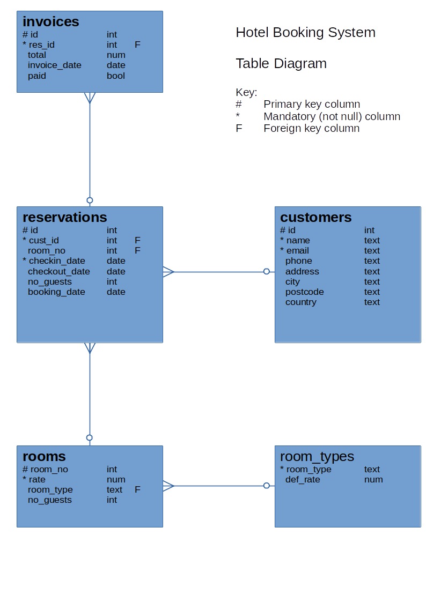

# Database 1: Introduction to SQL

---

**Teaching this lesson?**

Read the Mentors Notes [here](./mentors.md)

---

## What will we learn today?

- [Introduction to databases](#introduction-to-databases)
  - Why do we need them?
  - Different types of database
- [Introduction to PostgreSQL](#introduction-to-postgresql)
  - What is SQL?
  - What is a RDBMS?
  - What characterises a relational database?
  - Check your PostgreSQL installation
- [Communicating with the database using SQL](#communicating-with-the-database-using-sql)
  - Retrieving data from an existing database
  - Use basic single table query commands in SQL
  - Choose which values are returned by a query
  - Use literals, expressions and functions in queries
  - Restricting the rows returned by a query to match some condition
  - Sorting and limiting the number of rows returned
- [Homework](#homework)

---

## Learning Objectives

By the end of this lesson students should be able to

- Explain why databases are needed in Web Development
- Define what SQL is and what it is used for
- Describe what `tables`, `rows` and `columns` are used for in a relational database
- Retrieve data from a table using PostgreSQL
- Use expressions to manipulate the results of queries
- Retrieve data from a table using conditionals in PostgreSQL
- Insert new data into existing tables

---

## Introduction to databases

A database is a structured set of data held in a computer. It provides ways to store, retrieve and organize information.

### Why do we need them?

In the past few weeks, you stored and retrieved data using files. This is fine for simple data but it can quickly become an issue as your application becomes more complex and needs to store and manipulate more complicated data. For example, imagine you are asked to develop a booking system for a medium-sized hotel. You will need to store the list of rooms available for booking, and as you add more features, you will need to save users information, the reviews they post, the bookings each user makes and payment information. You can see that the data you need to handle can become very complicated, especially when you need to consider that data are not static, as they can be updated or deleted. To work more effectively with data, we can then use a database, which presents the following benefits:

- A database defines a structure for your data and the relationships between entities
- A database provides convenient and performant ways to safely store and retrieve data
- A database provides a mechanism to check the validity of your data

### Different types of database

There are many different kinds of database and different implementations. Sometimes, a database type is a better fit to certain use case or certain problems. The most well-known database types include relational database, key/value database, graph database and document database (also known as NoSQL). For this class, we will focus specifically on relational database as they are the most widely used and supported. You can consult [DB-Engines](https://db-engines.com/en/ranking) to see a ranking of the most used database, as you can see, there are a lot of them!

## Introduction to PostgreSQL

_"PostgreSQL is a powerful, open source object-relational database system that uses and extends the SQL language combined with many features that safely store and scale the most complicated data workloads. The origins of PostgreSQL date back to 1986 as part of the POSTGRES project at the University of California at Berkeley and has more than 30 years of active development on the core platform."_ (source: [postgresql.org](https://www.postgresql.org/about/))

### What is SQL?

- Pronounced S-Q-L or sequel
- Stands for Structured Query Language
- SQL is the standard language used to communicate with relational database
- SQL statements are used to query, create, update, delete records in a database as well as many other tasks
- SQL statements are executed by a RDBMS.

### What is an RDBMS?

- Stands for Relational Database Management System
- It is a program that processes SQL statements to manage a relational database
- PostgreSQL is an RDBMS.

### What characterizes a relational database?

As mentioned previously, a relational database is a specific type of database. Data is stored in _tables (relations)_ of _rows (tuples)_ and _columns (attributes)_ as per the example below:

<!--  -->
<p align="center">
  
</p>

## Communicating with the database using SQL

We use SQL to perform actions on the database and initially we can use a terminal-like utility to do this.  The utility is named `psql` and is run using the command:
```
psql <dbname> <username>
```
The command prompt from psql is the database name currently connected:
```
cyf_hotel=>
```
In psql, you can use the command `help` to show the help menu. Within the command prompt, you can enter SQL statements and run them against PostgreSQL. To quit psql, enter the command `\q`.

Download the following file to a directory on your computer. This file creates the sample data you can use for the following sections. To do this, click the file to open it in a github formatted page, then right click the Raw button in the bar just above the code and select Save As (or Save Link As or similar) to save it:

- [`build-hotel.sql`](./sql/build-hotel.sql)

Once you have the file downloaded to a known directory, execute the file `build-hotel.sql` from `psql` as shown below (replace `/your/sql/path/` with the path to the download directory used above):

```SQL
\include /your/sql/path/build-hotel.sql
```

Check that you have built all the required tables:

```sql
\dt
```
You should see a listing of your tables as follows (with your own username as owner):
```
            List of relations
    Schema |     Name      | Type  | Owner
    --------+---------------+-------+-------
    public | customers     | table | keith
    public | invoices      | table | keith
    public | reservations  | table | keith
    public | room_types    | table | keith
    public | rooms         | table | keith
    (5 rows)
```

Here is the table diagram of the hotel database:
<!--  -->
<p align="center">
  
</p>

## The SELECT Statement
We are first going to look at retrieving data from the database so we can examine it and later, use it in our applications.

To get data out of a table you use the SELECT statement (or command):
```sql
SELECT ... FROM ...;
```
For example:
```sql
SELECT name, phone, country FROM customers;
```
SQL commands entered in the psql command line tool are terminated with a semicolon (;). The SQL command can extend across several lines, but each keyword, name or value cannot be split over more than one line. For example:

```sql
SELECT name,
       phone,
       country
  FROM
       customers;
```
is the same as the previous example.

You can use `SELECT * FROM ...` to return all the columns of the table. For example:

```sql
SELECT * FROM rooms;
```
This is also a useful command to see what columns exist in a table. You can also use the `\d <table_name>` psql command to describe the table.

Note that the use of UPPER/lower case is only to emphasise and differentiate the SQL keywords (upper case) from the other names (lower case) e.g. column and table names. SQL keywords are not case-sensitive.

### Scrolling the Results
When you issue a `SELECT` that returns a lot of data `psql` displays it one screenful at a time. To get the next screenful just press the Space key. You can also use the Up and Down arrow keys for line-by-line control and you can go back one screen with the 'B' key.

When you have finished reading the output use the 'Q' key to quit the display manager.
```
    Space       Next screenful
    'B'         Previous screenful
    Down Arrow  Next line
    Up Arrow    Previous line
    'Q'         Quit back to prompt
```

## Exercise 1
1. List the name, phone and email of all customers
2. List all the details of rooms
3. List the customer id, checkin date and number of guests from reservations

---
## Some Useful `psql` Commands
The `psql` commands are not SQL and are specific to PostgreSQL (although most other RDBMS's have commands to perform similar jobs). These commands let you display information, execute system commands, etc. Use \\? to display a summary of all the `psql` commands.

Display a list of available tables in the database:

    \dt

Display the definition of a table:

    \d <table name>

Display help for SQL commands:

    \h [command]

Display a summary of the psql (backslash) commands:

    \?

Exit (quit) from psql:

    \q

Note that `psql` commands ARE case sensitive, unlike SQL commands.

---
## Exercise 2
1.  Display the definition of the `customers` table
2.  Display the help for the SELECT command (Note: we will not be covering ALL of this syntax!)
3.  Read the psql command help and find out what \dS does then try it

---
## Displaying More Than Just Columns
You can use expressions in SQL:
```sql
SELECT room_no, rate * 0.85 FROM rooms;
+---------+-------------+
| room_no | rate * 0.85 |
+---------+-------------+
|     101 |     72.2500 |
|     102 |     72.2500 |
|     103 |     72.2500 |
  ...
```
Use a **column alias** to give the expression a meaningful name:
```sql
SELECT room_no,
       rate * 0.85 AS discounted_rate
    FROM rooms;
+---------+-----------------+
| room_no | discounted_rate |
+---------+-----------------+
|     101 |         72.2500 |
|     102 |         72.2500 |
|     103 |         72.2500 |
```
Here, the query uses the alias as the column heading. Aliases can also be used in other contexts - more on this later...

---
## Expressions in SQL
As with Javascript you can use a variety of 'operators' to define expressions in SQL.

Arithmetic:

    *   Multiply

    /   Divide

    +   Add

    -   Subtract

    %   Modulo (remainder)

    (...) Parentheses (to override precedence)

String:

    ||  Concatenation

For example, to display the weekly rate for a room (with 10% weekly discount):
```sql
SELECT room_no, room_type, rate * 7 * 0.90 from rooms;
```
You can change the column heading using a **column alias**:
```sql
SELECT room_no, room_type, rate * 7 * 0.90 as weekly_rate from rooms;
```
Use string concatenation to glue character data together:
```sql
SELECT 'Customer name = ' || name FROM customers;
```
---
## Choosing the Rows
You can choose which rows to display by specifying some condition that must be matched:
```sql
SELECT id, name, phone, email, country
  FROM customers
  WHERE country = 'France';

 id  |        name        |      phone       |            email            | country
-----+--------------------+------------------+-----------------------------+---------
 9   | Laurence Lebihan   | 91.24.4555       | laurence.lebihan@xmzx.net   | France
 12  | Carine Schmitt     | 40.32.2555       | carine.schmitt@dftu.net     | France
 15  | Janine Labrune     | 40.67.8555       | janine.labrune@dlsh.net     | France
 25  | Mary Saveley       | 78.32.5555       | mary.saveley@yppl.net       | France
 34  | Martine Rancé      | 20.16.1555       | martine.rancé@xeqs.net      | France
 35  | Marie Bertrand     | (1) 42.34.2555   | marie.bertrand@glut.net     | France
 49  | Frédérique Citeaux | 88.60.1555       | frédérique.citeaux@vekn.net | France
 59  | Annette Roulet     | 61.77.6555       | annette.roulet@lgha.net     | France
 62  | Daniel Da Silva    | +33 1 46 62 7555 | daniel.da.silva@hijy.net    | France
 63  | Daniel Tonini      | 30.59.8555       | daniel.tonini@mxvw.net      | France
 91  | Laurence Lebihan   | 91.24.4555       | laurence.lebihan@xmzx.net   | France
 92  | Paul Henriot       | 26.47.1555       | paul.henriot@uwua.net       | France
 106 | Dominique Perrier  | (1) 47.55.6555   | dominique.perrier@bdim.net  | France
(13 rows)
```
You can use comparison operators =, <, >, <=, >=, != (or <>)

Note: use only one = (equals) symbol to test for equality

When comparing numbers no punctuation is needed around the value, for example, `WHERE rate > 100`.

When comparing character data or dates you must enclose the values in single quotes (apostrophes), for example, `WHERE name = 'Mary Saveley'`.

Only the rows that match the comparison test (called a predicate) are returned by the query. The predicate can use columns not returned by the query,


### Combining Tests in a Predicate

Use AND and OR to combine tests:
```sql
SELECT * FROM reservations
   WHERE room_no >= 200
     AND room_no < 300
     AND checkin_date >= '2018-01-01';
```
This lists reservations for rooms on the second floor (rooms 200 - 299) since the start of 2018. Note the format of the date value - this conforms to the ISO 8601 standard and should be used in preference to any other format to avoid ambiguity.

Another example - to find cheap or Premier rooms on floors 1 and 2 - we might try this to start with:
```sql
SELECT * FROM rooms
   WHERE room_type = 'PREMIER'
      OR rate < 100.00
     AND room_no < 300;
```
This isn't quite right - it returns rooms on the 3rd and 4th floors. Why?

### Overriding Evaluation Order
Just like any programming language, SQL has an evaluation order (precedence). For example, multiply and divide take precedence over add and subtract, so that:
```sql
SELECT rate + 20 * 0.85 from rooms;
```
is not the same as:
```sql
SELECT (rate + 20) * 0.85 from rooms;
```
We can override the normal precedence by using parentheses `(...)` around parts of the expression, just as in JavaScript.

With compound predicates AND takes precedence over OR, so that to make the query give the intended results we need to use:
```sql
SELECT * FROM rooms
   WHERE (room_type = 'PREMIER'
      OR rate < 100.00)
     AND room_no < 300;
```
---
## More Predicate Types
The BETWEEN operator has the form `a BETWEEN b AND c` : checks that a is in the range b - c inclusive. For example:
```sql
SELECT ... WHERE price BETWEEN 100 AND 250 ...
```
Note that the AND in this case is not combining multiple predicates, it's part of the BETWEEN operator.

The IN operator, `a IN (b, c, d, ...)` checks if the value of a is equal to any of b, c, d, etc... For example:
```sql
SELECT ... WHERE room_no IN (201, 202, 204, 206) ...
```
Both the BETWEEN and the IN operators can be inverted using:
```sql
  ... a NOT BETWEEN b AND c ...

  ... a NOT IN (b, c, d, ...)
```
The LIKE operator tests for a match against a wildcard string as `a LIKE b` where a is being tested and b is the wildcard string. The wildcard string contains text to be matched along with wildcard symbols '%' and '_'.
* `%` (percent)     matches any number of any characters
* `_` (underscore)  matches exactly one of any character

For example:

`name LIKE 'A%'`    matches names starting with 'A'

`name LIKE '_a%'`   matches names that have 'a' as the 2nd character (note the initial underscore '_')

`name LIKE '%ow%'`  matches names containing the sequence 'ow' anywhere in the name

LIKE can be inverted using `a NOT LIKE b`

If you need to match for a string that includes one of the wildard characters you can use the 'escape' character, which defaults to '\\' (backslash). For example:

`str LIKE '% discount = 5\% %'`    matches any value in str that contains 'discount = 5%'

LIKE is case sensitive in many SQL implementations so to make a case insensitive match you should either convert the tested value to either all upper or all lower case, for example:

`lower(name) LIKE '%b%'`    matches any name that contains the letters B or b

Note: PostgreSQL also has the non-standard operator ILIKE that can perform a case-insensitive comparison - but avoid this to make code more portable.

---
## Exercise 3
1.  Which customers are from Norway?
2.  Which rooms can accommodate more than two people?
3.  Which invoices are dated after one month ago?
4.  How would last month's invoices change if we gave a discount of 15%
5.  List all customers whose second name starts with 'M' (hint: there's a space before the second name)

---
### Using SQL Functions
You can use the built-in functions of SQL just as you can in JavaScript, but note that they are different (this is true of most programming languages) but there are also differences between SQL implementations.

You use functions to change values, usually of columns, wherever you can use a column, for example, in the selected list of values:
```sql
SELECT name, length(name) AS namelen, upper(email)
  FROM customers;
```
This query also uses a column alias (namelen) to provide a meaningful column heading.

Functions are available that operate on all different datatypes.

Country names are mixed case so to make sure we always match regardless of the stored case we can use the `lower` function to find all customers from Manchester, UK:
```sql
SELECT * FROM customers
   WHERE lower(country) = 'uk'
     AND city = 'Manchester';
```
Assuming room rates include VAT at 20%, list room rates after VAT increases to 23.5% (from 20%), but round to the nearest pound:
```sql
SELECT room_no, room_type, rate AS old_rate,
       round(rate * 100/120 * 123.5/100) AS new_rate
   FROM rooms;
```
*For further information on SQL functions see the official PostgreSQL documentation at https://www.postgresql.org/docs/12/functions.html (for version 12 - for other versions change 12 to the required version)*

---
### Date and Time in SQL
In SQL dates and times are held in an internal format but are represented externally (when entering values and displaying them) as strings;
*   Text date format:   'YYYY-MM-DD'    e.g. '2018-07-21' = 21 July 2018
*   Time format:        'HH:mm:SS.ddd'  e.g. '14:32'
*   Date/Time format:   'YYYY-MM-DD HH:mm:SS.ddd'   e.g. '2018-07-21 15:26:04'

You can perform arithmetic on dates and times, for example:
```sql
SELECT cust_id, room_no, checkin_date,
       checkout_date - checkin_date AS nights
   FROM reservations
   WHERE checkout_date = current_date + 1;
```
This query performs subtraction of one date from another (`checkout_date - checkin_date`) to calculate the number of nights the customer has stayed. It also performs addition (`current_date + 1`) to get tomorrow's date so that it lists all reservations that will be checking out tomorrow.

Note: `current_date` is a postgres function that returns the current date.

Also note that there are many ways to get the same result - you may explore those for yourself.

You can also represent time intervals but the representations can be complicated and we shall not cover them here.

---
## Exercise 4
1.  Write a query to check that all booking dates are before their checkin dates
2.  We plan to offer a discount of 10% on all Premier and Premier Plus rooms next month. How much would we gain on each room if occupancy rose by 5 nights over the month.
3.  List all reservations for this month and the number of nights booked.

---
## Eliminating Duplicates
"Which nationalities visit our hotel?":
```sql
SELECT country FROM customers;
```
But how many values do you see returned for each country? If two customers come from a particular country that country will appear twice in the output. If more than two come from the same country then... But we only need to know the different countries.

To see each country only once, use the keyword DISTINCT, as follows:
```sql
SELECT DISTINCT country FROM customers;
```
The keyword DISTINCT must appear immediately after the keyword SELECT. If more than one column is selected then DISTINCT applies to the combined values of those columns.

---
## Ordering the Returned Rows
If you want to see the data in a specific order, e.g. "List all customers alphabetically by name within each country":
```sql
SELECT id, name, phone, email, country
    FROM customers
    ORDER BY country, name;
```
You can can add ASC (ascending, the default) or DESC (descending) after each column name in the ORDER BY clause to control the direction of sorting.

For example:
```sql
SELECT id, name, country, city
    FROM customers
    ORDER BY country DESC, city;
```
This will sort the data into descending alphabetic order of country then ascending order of city name within each country. The output will look something like this:
```
 id  |          name           |   country    |       city        
-----+-------------------------+--------------+-------------------
  28 | Kelvin Leong            | USA          | Allentown
  96 | Juri Yoshido            | USA          | Boston
 132 | Valarie Franco          | USA          | Boston
 100 | Allen Nelson            | USA          | Brickhaven
  46 | Miguel Barajas          | USA          | Brickhaven
  43 | Leslie Taylor           | USA          | Brickhaven
  37 | Julie King              | USA          | Bridgewater
 130 | Sue Taylor              | USA          | Brisbane
 124 | Steve Thompson          | USA          | Burbank
  29 | Juri Hashimoto          | USA          | Burlingame
  36 | Jerry Tseng             | USA          | Cambridge
  70 | Marta Hernandez         | USA          | Cambridge
 112 | Dan Lewis               | USA          | Glendale
  52 | Mary Young              | USA          | Glendale
  13 | Jean King               | USA          | Las Vegas
  89 | Brian Chandler          | USA          | Los Angeles
  97 | Dorothy Young           | USA          | Nashua
  83 | William Brown           | USA          | Newark
 120 | Violeta Benitez         | USA          | New Bedford
  79 | Wing Huang              | USA          | New Bedford
 116 | Leslie Murphy           | USA          | New Haven
       . . .
```

Note: you can order by columns that are not returned by the query.

### Limiting the Number of Rows
You can reduce the number of rows returned by using the LIMIT clause at the end of the query:
```sql
SELECT id, name, phone, email, country
  FROM customers
  ORDER BY country, name
  LIMIT 20;
```
The LIMIT clause is not normally used without the ORDER BY clause - without the ORDER BY clause rows can be returned in any arbitrary sequence.

Not all SQL implementations of SQL support LIMIT, some use TOP while Oracle uses ROWNUM.

---
## Exercise 5

1.  List the different room types and rates for all rooms avoiding duplicates.
2.  List customers' names addresses and phone numbers in alphabetic order of names.
3.  List customers' names, addresses, city and country in ascending order of country then reverse order of city within country.
4.  List the room number, type and the cost of staying 5 nights in each of the top 15 most expensive rooms.

---
## Summary

In this lesson you have learned the use of databases and how relational databases are structured. You've also learned how to use basic single-table query commands in SQL and some of the special 'backslash' commands in `psql`. You have used the SELECT command to control the columns and values that are returned, the DISTINCT, ORDER BY and LIMIT clauses to control the order and numbers of rows returned and you've used the WHERE clause to choose the rows that you access. You have learned the INSERT command to add new data to the database

Next week we shall go on to more complex query constructs including joins, updates and deletes along with incorporating SQL into a node.js server.

## Homework

First complete all the exercises for this lesson if you haven't managed to finish them all.

All of the homework can be found in [this repository](https://github.com/KeithBremer/Databases-Homework).

### Submission

Fork and clone the repository above to get the homework for this week.

Create a new branch from `Master` to start working on this weeks homework. It should be called `[YOUR_NAME]/Week1`.

When you have completed the homework create a pull request back to the parent repository so your teacher(s) can feedback on it.

### Tasks

You should complete all of the tasks in **Week 1** of the [Database Homework repository](https://github.com/KeitBremer/Databases-Homework).
