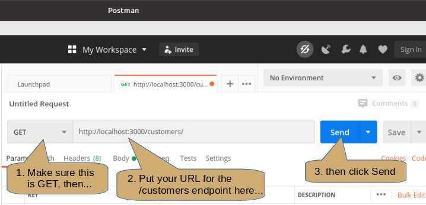

# Database 3: More integration with NodeJS

---

**Teaching this lesson?**

Read the Mentors Notes [here](./mentors.md)

---

## What will we learn today?

- Revision from last week
- [Recap integration of cyf_hotel DB with NodeJS](#recap-integration-of-cyf_hotels-db-with-nodejs)
- [Being More Selective](#being-more-selective)
- [CRUD operations with NodeJS and PostgreSQL](#crud-operations-with-nodejs-and-postgresql)
  - [Creating data](#creating-data)
  - [Reading data](#reading-data)
  - [Updating data](#updating-data)
  - [Deleting data](#deleting-data)
- [Homework](#homework)

---

## Learning Objectives

By the end of this lesson students should be able to

- Create an API endpoint that can add data to a database
- Write code that effectively validates data before adding it to a database
- Be aware of the dangers of SQL injection attacks, and how to avoid them
- Create an API endpoint that can retrieve data from a database with multiple parameters
- Create an API endpoint that can update data in a database
- Create an API endpoint that can delete data in a database
- Create tables with a variety of column types and primary and foreign keys

---

## Recap integration of cyf_hotels DB with NodeJS

For this class, we will use the tables and data from your `cyf_hotel` database. If you need to start from a clean state for your database, run `psql -d cyf_hotel -f build_hotel.sql`.

During the last class, we created a new NodeJS project called `cyf-hotels-api` with a single API endpoint `/customers` to get the list of all customers. In this class, we will add other endpoints with more functionalities to interact with the `cyf_hotel` database.

You should have a `server.js` file that looks something like this:
```js
const express = require("express");
const app = express();
const { Pool } = require("pg");

const db = new Pool({
  user: "keith",
  host: "localhost",
  database: "cyf_hotel",
  password: "",
  port: 5432,
});

app.get("/customers", function (req, res) {
  db.query("SELECT * FROM customers", function(err, result) => {
    res.status(200).json({customers: result.rows})
  })
});

app.listen(3000, function () {
  console.log("Server is listening on port 3000. Ready to accept requests!");
});
```
Before we move on, run the `server.js` file in node and check the endpoint using your browser.
### Using Postman to Test an API
You should have Postman already installed on your system. If not then please install it now.

Run Postman (it can be slow to start).
<p align="center">
  
</p>

Check the method is GET, set the URL for your customers endpoint then click Send.

<p align="center">
  
</p>

## Being More Selective
Returning all the customers is fine for a small table (even the 130+ customers) but if we have a large number of rows, thousands or millions, then that approach is very clumsy.

If we know the value of the `id` column for the customer we can retrieve just that one row (we know there is only one row because `id` is the Primary Key).

Create a new endpoint to get the customer by using the id value:
```js
app.get("/customers/:id", function(req, res) {
  // TODO - add code here
})
```
Here the endpoint includes `:id`, which identifies an extra parameter in the URL that will provide the id value, as in `http://localhost:3000/customers/3`. We just need a way to get the value from the URL.

Express provides a simple way to get such parameters from the request:
```js
  var custId = parseInt(req.params.id)
```
Note that the `id` in `req.params.id` must match the name after the colon in the endpoint `"customers/:id"`.

Next we need to query the `customers` table and provide the value of the id into a WHERE clause so that we retrieve only the one row that matches:
```js
db.query("SELECT * FROM customers WHERE id = $1", [custId],
    function(err, result) {
      // TODO - more code here...
    });
```
In the above code notice that:
* The SELECT now uses a WHERE clause
* The value we are wanting to look for appears as $1 - this is a placeholder for the 'id' value
* The second parameter is the array `[custId]` that provides the id value

Let's complete the endpoint to return the retrieved values:

```js
app.get("/customers/:id", function(req, res) {
   var custId = parseInt(req.params.id);
   db.query("SELECT * FROM customers WHERE id = $1", [custId],
      function(err, result) {
         result.json()
      });
})
```
In `db.query` you can use placeholders $1, $2, ... $9, $10, $11, ... etc to mark the place where a parameter value should be used. The parameters to replace the placeholders are supplied in the second argument, the array of values. In this case there is only one value (but it must still be put into an array) so we have `[custId]` as the replacement value for the first placeholder, `$1`. If there is more than one placeholder there must be the same number of array elements and they must be in the order of the placeholder numbers.

### String Placeholders
With String placeholders you don't put apostrophes around the placeholder:
```js
app.get("/customers/by_city/:city", (req, res) => {
  const cityName = req.params.city;
  db.query("SELECT * FROM customers WHERE city LIKE $1 || '%'", [cityName],
    function { ... /* etc */ }
  );
});
```

### Exercise 1
1.  Make sure you have defined the endpoints for:
  1.  Getting all customers
  2.  Getting a single customer by id
2.  Using a method similar to the one used to get a customer by id, define an endpoint that can get customers by matching part of the name (e.g. /customers/by-name/:name).
    **Remember there may be more than one matching row!**
3.  Test all these endpoints with Postman and ensure the results are as expected.

## CRUD operations with NodeJS and PostgreSQL

_"The acronym CRUD refers to all of the major functions that are implemented in relational database applications. Each letter in the acronym can map to a standard Structured Query Language (SQL) statement and Hypertext Transfer Protocol (HTTP) method [...]."_ - [Wikipedia](https://en.wikipedia.org/wiki/Create,_read,_update_and_delete)

<!--  -->
<p align="center">
  
</p>

### Creating data

In the following, we will add a new API endpoint to create a new customer in the table `customers` of the `cyf_hotel` database. As a reminder, here is an example of a SQL insert statement to add a new customer:

```sql
INSERT INTO customers (name, email, phone, address, city, postcode, country)
  VALUES ('Fred Bloggs', 'fred@bloggs.org', '07123456789', '1 Low Brow',
          'Ashbottom', 'XY2 3ZA', 'UK');
```
### Using body-parser for Form Data

When an endpoint can reasonably expect a large number of data values, for example, when we need to insert a new row into the `customers` table, then using parameters in the URL is not practical. Instead we can use a 'middleware' package such as `body-parser`, which can extract data from the body of the request.

As we create a new record in the database, we will add a new POST endpoint in the `cyf-hotels-api` project from last class. Moreover, we need to be able to pass data to this API endpoint such as the name, address, postcode, etcetera, so we can use this API to create different customers. The data can be sent in the body of the request. To access the parameters in the body of the request with Express.JS, we need to add the module `body-parser` to the `cyf-hotels-api` project:

At the terminal command line:
```
npm install --save body-parser
```

Then include it in the `server.js`:

```js
const bodyParser = require("body-parser");
app.use(bodyParser.json());
```

### Inserting Rows Using Node.js
We can finally add our new endpoint to create a new customer:

```js
app.post("/customers", function (req, res) {
  const newName = req.body.name;
  const newEmail = req.body.email;
  const newPhone = req.body.phone;
  ...
  const newCountry = req.body.country;

  const query =
    "INSERT INTO customers (name, email, phone, address, city, postcode, country) " +
      "VALUES ($1, $2, $3, $4, $5, $6, $7)";

  db.query(query, [newName, newEmail, ..., newCountry], (err) => {
    res.send("Customer created.");
  })
});
```
### Using Postman to Test a POST
In Postman:
* Change the method to POST
* Ensure the URL address is your customers endpoint, for example: http://localhost:3000/customers
* Under the address in the Postman window select **Body** then select **raw**
* Ensure that JSON is selected at the right hand end
* Enter the data as JSON in the panel below these settings, for example:
```json
{ "name": "Fred Bloggs",
  "email": "fred@bloggs.org",
  "phone": "07123456789"
}
```
* Click send

You should see the response "Customer created."
### Exercise 2
1.  Install body-parser and enable it in your server.js
2.  Define a new endpoint to create new customer records<br>
For simplicity, only insert the name, phone & email values. Invent your own values.
3.  After successfully inserting the row send back a message, "New customer added."
4.  Test your endpoint using Postman
5.  Check the data has appeared in the table

### What Can We Do After an Insert?
* We must start checking for errors in the executution of the SQL. This applies to all commands, not just INSERT.
* If the table has an autoincrementing primary key we can obtain the value for the new row and return it to the browser. This is often required for subsequent actions in the use case.
* The new data can be logged to the console (although this is not common practice).
* ... and so forth ...

### Checking for Errors in SQL
The callback function in `db.query` always has an error parameter as the first parameter, sometimes followed by a result parameter if the query is likely to return some data. If the SQL succeeds then the error parameter is `undefined` otherwise it is an error message.

A typical situation might be:
```js
  db.query(..., function(err) {
    if (err == undefined) {
      // do things here on success
    } else {
      res.status(500).json({error: err});
    }
    ...
  })
```
If you prefer to use other ways of executing SQL, for example, using promises, then the approach is different, of course:
```js
  db
    .query(...);
    .then(/* do things for success*/);
    .catch((err) => res.status(500).json({error: err}));
```
### Validating
What could go wrong with our code so far? There is no validation of any user inputs which could result in errors, duplications or inconsistent data in the database! Here are few examples of things we can verify before creating the customer in the database:

1. Check that the phone number contains only digits, '+', '-', '(' or ')'
2. Check that no customer with the same email already exists in the database
3. ...

Let's start by validating that phone number the consists of only digits, +, -, (, ) or space and if it doesn't, return an error. This check uses a regular expression to replace all valid characters with a '0' (zero) symbol then check the result is made up of only '0' symbols.

```js
if (newCustPhone.replace(/[+\-()0-9 ]/g, '0') !=      // replace all valid chars with 0
    '0'.padEnd(newCustPhone.length, '0')) {           // compare with all zeros same length as phone
  return res
    .status(400)
    .send("The phone number must only contain 0-9, +, -, (, ) or space.");
}
```
Note: **regular expressions** may be new to you but they are very powerful and also quite complicated. We don't have time to teach you the inticacies of "regex" here but you can find numerous resources on the web and in the JavaScript documentation:
https://developer.mozilla.org/en-US/docs/Web/JavaScript/Guide/Regular_Expressions

Note also that this validation can also be performed in the browser because it doesn't involve any database interaction. This is a faster and less costly (in terms of network traffic) approach and should be used where practical. It makes user correction of mistakes quicker and more natural and can be done on a per item basis.

### Exercise 3
1.  Modify your endpoint to check for SQL errors. If an error is encountered then console.log it and return it to the browser.
2.  Add phone number validation to your endpoint to check that only digits, +, -, (, ) or space are present. Any other characters should send a suitable message back to the browser and abort the insert.<br>
(*You may use copy & paste to get the regular expression - it's not easy to get right by hand.*)
3.  Test your endpoint with a variety of data including valid and invalid phone numbers.

### Check the Customer's Email
We can also validate the new customer's email doesn't already exist in the database, thus preventing duplicate data.

```js
app.post("/customers", function (req, res) {
  const newName = req.body.name;
  const newEmail = req.body.email;
  const newPhone = req.body.phone;
  // etcetera ...

  //
  // First validate the phone number using a regular expression to check for valid characters
  //
  if (newPhone.replace(/[+\-()0-9 ]/g, '0') ==    // replace all valid chars with 0
      '0'.padEnd(newPhone.length, '0')) {
    return res
      .status(400)
      .send("The phone number must only contain 0-9, +, -, (, ) or space.");
  }

  //
  // Validate the new customer's email address by querying the existing customers table
  // to return any rows that contain the same values
  //
  db.query("SELECT 1 FROM customers WHERE email=$1", [newEmail],
            (err, result) => {
      if (result.rowCount > 0) {      // note the use of result.rowCount
        return res
          .status(400)
          .send("A customer with that email address already exists!");
      } else {
        const query =
        "INSERT INTO customers (name, email, phone, address, city, postcode, country) " +
          "VALUES ($1, $2, $3, $4, $5, $6, $7)";
        db.query(query, [newName, newEmail, ..., newCountry],
          (err) => {
            res.send("Customer created.");
          }
      }
    });
});
```
Note:
* The SELECT does not choose any column values, just the literal `1`. We are only interested in the number of rows found (it must be 0 for success).
* That the INSERT is now executed as part of the callback of the query that returns a row if the same email already exists.
* This validation is NOT suitable for performing in the browser because it interacts with the database.

### Exercise 4

1.  Before adding a new customer ensure there are none with the same email address in the customers table
2.  If a duplicate email is found send an appropriate message to the browser
3.  Use Postman to check that your new code works as expected by trying to insert duplicate emails as well as correct ones
4.  Check the data has been added to the database (use psql)

### Return the Primary Key Value for an Insert
If the table uses an autoincrementing primary key then it is very useful to return the generated value after the INSERT. PostgreSQL provides a very simple mechanism to do this (as do most RDBMS's) by appending the RETURNING clause to the INSERT, as below:
```sql
INSERT INTO customers (name, email, phone)
  VALUES ('Fred Bloggs', 'fred@bloggs.org', '07123456789')
  RETURNING id;
```
The endpoint now uses the query call shown below:
```js
  const query =
  "INSERT INTO customers (name, email, phone, address, city, postcode, country) " +
    "VALUES ($1, $2, $3, $4, $5, $6, $7) " +
    "RETURNING id";                         // Note the new clause
  db.query(query, [newName, newEmail, ..., newCountry],
    (err, result) => {                      // note the addition of result parameter
      if (err == undefined) {
        const newId = result.rows[0].id;
        console.log(`New Customer id = ${newId}`);
        res.status(200).json({lastId: newId});
      } else {
        res.status(500).json({error: err});
      };
    });
```
### Exercise 5
1.  Further extend your POST endpoint so that it returns the new customer id value to the browser.
2.  Use Postman to check that the new value is returned.

### Updating data

We can now implement an endpoint to update a customer record in the database. For this, we will use a PUT endpoint.

```js
app.put("/customers/:id", function (req, res) {
  const custId = req.params.id;
  const newEmail = req.body.email;
  const newPhone = req.body.phone;

  db
    .query("UPDATE customers SET email=$2, phone = $3 WHERE id=$1",
            [custId, newEmail, newPhone])
    .then(() => res.send(`Customer ${customerId} updated!`))
    .catch((err) => {
      console.error(err);
      res.status(500).json({error: err})
    );
});
```
Note: 
* This endpoint uses both a URL parameter (`:id`) to supply the customer id and data in the request body to provide the updated column values.
* The order of the placeholders does not have to correspond to their sequence in the SQL. In this case we've put the `custId` value first but it appears last in the SQL (in the WHERE clause).

We used URL parameters to query for a specific customer earlier and we used body data to insert a new customer.

What can go wrong in the code above? Again, there is no validation! The user could try to set an empty email or even a string which is not following the format of an email. **Remember, validating data is very important to make sure you don't end up with inconsistent data in your database!**

### Exercise 6

1.  Create a new endpoint to update reservations to provide the room number allocated to the guest when they check in. Use the reservation id value to identify the row.
2.  Use Postman to check that the endpoint works correctly and the row is updated.

### Deleting data

To delete a record from the database, we will use a DELETE endpoint:

```js
app.delete("/customers/:id", function (req, res) {
  const custId = req.params.id;

  db
    .query("DELETE FROM customers WHERE id=$1", [custId])
    .then(() => res.send(`Customer ${custId} deleted!`))
    .catch((err) => console.error(err));
});
```

However, if you try to delete a customer which already has some bookings, the previous endpoint will fail. Do you know why? You cannot delete a customer whose ID is used as a foreign key in another table (in this case, in the `reservations` table). Let's delete all the customer bookings first:

```js
app.delete("/customers/:customerId", function (req, res) {
  const customerId = req.params.customerId;

  db
    .query("DELETE FROM reservations WHERE cust_id=$1", [customerId])
    .then(() => {
      db
        .query("DELETE FROM customers WHERE id=$1", [customerId])
        .then(() => res.send(`Customer ${customerId} deleted!`))
        .catch((e) => console.error(e));
    })
    .catch((e) => console.error(e));
});
```

### Exercise 7

1.  Add an endpoint to delete from the reservations table using the value of the id to choose the row to be removed. Only allow deletion of reservations with future checkin dates otherwise return an error.
2.  Check the endpoint works correctly using Postman (use psql to verify the row has been deleted).

## Homework

All of the homework can be found in [this repository](https://github.com/CodeYourFuture/Databases-Homework).

### Submission

Create a new branch from `Master` to start working on this weeks homework. It should be called `[YOUR_NAME]/Week3`.

When you have completed the homework create a pull request back to the `CodeYourFuture/Databases-Homework` repository so your teach can feedback on it.

### Tasks

You should complete all of the tasks in **Week 3** of the [Database Homework repository](https://github.com/CodeYourFuture/Databases-Homework).
