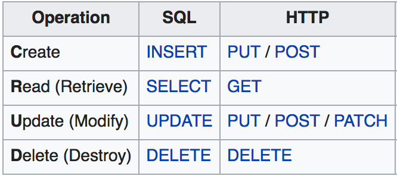

import Feedback from "@theme/Feedback";

## What will we learn today?

- Revision from last week
- [Recap integration of cyf_hotels DB with NodeJS](#recap-integration-of-cyf_hotels-db-with-nodejs)
- [CRUD operations with NodeJS and PostgreSQL](#crud-operations-with-nodejs-and-postgresql)
  - [Creating data](#creating-data)
  - [Reading data](#reading-data)
  - [Updating data](#updating-data)
  - [Deleting data](#deleting-data)
- [Coursework](#coursework)

---

## Learning Objectives

By the end of this lesson trainees should be able to

- Create an API endpoint that can add data to a database
- Write code that effectively validates data before adding it to a database
- Be aware of the dangers of SQL injection attacks, and how to avoid them
- Create an API endpoint that can retrieve data from a database with multiple parameters
- Create an API endpoint that can update data in a database
- Create an API endpoint that can delete data in a database

---

## Recap integration of cyf_hotels DB with NodeJS

For this class, we will use the tables and data from [`cyf_hotels_exercise5.sql`](../week-1/cyf_hotels_exercise5.sql). To start from a clean state for your `cyf_hotels` database, run `psql -d cyf_hotels -f cyf_hotels_exercise5.sql`.

During the last class, we created a new NodeJS project called `cyf-hotels-api` with a single API endpoint `/hotels` to get the list of all hotels. In this class, we will add other endpoints with more functionalities to interact with the `cyf_hotels` database.

```js
const express = require("express");
const app = express();
const { Pool } = require("pg");

const pool = new Pool({
  user: "postgres",
  host: "localhost",
  database: "cyf_hotels",
  password: "",
  port: 5432,
});

app.get("/hotels", function (req, res) {
  pool
    .query("SELECT * FROM hotels")
    .then((result) => res.json(result.rows))
    .catch((error) => {
      console.error(error);
      res.status(500).json(error);
    });
});

app.listen(3000, function () {
  console.log("Server is listening on port 3000. Ready to accept requests!");
});
```

## CRUD operations with NodeJS and PostgreSQL

_"The acronym CRUD refers to all of the major functions that are implemented in relational database applications. Each letter in the acronym can map to a standard Structured Query Language (SQL) statement and Hypertext Transfer Protocol (HTTP) method [...]."_ - [Wikipedia](https://en.wikipedia.org/wiki/Create,_read,_update_and_delete)

<!--  -->
<p align="center">
  
</p>

### Creating data

In the following, we will add a new API endpoint to create a new hotel in the table `hotels` of the `cyf_hotels` database. As a reminder, here is an example of a SQL insert statement to add a new hotel:

```sql
INSERT INTO hotels (name, rooms, postcode) VALUES ('New Hotel', 5, 'ABC001');
```

As we create a new record in the database, we will add a new POST endpoint in the `cyf-hotels-api` project from last class. Moreover, we need to be able to pass some parameters to this API endpoint such as the hotel name, the number of rooms and the postcode, so we can use this API to create a different hotel. These parameters can be sent in the body of the request. To access the parameters in the body of the request with Express.JS, we need add the following line in the `server.js` file of the `cyf-hotels-api` project:

```js
app.use(express.json());
```
This means the body will be automatically parsed from a string into a JSON object.
We can finally add our new endpoint to create a new hotel:

```js
app.post("/hotels", function (req, res) {
  const newHotelName = req.body.name;
  const newHotelRooms = req.body.rooms;
  const newHotelPostcode = req.body.postcode;

  const query =
    "INSERT INTO hotels (name, rooms, postcode) VALUES ($1, $2, $3)";

  pool
    .query(query, [newHotelName, newHotelRooms, newHotelPostcode])
    .then(() => res.send("Hotel created!"))
    .catch((error) => {
      console.error(error);
      res.status(500).json(error);
    });
});
```

What could go wrong with the code above? There is no validation of any user inputs which could result in errors, duplications or inconsistent data in the database! Here are few examples of things we can verify before creating the hotel in the database:

1. Check that the number of rooms is a positive number
2. Check that no hotel with the same name already exists in the database
3. ...

Let's start by validating that the number of rooms is a positive number and if it doesn't, return an error.

```js
if (!Number.isInteger(newHotelRooms) || newHotelRooms <= 0) {
  return res
    .status(400)
    .send("The number of rooms should be a positive integer.");
}
```

Then we can validate the new hotel doesn't already exist in the database, thus preventing duplicate data.

```js
app.post("/hotels", function (req, res) {
  const newHotelName = req.body.name;
  const newHotelRooms = req.body.rooms;
  const newHotelPostcode = req.body.postcode;

  if (!Number.isInteger(newHotelRooms) || newHotelRooms <= 0) {
    return res
      .status(400)
      .send("The number of rooms should be a positive integer.");
  }

  pool
    .query("SELECT * FROM hotels WHERE name=$1", [newHotelName])
    .then((result) => {
      if (result.rows.length > 0) {
        return res
          .status(400)
          .send("An hotel with the same name already exists!");
      } else {
        const query =
          "INSERT INTO hotels (name, rooms, postcode) VALUES ($1, $2, $3)";
        pool
          .query(query, [newHotelName, newHotelRooms, newHotelPostcode])
          .then(() => res.send("Hotel created!"))
          .catch((error) => {
            console.error(error);
            res.status(500).json(error);
          });
      }
    });
});
```

#### Exercise 1

:::note Exercise

- Follow the above steps to create a new POST endpoint `/hotels` to create a new hotel. Make sure to add validation for the number of rooms and the hotel name. Test your new API endpoint with Postman and check that the new hotel has been correctly created in your database.
- Add a new POST API endpoint to create a new customer in the `customers` table.
- Add validation to check that there is no other customer with the same name in the customers table before creating a new customer.

:::

### Reading data

We already have one GET endpoint to load all the hotels in the database. However, we can improve this endpoint and add a couple of extra functionalities. First, we may want to order the list of hotels by name:

```js
app.get("/hotels", function (req, res) {
  pool
    .query("SELECT * FROM hotels ORDER BY name")
    .then((result) => res.json(result.rows))
    .catch((error) => {
      console.error(error);
      res.status(500).json(error);
    });
});
```

Another functionality which could be useful is to filter the hotel with a keyword to be able to search for a specific hotel name:

```js
app.get("/hotels", function (req, res) {
  const hotelNameQuery = req.query.name;
  let query = `SELECT * FROM hotels ORDER BY name`;
  let params = [];
  if (hotelNameQuery) {
      query = `SELECT * FROM hotels WHERE name LIKE $1 ORDER BY name`;
      params.push(`%${hotelNameQuery}%`);
  }
  
  pool
    .query(query, params)
    .then((result) => res.json(result.rows))
    .catch((error) => {
      console.error(error);
      res.status(500).json(error);
    });
});
```

In some case, you would want to load only a specific hotel by id. Let's define a new GET endpoint to load one specific hotel:

```js
app.get("/hotels/:hotelId", function (req, res) {
  const hotelId = req.params.hotelId;

  pool
    .query("SELECT * FROM hotels WHERE id=$1", [hotelId])
    .then((result) => res.json(result.rows))
    .catch((error) => {
      console.error(error);
      res.status(500).json(error);
    });
});
```

#### Exercise 2

:::note Exercise

- Add the GET endpoints `/hotels` and `/hotels/:hotelId` mentioned above and try to use these endpoints with Postman.
- Add a new GET endpoint `/customers` to load all customers ordered by name.
- Add a new GET endpoint `/customers/:customerId` to load one customer by ID.
- Add a new GET endpoint `/customers/:customerId/bookings` to load all the bookings of a specific customer. Returns the following information: check in date, number of nights, hotel name, hotel postcode.

:::

### Updating data

We can now implement an endpoint to update a customer record in the database. For this, we will use a PUT endpoint.

```js
app.put("/customers/:customerId", function (req, res) {
  const customerId = req.params.customerId;
  const newEmail = req.body.email;

  pool
    .query("UPDATE customers SET email=$1 WHERE id=$2", [newEmail, customerId])
    .then(() => res.send(`Customer ${customerId} updated!`))
    .catch((error) => {
      console.error(error);
      res.status(500).json(error);
    });
});
```

What can go wrong in the code above? Again, there is no validation! We could set an empty email or even a string which is not following the format of an email. **Remember, validating data is very important to make sure you don't end up with inconsistent data in your database!**

#### Exercise 3

:::note Exercise

- Add the PUT endpoint `/customers/:customerId` and verify you can update a customer email using Postman.
- Add validation for the email before updating the customer record in the database. If the email is empty, return an error message.
- Add the possibility to also update the address, the city, the postcode and the country of a customer. Be aware that if you want to update the city only for example, the other fields should not be changed!

:::

### Deleting data

To delete a record from the database, we will use a DELETE endpoint:

```js
app.delete("/customers/:customerId", function (req, res) {
  const customerId = req.params.customerId;

  pool
    .query("DELETE FROM customers WHERE id=$1", [customerId])
    .then(() => res.send(`Customer ${customerId} deleted!`))
    .catch((error) => {
      console.error(error);
      res.status(500).json(error);
    });
});
```

However, if you try to delete a customer which already has some bookings, the previous endpoint will fail. Do you know why? You cannot delete a customer whose ID is used as a foreign key in another table (in this case, in the `bookings` table). Let's delete all the customer bookings first:

```js
app.delete("/customers/:customerId", function (req, res) {
  const customerId = req.params.customerId;

  pool
    .query("DELETE FROM bookings WHERE customer_id=$1", [customerId])
    .then(() => pool.query("DELETE FROM customers WHERE id=$1", [customerId]))
    .then(() => res.send(`Customer ${customerId} deleted!`))
    .catch((error) => {
      console.error(error);
      res.status(500).json(error);
    });
});
```

#### Exercise 4

:::note Exercise

- Add the DELETE endpoint `/customers/:customerId` above and verify you can delete a customer along their bookings with Postman.
- Add a new DELETE endpoint `/hotels/:hotelId` to delete a specific hotel.

**Note**: A hotel can only be deleted if it doesn't appear in any of the customers' bookings! Make sure you add the corresponding validation before you try to delete a hotel.

:::

## Coursework

All of the coursework for this week can be found [here](./homework).

## Feedback

Please spend two minutes reviewing this lesson to help us improve it for the future. This feedback will be shared with volunteers.

<Feedback module="SQL" week="Week 3" />
