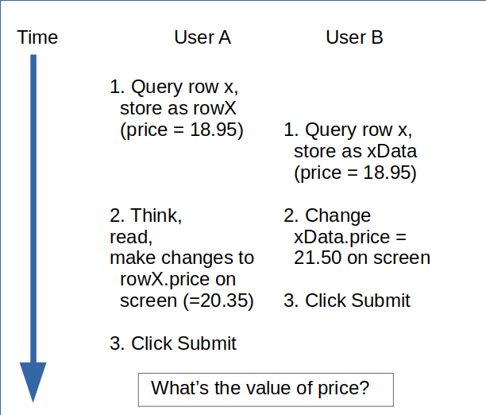

# More Uses of Node.js for SQL

## Node and PostgreSQL Authentication

So far we have used a very insecure method to log on to our database server. All the connection an login details have bee stored in plain text in the code of our server.js file. If we use a service such as github to manage our code then the details are open to the entire internet.
```js
const db = new Pool({
  user: "keith",
  host: "localhost",
  database: "cyf_hotel",
  password: "?????",
  port: 5432,
});
```
There are other ways to accomplish the same connection but without making the details public.

### Separate the PostgreSQL Authorisation Details

In this approach you put the database connection information into a separate file and include it into your server.js:
```js
// credentials.js
const credentials = {
  user: "keith",
  host: "localhost",
  database: "cyf_hotel",
  password: "?????",
  port: 5432
};
module.exports = credentials;
```
Then, in server.js you can include the `credentials.js` file and use the details to define your `db` Pool:
```js
// server.js
...
const credentials = require('./credentials.js');

const db = new Pool(credentials);
...
```
The next very important thing to do is ensure that your `credentials.js` file is not included in your source control system, e.g. add it to your `.gitignore` file so that it does not get versioned and pushed to github.

### Use Sytem Environmemt Variables

Another approach is to provide all the database connection and authorisation details via environment variables. Since these are done differently on different platforms we provide only the Linux/Unix style for achieving this.
```bash
export PGUSER=keith \
    PGHOST=localhost \
    PGDATABASE=cyf_hotel \
    PGPASSWORD=????? \
    PGPORT=5432 \
    node server.js
```
Note: This is a single command and could be typed on one line (without the continuation character `\`).

The node-postgres package will automatically use the environment variables to provide the connection details. In `server.js` you now just use:
```js
const db = new Pool();
```
Even this approach has some security issues because some operating systems allow other users to see your environment variables. To ensure that the password is completely secure you should use the `.pgpass` file in your home directory (or, on Windows, `%APPDATA%\postgresql\pgpass.conf`).

This file has contents formatted as:
```
# Password file formatted as:
# hostname:port:database:username:password
#
localhost:5432:cyf_hotel:keith:mysecretpassword
*:*:*:postgres:pgsuperpass
```
This file is matched, line by line, with the host, port, database and user used by the connection until a match is found. The password from that line is used. Note that `*` is a wildcard and matches anything and can be used in the any of the first four fields.

When using this file:
* You should not provide the PGPASSWORD environment variable
* The file must only be readable by you - on *nix use `chmod 0600 .pgpass`
* You can override the file name using the PGPASSFILE environment variable

## Understanding Connections to PostgreSQL

So far in the CYF course we have used the `db.query` method for executing SQL. By using `db.query` the server opens a new connection, executes the query then closes the connection. This is fine for a single SQL command but is inefficient or simply won't work for more complex situations that involve multiple SQL commands.

Just to recap, we used the following preamble to configure our server to use express, bodyparser and postgres:

```js
const express = require("express");
const bodyParser = require("body-parser");

const app = express();

const Pool = require("pg").Pool;

const db = new Pool();    // Assuming use of environment variables for authorisation


app.use(bodyParser.json());
```

All of this is still required.

We also defined an endpoint to handle POST requests to insert a new customer, first checking that the customer's email is not already in the database:

```js
//
// Route to add a new customer
//
app.post("/customers", function (req, res) {
  const custName = req.body.name;
  const custEmail = req.body.email;
  const custPhone = req.body.phone;
  if (
    custPhone.replace(/[\+\-\(\)0-9 ]/g, "0") !=
    "0".padEnd(custPhone.length, "0")
  ) {
    return res
      .status(400)
      .send("Phone number can contain only 0-9, +, -, (, ) or space.");
  }
  //
  // Check the customer's email isn't already in the table
  //
  db.query(
    "SELECT 1 FROM customers WHERE email=$1",
    [custEmail],
    (err, result) => {
      if (result.rows.length > 0) {
        //
        // The email already exists in the table so return an error
        //
        return res
          .status(400)
          .send("A customer with that email address already exists!");
      } else {
        //
        // The email is not in the table so insert the new customer
        //
        db.query(
          "INSERT INTO customers (name, email, phone) " +
            "VALUES ($1, $2, $3) " +
            "RETURNING id",
          [custName, custEmail, custPhone],
          (err, result) => {
            if (err == undefined) {
              let newId = result.rows[0].id;
              res.send(`New customer added with id = ${newId}.`);
            } else {
              res.status(500).json({ error: err });
            }
          }
        );
      }
    }
  );
});
```

Because this uses `db.query` twice, once to check the email is not present and again to insert the new customer, it requires two separate connections to the database, one for each `db.query`. Since connections are expensive to acquire it makes sense to try to reduce them if possible, which we can do in this case.

## Using a Single Connection for Multiple SQL Commands

Instead of using `db.query` for each SQL command we first of all establish a connection:

```js
  db.connect((err, conn, release) => { ... });
```

The `db.connect` method uses a callback function with three arguments, `(err, conn, release)`.

The `err` argument is as before, it is either undefined if no error occurred or an appropiate message if the connection failed.

The `conn` argument takes the connection information and makes it available for the duration of the callback function with methods such as `conn.query`, which is very similar to the `db.query` method we've used before but doesn't establish its own connection, it uses the one we've created using `db.connect`.

The `release` argument takes as its value a function that will release the connection when no longer needed.

As before, all the work is done within the callback function using multiple invocations of the `conn.query` method to execute SQL but this time using just the one connection. For example:

```js
...
app.post("/customers", function(req, res) {
  const custName = req.body.name;
  const custEmail = req.body.email;
  const custPhone = req.body.phone;
  // ... Omitted the code to check the phone number to simplify the example
  db.connect((err, conn, release) => {
    conn.query("SELECT 1 FROM customers WHERE email=$1", [custEmail],
            (err, result) => {
      if (result.rowCount > 0) {
        release();
        return res
          .status(400)
          .send("A customer with that email address already exists!");
      } else {
        conn.query("INSERT INTO customers (name, email, phone) " +
                "VALUES ($1, $2, $3) " +
                "RETURNING id", [custName, custEmail, custPhone],
          (err, result) => {
            if (err == undefined) {
              let newId = result.rows[0].id;
              release();
              res.send(`New customer added with id = ${newId}.`);
            } else {
              release();
              res.status(500).json({error: err});
            }
        });
      }
    });
  });
});
```

Notice that in this example we're using `conn.query` instead of `db.query` but the rest of the code is very similar to the previous example.

You may have noticed the addition of a few calls of the `release()` function - these are important. You must call `release()` to release a connection you have established using `db.connect` otherwise you could exhaust the pool of available connections. The above code calls `release()` at every point where the endpoint could exit.

So now you have learned how to use a single connection and how to release it when finished.

### Exercise:
We can use the server.js that you wrote for the CYF DB Module or you can start with a new node environment completely - it's your choice.

1.  Ensure your server.js file has the appropriate preamble to initialise Express, Body Parser and PostgreSQL. You can use the cyf_hotel database created as part of the previous course.
2.  Rewrite the `POST` endpoint for `/customers` that inserts new customer data so that it uses a single connection for both checking the email and inserting the new customer.
3.  Create a new `PUT` endpoint for updating a customer's email address but include a check that the new email address doesn't exist in the customers table already.

## Understanding Synchronous and Asynchronous Computing

### Synchronous vs Asynchronous
In synchronous code each step completes fully before moving on to the next step. In JavaScript this is normal for operations that act only on memory and don't involve any input or output. For example:
```js
const limit = 1000;
let step = 1;
let total = 0;
for (let i = 1; i <= limit; i += step) {
  total += i;
  step++;
}
```
These synchronous operations effectively "block" the execution of subsequent steps until the operation is complete. For in-memory operations, such as manipulating variables, these operations are very fast so blocking is short-lived, lasting only micro-seconds. In any case, the requirements of an algorithm will usually require that preceding operations complete before subsequent operations can take place.

For operations that involve some kind of input or output (for example, reading a file, sending a request over a network) the input/output (I/O) operations are normally processed asynchronously. These operations are much slower than in-memory actions, usually taking milli-seconds or longer to complete. The input/output operation simply adds a request to perform this operation onto a queue of operations. Following code continues to execute immediately after the request has been queued. For example:
```js
function my_callback(err, result) {
  if (err == undefined) {
    console.log("Result = ", result);     // process the result of the query 
                                          // in the callback function
  }
}

db.query("SELECT * FROM rooms WHERE room_no = 123", my_callback(err, result));   // I/O operation queues request

console.log("Query has been queued");     // executes immediately after db.query sends the request
```
This will result in the output:
```
Query has been queued
Result = {...}
```
Notice that the message produced in the callback function will invariably appear after the message produced immediately after sending the query to the database.

### Why Does JavaScript Prefer Asynchronous I/O?
Firstly it's important to understand that JavaScript was originally developed as a language to be used in the browser environment. A user might initiate an action in the browser that takes some time then decide to cancel it. In order to activate another element (e.g. link, button,...) to perform the cancel operation the browser must respond to an event. It must not be blocked by an earlier operation that has not yet completed.

Because JavaScript is "single-threaded", blocking the execution could potentially lock up the entire web page, hence the preference for asynchronous I/O.

"But," you argue, "we are using node as a server, not in a web page". The trouble is that making the behaviour of node different from the browser would require a complete re-working of JavaScript, so we have to conform to the same rules. Even in the server environment we must use asynchronous I/O to prevent the whole server from becoming blocked.

### How Does JavaScript Handle Queued Requests?
This is a rather long and complicated story, but essentially it works a bit like the following:
A looping process looks at the queue of requests:
1.  If a request is ready on the queue, remove it from the quque (de-queue the request)
2.  Assign the request to an available "non-blocking worker" thread
3.  Go back to step 1

The worker thread will then:
1.  Process the request (e.g. send it to the database server)
2.  Wait for the results from the request (e.g. rows from the database)
    * (Note the worker thread IS blocked until the results arrive)
3.  Add the results to another queue (results queue)
4.  Signal completion of the request
5.  Wait for another request

When the completion signal is received JavaScript executes the callback function of the request-making call and returns the results from the queue.

This is a rather simplified and loosely described process but it captures the essential features.

## Using async/await for Complex Database Activity
We've only had fairly simple endpoints so far in our use of the database. A `GET` endpoint to return all or selected customers, a `POST` endpoint to insert a new customer, and so forth. In each of these there are only a few SQL commands, each of which involves a callback function. When the endpoint gets more complex with the number of SQL commands increasing then the corresponding callback functions can become very ugly and difficult to manage (known as "callback hell").

One elegant and easy way to overcome this is to use the Javascript async/await capability. You may have used async/await in previous sessions but we can provide the basics again here. Remember that async/await uses promises but makes the code structure much simpler (more like a "conventional" programming language) by hiding the asynchronous parts. We also use the `try/catch` construct to handle errors, simplifying error handling too.

First of all the `await` mechanism can only be used inside a function declared as `async`, so:
```js
async function doSomething() {
  // await code can go in here...
}
```
Another way to do this, especially useful in a Node/Express endpoint, is to use an "Immediately Invoked Function Expression" or IIFE (you can look this up on the web...). In a node/express endpoint this would look like:
```js
app.post("/customer", (req, res) => {
  ... // initialise endpoint stuff here...
  (async function() {           // here's the IIFE syntax for the function
    ...               // database stuff here using await ...
  })();                         // notice the () after the closing parenthesis )
});
```
Things to notice about the above:
1.  The endpoint is just a normal endpoint - the endpoint address is not important here
2.  Enclose the entire async function expression in parentheses
3.  Put an empty pair of parentheses after the enclosing ()'s
```js
  (async function() { ... })();
```
Note: Very carefully go through the above line of code checking the parentheses - which ones match?

Now, let's do some real work in that endpoint. We'll do the same things that happened in our callback version but use `await` instead:
```js
app.post("/customers", function(req, res) {
  const custName = req.body.name;
  const custEmail = req.body.email;
  const custPhone = req.body.phone;
  ...
  
  (async () => {      // Yes, we can use the arrow function notation
    try {
      let result;

      const conn = await db.connect();
      result = await conn.query("SELECT 1 FROM customers WHERE email=$1", [custEmail]);
      if (result.rowCount > 0) {
        await conn.release();
        return res
          .status(400)
          .send("A customer with that email address already exists!");
      } else {
        result = await conn.query("INSERT INTO customers (name, email, phone) " +
                          "VALUES ($1, $2, $3) " +
                          "RETURNING id", [custName, custEmail, custPhone]);
        let newId = result.rows[0].id;
        await conn.release();
        res.send(`New customer added with id = ${newId}.`);
      }
    } catch(err) {
      await conn.release();
      res.status(500).json({error: err});
    }
  })();
});
```
If you compare the above with the callback version of the same thing you'll notice:
* A simpler code structure to the whole endpoint, which can become very significant in complex cases
* The use of `try {...} catch ...` to handle errors, saving a lot of effort.

The above example involves just two SQL commands and doesn't require a transaction as it just performs a simple INSERT. In more complex cases where several tables need changes then transactions can be used and are often essential to avoid inconsistencies.

## Transactions in Node
In order to use a transaction in Node we must use  `BEGIN TRANSACTION`, the insert/update/delete commands and the `COMMIT` or `ROLLBACK` to terminate it, at least three SQL commands in all but usually rather more. We must also use a single connection for all these so must use the above scheme of working.

Consider the situation when a customer checks in to our hotel and is assigned a room and has their room billing initialised by creating an invoice. The customer can optionally request a change to their checkout date at the same time. This requires an update to the reservation and the insert of an invoice record. We can do this as follows:
```js
app.put("/reservations/checkin/:id", function(req, res) {
  const resId = req.params.id;
  const resRoomNo = req.body.room_no;
  const resCheckout = req.body.checkout_date;  // customer can amend checkout date on arrival

  (async () => {
    try {
      const conn = await db.connect();
      await conn.query("BEGIN TRANSACTION");
      if (resCheckout === undefined) {
        await conn.query("UPDATE reservations" + 
                          " SET room_no = $2" +
                          " WHERE id = $1", [resId, resRoomNo]);
      } else {
        await conn.query("UPDATE reservations" + 
                          " SET room_no = $2, checkout_date = $3" +
                          " WHERE id = $1", [resId, resRoomNo, resCheckout]);       
      }
      await conn.query("INSERT INTO invoices (res_id, total)" +
                        " VALUES ($1, 0.0)", [resId]);
      await conn.query("COMMIT");
      await conn.release();
      res.status(200).send("Checkin completed successfully");
    } catch(err) {
      if (conn != null) {
        await conn.query("ROLLBACK");
        await conn.release();
      }
      res.status(500).json({error: err});
    }
  })();
});
```
That is how to do a very basic transaction in Node.js but it misses an important consideration. If our application is intended to be used by multiple users, some of whom may be online over the web, then we cannot safely leave it as it is. In particular there is the potential for users to make conflicting updates and destroy each other's work.

The problem arises in the time spent by the user checking and making the changes on their screen. They've just queried to see the customer's details and reservation, they assign a room number and ask if the customer wishes to change the checkout date. They type in the relevant details to confirm the checkin. In the time between their initial query and getting to this point another user could make a change to the same data. Whoever hits the 'Submit' button first will lose their changes as the second user overwrites them when they press 'Submit'.



There are two ways to deal with this. We could lock the relevant row(s) when a user queries the initial data (e.g. customer and reservation details) but this could cause concurrency problems and is also not possible in a web-based application. In order to hold a lock we must retain the same connection session on the database but node releases the connection as it returns to the user.

The second way is to use what is called "optimistic locking". We only lock the records to be updated after the user has submitted their changes. This approach requires some extra processing, in particular we need to be sure the data to be changed hasn't been modified by another user since the original query. There are two main ways to do this:
1.  Send the results of the original query along with the changes from the browser to the server<br>
    Note that this requires the browser to store those original values so they can be returned to the server
2.  Create a new column in the table to be updated (e.g. row_version) that is incremented each time a change is made

The first approach has the advantage that it doesn't need any special design changes to the tables but requires us to compare the results of the original query (sent from the browser) with the results of a new query executed before we perform the update.

The second method also requires the browser to send extra data but this time only the previous value of the row version which we can then compare to the current value of the row version obtained from a new query. This also requires general query endpoints from the results of which the user might want to update the data must now also send the row version to the browser so that it can be returned for the update.

The method you use will depend on a number of factors but most likely will be dictated by the coding standards of the organisation you work for.

Below is an example, with comments in the code, based on method 1. for the reservation checkin process given above. The process is shown in full, from the initial query through the change process to the database transaction. Alongside this there is an example of what might occur if a second user attempts to change the same data.

User A (the receptionist in our hotel) asks the customer for their name and issues a query via the endpoint `/customers/by_name/:name` to retrieve their details. They then query the reservations table to get the corresponding reservation for today's date. This query returns the reservation details as an array of matching rows (in this case only one row) as follows:
```json
[
  {
    "id": 43,
    "cust_id": 104,
    "checkin_date": "2020-05-13",
    "checkout_date": "2020-06-19",
    "room_no": null,
    "no_guests": 2,
    "booking_date": "2020-06-05"
  }
]
The code that runs in user A's browser saves a copy of this data for use in the update request then populates the fields on the web page so that the user can check and update them.

   Meanwhile user B has also queried this reservation and plans
   to change the number of guests to 1. User B receives the same 
   JSON block as user A.

User A checks the details with the customer and asks if there are any changes they would like. The customer asks if it would be possible to stay two more nights. The receptionist checks the room bookings and agrees the change. User A now makes the room allocation and updates the room number on the screen - nothing is sent to the database yet.

   User B has changed the number of guests in the reservation
   but has not yet clicked Submit.

User A now hits the Submit button. The code in the browser now collates all the required information, the changes and the results from the original query, into a JSON structure and sends the request to the server.

This now requires a more complex JSON body - it must include both the assigned room no and the adjusted checkout date but also the unmodified data from the original query, for example:
```js
{
  "original": {
                "id": 43,
                "cust_id": 104,
                "checkin_date": "2020-05-13",
                "checkout_date": "2020-06-19",
                "room_no": null,
                "no_guests": 2,
                "booking_date": "2020-06-05"
              },
  "changes":  {
              "room_no": 309,
              "checkout_date": "2020-06-21"
              }
}
```

Note that the JSON body now includes the results of the original query against the reservations table. We must check that the corresponding row (id = 43) still contains the same data (otherwise we can assume another user has changed it in the intervening period). Below is the endpoint we might use:

```js
app.put("/reservations/checkin/:id", function(req, res) {
  const resId = req.params.id;
  const resRoomNo = req.body.changes.room_no;    // NOTE: this now refers to req.body.changes.room_no
  const resCheckout = req.body.changes.checkout_date;
  
  //
  // Function to compare two objects for equality of properties
  // Note: this does not perform a true equality test but compares
  //   attributes in 'a' that also occur in 'b'. Any attributes in
  //   'b' that don't appear in 'a' are not checked.
  //
  function objEqual (a, b) {
    for (var item in a) {
      if (a[item] != b[item]) {
          return false
      }
    };
  return true
  }

  //
  // Here is the main part of the endpoint code - checking the original 
  // data is unchanged then applying the changes.
  //

  (async () => {
    try {
      let result;

      const conn = await db.connect();
      await conn.query("BEGIN TRANSACTION");
      //
      // Here we re-query the row to get the data to match against 
      // req.body.original. Notice that we use the FOR UPDATE option
      // on the query to lock the row to prevent any further changes
      // until we commit or rollback our transaction.
      // If they are the same then proceed normally, otherwise 
      // return an error to the user
      //
      result = await conn.query(
          "SELECT cust_id, checkin_date, checkout_date, room_no, no_guests, booking_date" +
            " FROM reservations" +
            " WHERE id = $1" +
            " FOR UPDATE",    // Note - using the FOR UPDATE option
          [resId]
        ):
      //
      // Now use the objEqual function to compare the row with the 
      // data in req.body.original
      //
      if (objEqual(result.rows[0], req.body.original)) {
        //
        // Latest row = original, so now we are OK to continue...
        //
        if (resCheckout === undefined) {
          await conn.query("UPDATE reservations" + 
                            " SET room_no = $2" +
                            " WHERE id = $1", [resId, resRoomNo]);
        } else {
          await conn.query("UPDATE reservations" + 
                            " SET room_no = $2, checkout_date = $3" +
                            " WHERE id = $1", [resId, resRoomNo, resCheckout]);       
        }
        await conn.query("INSERT INTO invoices (res_id, total)" +
                          " VALUES ($1, 0.0)", [resId]);
        await conn.query("COMMIT");
        conn.release();
        res.status(200).send("Checkin completed successfully");
        //
        // By this point we've completed the changes successfully
        //
      } else {
        //
        // Here if the row doesn't match the original
        //
        conn.query("ROLLBACK");
        conn.release();  
        res.status(400).json({error: "Data modified by another user - please retry."});
      }
    } catch(err) {
      //
      // General error handling in the case of database errors
      //
      if (conn != null) {
        conn.query("ROLLBACK");
        conn.release();
      }
      res.status(500).json({error: err});
    }
  })();
});
```

That is doing a lot more work than the previous version of our checkin routine so it's rather more code. It is, however, a much more robust piece of code and is able to cope with multi-user activity that could break the previous version. For example, user B now clicks the Submit button, sending back the same original data. When this is checked against the current state of the row it no longer matches (room_no and checkout_date differ), however, so user B receives the message:
```
Data modified by another user - please retry.
```
User B must restart their changes and resubmit if they still wish to make their change.

Just to recap, the sequence of events is as follows:
1.  The user queries to get the data they need to complete the checkin process (e.g. customer and reservation details)
2.  The code in the browser saves the results of the query locally
3.  The user spends time completing the checkin details
4.  The user clicks the button to send the changes to the server, the browser also sends the original query results
5.  The server issues a query using the `FOR UPDATE` option against the reservations table to ensure no other user has changed that reservation while our user was working. The row is locked.
6.  If the results of the query at (5.) returns the same data as the original from (1.) - sent by the browser then we can continue with the update
7.  If the results are different then we abort the transaction and send a message to the user saying another user has changed the data

The endpoint above uses an IIFE (Immediately Invoked Function Expression) to establish an "async" environment in which to use the "await" calls. Another way to use `async` is in the endpoint callback (possibly more appropriately considered an event-handler).

The endpoint would then start as follows:
```js
app.put("/reservations/checkin/:id", async function(req, res) {
  ...
```
Note the use of `async` before the callback function. This can also use an arrow function, written as:
```js
app.put("/reservations/checkin/:id", async (req, res) => {
```
The rest of the code, excluding the IIFE, would remain the same. Here is the relevant part at the start of what was the IIFE (which has been commented out):
```js
  //
  // Here is the main part of the endpoint code - checking the original 
  // data is unchanged then applying the changes.
  //

//  (async () => {    // This was the IIFE to allow use of await
    try {
      let result;
      ...
```
then the end of the IIFE is also removed:
```js
      res.status(500).json({error: err});
    }
//  })();             // The end of the IIFE commented out
});
```
All the other code remains the same and the endpoint works as before.

