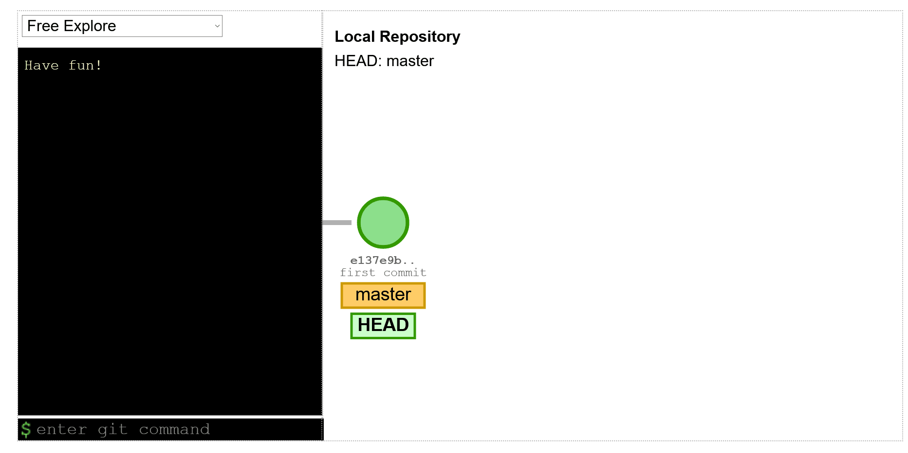

import Feedback from "@theme/Feedback";

## Learning objectives

By the end of this class, you should be able to:

- Explain why branches can be useful when using Git.
- Create a branch, and add commits to it.
- Switch between branches.
- Create a pull request from a branch to the main branch.
- Work with another trainee on non-conflicting changes to a single branch.

---

So far, we've seen that we can use Git to share our work, get code review, and view history. This week, we're going to learn more about how we can use Git to work together in groups, and to work on more than one thing at the same time.

For this class, we're going to use the Git CLI, but everything we're doing can also be done in GitHub Desktop. Remember you can always check the [cheatsheet](../desktop/cheatsheet-cli)!

In this class, we're going to work with a GitHub repository of recipes.

CodeYourFuture has made a _template_ repository on GitHub. Go to

https://github.com/CodeYourFuture/GitExampleRecipes

and click on "Use this template" to make a repository owned by your user account which contains the right files. Then clone your newly created repository onto your computer. You're going to do all of your exercises in your copy of this repository.

## 1) What is a branch?

We saw in the first Git lesson that Git stores the history of your changes as a list of commits, one after the other:



Since then, you've been pressing a button in GitHub Desktop called "Commit to main", or running `git commit`, to make a new commit. But what does that "to main" mean? main is called a _branch_, which is a list of commits. It turns out, you can have more than one branch, and they can share some commits if they want:


### Why would we want to do this?

There are a few reasons. The main one is: So you can work on more than one thing at the same time.

Let's look at our repo of recipes. Right now, it contains one recipe, for a brownie in a mug. There are a couple of changes we want to make:

1. We want to add an optional topping to put on top of the brownie (maybe ice cream, maybe you have a better idea). We'll need to add it both as an extra ingredient, and an extra step at the end.
2. A lot of recipes start with a story of how the author found them, or some time they've really enjoyed the recipe. We want to add a story, before the "What you need" section.

Let's imagine we start writing the story, but we want to quickly add the optional ice cream step. And let's imagine that we want someone else to review both changes before we merge them to main.

We could make both changes to main, and ask someone to review them both, but then they both need to be right before we can merge either one - we can't merge just the ice cream step until the story is finished.

Or we could only make the ice cream change, then send it for review, then when that merges, write the story and send it for review. But that slows us down, and also means that the reviewer can't review both changes at the same time.

It would be better if we could send out one pull request for the ice cream change, and another for the story. We can do this - with branches:


We can then add new commits on top of each branch, separately, and later on merge both branches to main.

### How do we create a new branch?

```console
$ git switch --create story
Switched to a new branch 'story'
```

Let's run through the bits of that command:

`git` - we're running a git command.

`switch` - we're switching to a different branch than the one we're on right now.

`--create` - we want git to create the branch we're switching to.

`story` - the branch we want to switch to (and create) is called `story`.

Running this command doesn't change any of the files in our repository - they stay the same, but if we commit changes, they will only get committed on this branch. If we switched back to the `main` branch, the changes would be un-done. But if we switch back to `story`, they'll come back!

(Note that some of the graphics in this class show slightly different commands than the ones we're teaching you. What we're teaching you is the newer way to do things - there's a note at the bottom of the lesson about the old way if you're curious. But we recommend you use `git switch` :))

### How do I know what branch I'm on?

You've already run one command which tells you this, you just may not have noticed!

```console
$ git status
On branch story
nothing to commit, working tree clean
```

That's right, `git status` tells you what branch you're on (and about any changes you haven't committed).

You can also find out more about branches by running:

```console
$ git branch
  main
* story
```

`git branch` tells you what branches exist in your repository, and puts a star next to the one you're currently switched to.

### Exercise 1 (15 minutes)

:::note Exercise
Let's make a new branch, and make a new commit on it.

Create a branch named `story`, and edit `mug-brownie.md`.

Before the "What you need" heading, make up a story about how the author discovered the recipe, or a time they enjoyed it.

When you've written a bit, make a commit (make sure to give it a good commit message!)

Explore the history with `git log` - make sure you understand the commits in your history and why they're there.

If you're confused, or don't understand what you're seeing, ask on Slack now!
:::

## 2) Switching back to main

Can you guess how to switch back to the `main` branch?

What do you think will happen to the contents of the files when you do?

What will the history look like?

### Exercise 2 (5 minutes)

:::note Exercise
Switch back to the `main` branch (hint: The command to run is like the one you used to create a new branch, but you're not creating a new one).

Look at the contents of `mug-brownie.md` - what's changed?

Explore the history with `git log` - make sure you understand the commits in your history and why they're there.

If you're confused, or don't understand what you're seeing, ask on Slack now!
:::

## 3) Managing multiple branches

When we created our `story` branch, it shared its history with the `main` branch. This is because whenever we create a branch, it will start off being the same as the branch we were on before.

In general, you always want to make new branches based on `main`, so always make sure to `git switch main` before creating a new branch.

If you find that the history of a new branch isn't what you expect, you probably didn't switch back to `main` before creating the new branch. We'll learn how to delete branches soon.

You can have multiple branches at the same time, and you can work on them separately. When you make a pull request, it will be tied to one branch.

You can make more than one pull request, as long as each is created from a different branch. This can be useful, so that you can propose multiple changes to code separately.

For example, if you have two changes to make, and one is really simple (like fixing a typo) and the other may need some discussion (like changing the colour scheme of a page), if you make separate pull requests (from separate branches), the easy one can get merged while the other one is being discussed.

Having small, separate pull requests also helps to keep your changes small, and allows your reviewer to focus on one thing, which makes their job easier.

#### Naming

Just like with variables and files, you want to name your branches in ways that will help you remember/understand what they're for. We normally name Git branches with 1-5 words, with no spaces. Some good examples:

- `add-story`
- `make-button-red`
- `delete-out-of-date-news`

And some bad examples:

- `branch1` or `branch2`
- `new`
- `feature`
- `addalltheingredientsbutalsoremovevanilla`

### Exercise 3 (10 minutes)

:::note Exercise
Make another branch based on `main` called `extra-topping` (remember to make sure you're on the `main` branch before creating the new one!).

Add a new topping to the recipe. Make sure to include it both in the ingredients list, and the steps.

Commit your changes.
:::

## 4) Managing branches for pull requests

We've seen before that to make a pull request from the Git CLI the steps are to `git push` (to make the remote's version of `main` be the same as your local version), and then make a pull request from the GitHub UI.

Most developers avoid doing work on their `main` branch, and always work on some other branch. This is because if you commit things to `main`, all new branches you create will have those changes on, and you generally want to make pull requests with only a specific set of changes compared to upstream's `main`.

From now on, your steps to start working on code for a pull request should be:

- `git switch main` (switch back to the main branch)
- `git pull` (pull in any changes from upstream)
- `git switch --create my-new-branch-name` (make a new branch)
- (make your changes)
- `git commit`
- `git push` (send your changes to the remote)
- Create a pull request through the GitHub UI

If you need to make changes (e.g. because your reviewer gave you feedback), you should switch to your branch, make the changes, commit them, and push them to the remote again. The pull request will automatically get updated with the changes you committed.

## 5) Deleting branches

After you merge your pull request, you should delete your branch. GitHub can't change things on your computer automatically, so you need to do it yourself.

You can't delete a branch you're switched to, so first, switch to `main`: `git switch main`.

Then pull in any changes from upstream (this helps Git to work out whether you've already merged your PR): `git pull`.

And finally, delete the branch: `git branch --delete your-branch-name`.

## 6) Comparing local and remote

Before, we saw that `git status` can tell you what branch you're on, and any changes you haven't commited.

But it can also tell you more than that!

If you have made commits locally, but haven't pushed them, `git status` may say something like:

```console
$ git status
Your branch is ahead of 'origin/story' by 2 commits.
```

Or if you have run a `git fetch` but not a `git pull`, and the remote has changes that you haven't pulled yet, it may say:

```console
$ git status
Your branch is behind 'origin/main' by 3 commits, and can be fast-forwarded.
```

`git status` can remind you that you have or haven't pushed or pulled yet.

After you've merged a pull request, you can delete your branch, because you don't need it any more - your code is on the main branch!

## 7) On "git checkout"

On the internet, you may see people referring to `git checkout` and `git checkout -b` as ways to switch, or create, branches. These are old versions of the commands `git switch` and `git switch --create`. They work the same, but because their names are less good (and sometimes they can also do extra things, which may be surprising), they have been replaced with `git switch`. You should use `git switch`, but don't be scared if you see someone talking about `git checkout` - it's the same thing!


## Coursework

You can find this weeks coursework [here](./homework).

## Feedback

It's really helpful if you give us feedback for this lesson. This helps us improve it for future trainees!

<Feedback module="Git" week="Week 4" />
