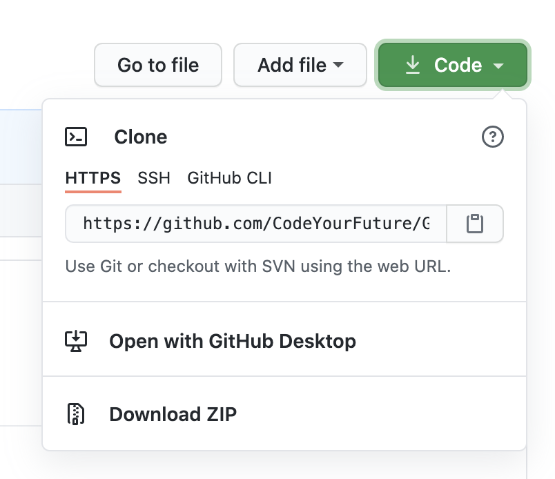
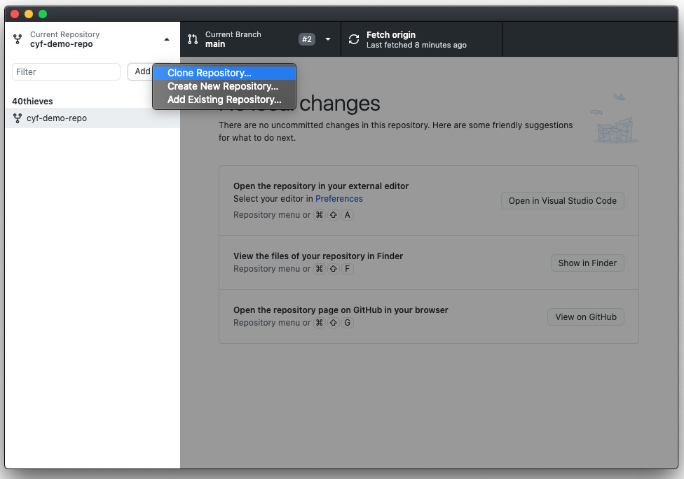
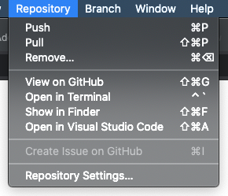

## I want to get code from a repo onto my computer (Cloning)

Follow these steps if you need to get code from a Github repo onto your computer (for example to complete your coursework).

#### Video

<video width="100%" controls>
  <source src={require('./assets/cloning-video.mp4').default} />
</video>

#### Screenshots

1. Open the repo on Github in your browser (for the coursework this will likely be https://github.com/CodeYourFuture/COURSEWORK_REPO_NAME):
2. Click the "Code" button, which opens a menu:

3. Copy the URL (Pro Tip: you can click the clipboard icon on the right to copy automatically!)
4. Open Github Desktop, and click on the Current Repository menu in the top left:

5. Click the Add button at the top, then the Clone Repository option:

6. In the Clone Repository modal, make sure you are on the URL tab. Then paste the URL that you copied before into the "URL or username/repository" input:

7. Click the Clone button, and wait until it has finished cloning
8. Congrats! You have successfully cloned a repo from Github! 🎉

## I want to open VS Code with my repo

Follow these steps if you already have the repo on your computer and you want to edit the files.

1. In the menubar, click the Repository option
2. Then click the Open in Visual Studio Code option:

## I want to save my code to the repo (Committing)

## I want to send my code to volunteers (Pushing)

#### TODO

- Decide what to do about the UI being different for the first repo
