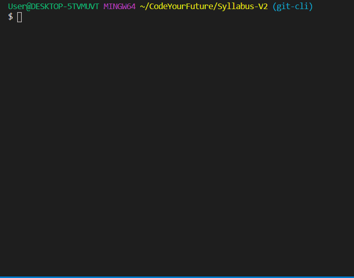
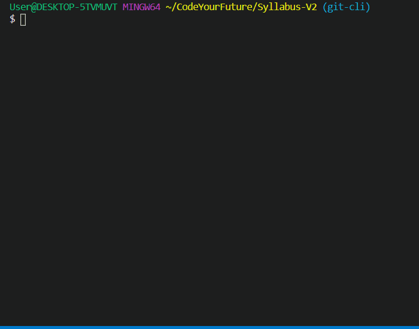

Everything that you're going to be doing using Git CLI you can also do using Github Desktop.

In this page, you'll comparisons of how to complete command tasks on both Github Desktop and Git CLI.

### Viewing Changed Files

To view the files that you have changed you can use

```sh
git status
```

This will show a list of files that have changed since the last time that you committed.

| Github Desktop                                                 | Git CLI                                                      |
| -------------------------------------------------------------- | ------------------------------------------------------------ |
|  |  |

### Including Files to Commit

One key difference between Github Desktop and Git CLI is that you need to set which files will be committed to your repository. You can add files to be committed by using

```sh
git add .
```

This command will add **every** file you have changed to be ready to commit

| Github Desktop                                    | Git CLI                                                        |
| ------------------------------------------------- | -------------------------------------------------------------- |
|  |  |

### Committing Changes

Committing changes to your repository can be done by using this command

```sh
git commit -m "YOUR MESSAGE HERE"
```

The `-m` means that after you are going to write your commit message. Make sure to put your commit message in quotes! You can press enter to add new lines in your message, too.

Some characters are treated specially in the terminal, and we can tell the terminal not to treat them specially by _escaping_ them with a backslash. For example, if you want to use a quote character inside your message, you need to escape it, otherwise the terminal will think your quote is the end of the message:

```sh
git commit -m "Use \"s instead of 's"
```

Here's how committing on Github Desktop and Git CLI is different

| Github Desktop                                               | Git CLI                                             |
| ------------------------------------------------------------ | --------------------------------------------------- |
|  |  |

### Pushing Changes to Github

Finally, pushing your changes to Github can be completed by using

```
git push
```

| Github Desktop                                 | Git CLI                                             |
| ---------------------------------------------- | --------------------------------------------------- |
|  |  |

### Fetching from Github

To check if there have been any changes on Github you can use

```sh
git fetch
```

| Github Desktop                                     | Git CLI                                      |
| -------------------------------------------------- | -------------------------------------------- |
|  |  |

### Pulling from Github

To pull any changes from Github you can use

```sh
git pull
```

| Github Desktop                                     | Git CLI                                     |
| -------------------------------------------------- | ------------------------------------------- |
|  |  |
