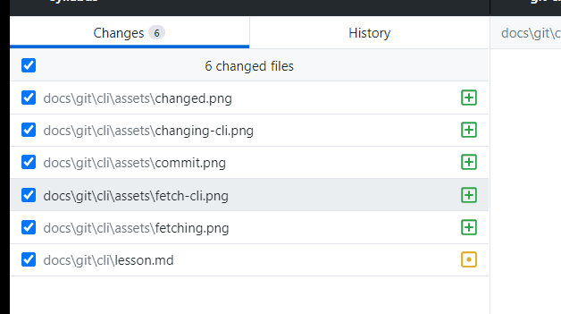
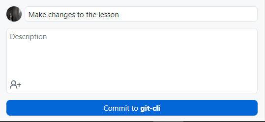
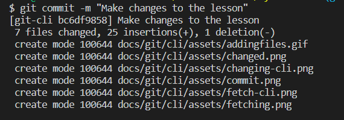
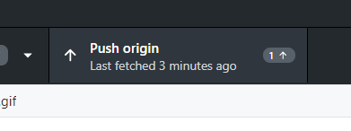
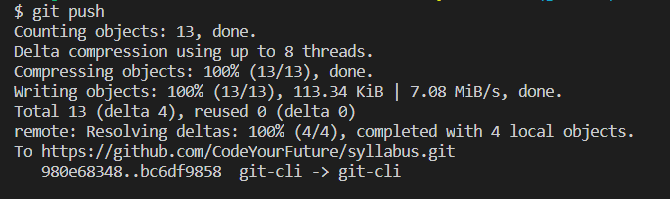

Everything that you're going to be doing using Git CLI you can also do using Github Desktop. Let's run through a few example of this

### Viewing Changed Files

| Github Desktop                                                 | Git CLI                                                      |
| -------------------------------------------------------------- | ------------------------------------------------------------ |
|  |  |

### Including Files to Commit

| Github Desktop                                      | Git CLI                                                          |
| --------------------------------------------------- | ---------------------------------------------------------------- |
|  |  |

### Committing Changes

| Github Desktop                                               | Git CLI                                             |
| ------------------------------------------------------------ | --------------------------------------------------- |
|  |  |

### Pushing Changes to Github

| Github Desktop                                 | Git CLI                                                |
| ---------------------------------------------- | ------------------------------------------------------ |
|  |  |

### Fetching

| Github Desktop                                     | Git CLI                                      |
| -------------------------------------------------- | -------------------------------------------- |
|  |  |
