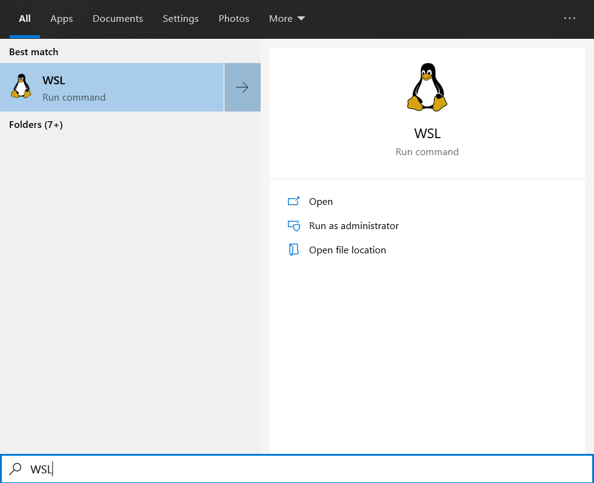

import Feedback from "@theme/Feedback";

## Learning Objectives

By the end of this class, you should be able to:

- Define the differences between a Terminal and a GUI and describe the benefits of both
- Open a terminal window
- Using the terminal navigate to a specified folder (using `cd`)
- Move up a level in a folder directory (using `cd ..`)
- Cancel a running task in the terminal (using `ctrl+c`)
- View all the files of the current directory they are in (using `ls`)
- Use arguments to augment the commands learnt in the lesson (e.g. `ls -all`)
- Clear the terminal window (using `clear`)
- Use autocomplete when in the terminal to complete commands (using the Tab key)
- Find which directory you're currently in (using `pwd`)

---

## Before you start

If you're on Windows, make sure that you've followed the instructions [here](../js-core-1/preparation) to get setup with WSL. Alternatively, these exercises can be completed using [Git Bash](https://gitforwindows.org/)

## 1) Opening the Terminal

There are a few different ways that you can open the terminal.

### 1) (Recommended) In Visual Studio Code

Open VSCode and Click on `View` > `Terminal`.

This will then open a new Terminal windows

This is a fully featured Terminal where you can complete this week's coursework.

### 2) Through Your Operating System

### 2.1) On Windows

Open the Start Menu and search `WSL`.

Click on the `WSL` button to open the WSL window

### 2) On Mac

## Coursework

You can find this weeks coursework [here](./homework)

## Feedback

It's really helpful if you give us feedback for this lesson. This helps us improve it for future students!

<Feedback module="Git" week="Week 2" />
