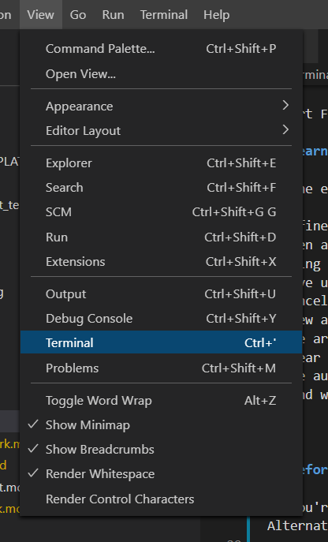
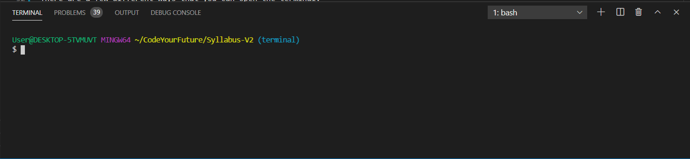
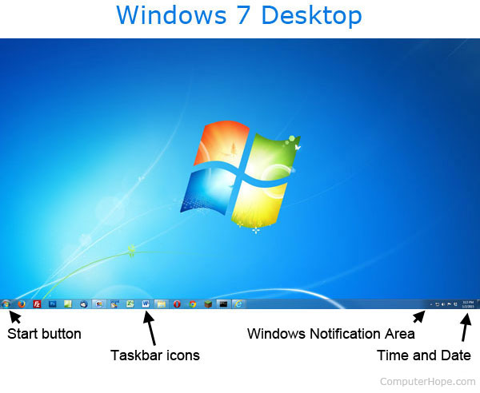
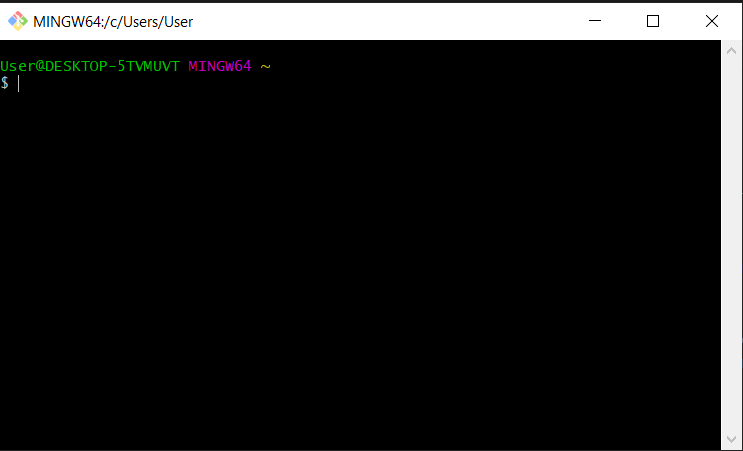
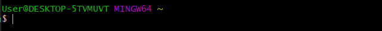
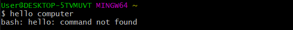
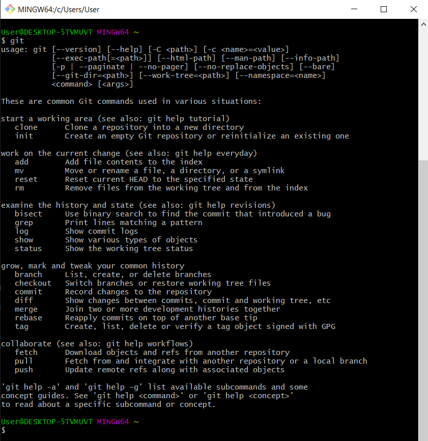

import Feedback from "@theme/Feedback";
import Tabs from '@theme/Tabs';
import TabItem from '@theme/TabItem';

## Learning Objectives

By the end of this class, you should be able to:

- Define the differences between a Terminal and a GUI and describe the benefits of both
- Open a terminal window
- Using the terminal navigate to a specified folder (using `cd`)
- Move up a level in a folder directory (using `cd ..`)
- Cancel a running task in the terminal (using `ctrl+c`)
- View all the files of the current directory they are in (using `ls`)
- Use arguments to augment the commands learnt in the lesson (e.g. `ls -all`)
- Clear the terminal window (using `clear`)
- Use autocomplete when in the terminal to complete commands (using the Tab key)
- Find which directory you're currently in (using `pwd`)

---

## Before you start

If you're on Windows, make sure that you've followed the instructions [here](../js-core-1/preparation) to get setup with WSL. Alternatively, these exercises can be completed using [Git Bash](https://gitforwindows.org/)

## 1) Opening the Terminal

There are a few different ways that you can open the terminal.

### (Recommended) In Visual Studio Code

Open VSCode and Click on `View` > `Terminal`.

This will then open a new Terminal windows

This is a fully featured Terminal where you can complete this week's coursework.

### Through Your Operating System

#### On Windows

Open the Start Menu and search for `WSL`.

Click on the `WSL` button to open the WSL window.

This will open Windows Subsystem for Linux, it may take a moment to finish loading.

#### On Mac

Perhaps the easiest and quickest way to open Terminal is through Spotlight Search. To launch Spotlight, click the small magnifying glass icon in your menu bar (or press `Command+Space`).

When the Spotlight Search bar pops up on your screen, type `terminal.app` and hit `Return`. Or you can click the Terminal.app icon that appears.

Terminal will launch, and you’ll be ready to go.

#### Ubuntu

You’ll find the Terminal application included with your other installed applications. To find them, click the `Show Applications` button at the bottom-left corner of your screen, on the dash bar.

Type `Terminal` and press Enter to find and launch the Terminal shortcut. You can also locate the Terminal icon in the list of all applications that appears here and click it.

### Exercise (5 minutes)

:::tip Exercise
Using the above instructions, open the terminal now.

Having issues? Can't open the terminal? Ask for help on your Slack channel **now**!.
:::

## 2) What is a GUI?

GUI stands for **G**raphical **U**ser **I**nterface.

A GUI is a useful way to make computers easier to use for general users of software. An example of a GUI is the Windows Desktop.

In a GUI, there a visual elements (buttons, text, windows etc) that a user can interact with to complete tasks.

### Self-Study Exercise (15 minutes)

:::tip Exercise
Research the following questions

- What is a GUI useful?
- What are three examples of a GUI?
- When were GUIs invented?
- What came before GUIs?

Anything you don't understand? Ask your questions in your Slack channel.
:::

## 3) What is a CLI (or Terminal)?

CLI stands for **C**ommand **L**ine **I**nterface. An example of a CLI is Git Bash.

The terminal exists to take commands that you write and turn them into something that the computer can **do**.

Many of the tasks that you complete using a GUI can also be done using the command line. For example,

- Creating a file
- Creating a folder
- Looking at the contents of a file
- Connecting to the internet
- Opening programs

You can write `commands` to your computer by wring text after the `$` sign in your terminal window and pressing `enter`.

However, you can't just type anything! Your computer only understand commands in a specific format

If you type something that the computer doesn't understand, you'll see the above error.

### Self-Study Exercise (5 minutes)

<Tabs
defaultValue="exercise"
values={[{ label: "Exercise", value: "exercise", },{ label:"Answer", value: "answer", },]}>
<TabItem value="exercise">

:::tip Exercise
Make the command line do something!

It's really really hard to break something in the terminal by mistake.

I want you to try and type random words into the terminal. Stop after five minutes or until you get the terminal to respond to you.
:::

</TabItem>
<TabItem value="answer">

:::note Result
Maybe you tried to type the word `git`?

If you did, you'll have seen this response.

This might look confusing but you might already recognize some of those words. We'll be covering more about git in the command line in the following weeks.
:::

</TabItem>
</Tabs>

## 4) Why does the CLI exist?

### Tasks done in a CLI are easily repeatable

Imagine needing to configure 5 computers for some purpose. For this small number, it's probably not worthwhile to create an automated solution to configure them all. You'll just tweak the settings of each.

On a CLI, it's simple to copy and paste the commands. On a GUI, you might get familiar with where the configurations are stored, but may still be left with a fair deal of clicking. Mistakes are more likely.

This also is relevant to documentation and technical help. Providing four lines to copy and paste into a terminal console might replace a couple paragraphs of explanation of how to click into various admin tools (especially since the GUI directions might only be perfect for one of several interfaces, see “GUI interfaces are countless” below).

### Tracking/auditing is easier

A command-line interface (CLI) retains a record of what you've done, which you can easily extract and keep. When something goes wrong your boss asks, "Are you sure you did it exactly right?" you can have evidence to prove you did. Even if you did make a mistake, you can more easily see it and learn from it.

### Scripting/automating is nearly as easy as entering commands

Everyone knows how to use a mouse to open a file in a GUI. Far fewer people know how to make that happen automatically. With a CLI, automating the task can be almost as easy as typing it in by hand.

### Technological Constraints can still make CLI's compelling

Logging into a GUI box remotely requires a fairly fast internet connection without which can make the experience frustrating. A CLI remote login has a much lower bandwidth requirement, since it is just transmitting a little text back and forth. And latency is much easier to deal with when you are typing, than when you are trying to hover a mouse over an icon.

### There are just a few standard Terminals; GUI interfaces are countless

If you log into the GUI admin interface of a few different web hosting services, you’ll probably see that they are all different. It’s not hard to poke around and figure out where everything is, but it takes time. Next year, the host may have upgraded their solution, and now everything is in a slightly different place — one more thing to learn.

That hosting service probably still uses the same CLI. The new version is backward compatible with the old. Users familiar with Bash, PowerShell, or whatever CLI is on the system can eliminate the ramp-up time spent familiarizing (or re-familiarizing) themselves with that particular GUI.

### Self-Study Exercise (15 minutes)

:::tip Exercise
Research the following questions

- When was the Command Line Interface invented?
- What problems was it trying to solve?

Anything you don't understand? Ask your questions in your Slack channel.
:::

## 5) Getting Started with the Terminal

The best way to get started with the Terminal is to start using it - move to the coursework page to begin working.

## Coursework

You can find this weeks coursework [here](./homework)

## Feedback

It's really helpful if you give us feedback for this lesson. This helps us improve it for future students!

<Feedback module="Git" week="Week 2" />
