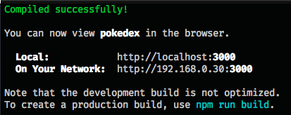
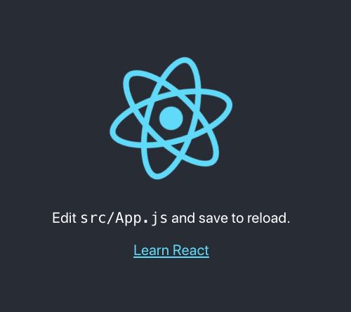

The Facebook team behind React have created a tool to help you create and set up React projects. It is called [Create React App](https://create-react-app.dev/). The official documentation is available [here](https://create-react-app.dev/docs/getting-started).

Install & set up a Create React App by following the steps below:

1. Open your terminal and `cd` to where you keep your projects
2. In your terminal, run (this may take several minutes to complete):

```
npx create-react-app@latest pokedex --use-npm --template @codeyourfuture
```

(Note: for the React module lessons, you should name your app `pokedex`, but if you are creating another app, you can name it whatever you like.)

3. Then run:

```
cd pokedex
```

4. Open the `pokedex` folder in your editor. Notice that create-react-app has created a bunch of folders for you. It has even made a new git repo in the folder and committed the files for you.

## Starting the app

To start running your application follow the steps below:

1. Open your terminal and `cd` to the `pokedex` folder we created previously
2. In your terminal, run:

```
npm start
```

This does two things:

1. Run a program on your computer that _watches_ your files and updates your application when you make changes. It also runs some checks for common bugs or problems in your code. An error message will be shown in your browser if it detects that there is a problem. When it has started it looks like this:



2. Opens a web browser with a link to your React app so that you can develop and test the changes you made. You should see a big rotating React logo:



**Don't** try to use "Open with Live Server" (in VSCode) as you have done previously. Your app will automatically reload the browser just like Live Server does.

## Stopping the app

You might notice that once you have run `npm start` your terminal will look different. This is because it is running the _watcher_ program. If you have a slower computer we recommend that you _stop_ the program when you are not using your React app.

To stop the program, open your terminal and press `Ctrl-C` (it's the same on Windows, Mac & Linux). Unfortunately, closing your terminal will **not** stop the program from running.

Once you have stopped running the program, your React app **will stop working**. To start it again, see the instructions above for starting your app.

## Bonus

You're done! You don't have to read more - you can now develop React apps on your computer. How do we get them onto the web so we can share them with others?

### Deployment with Netlify

If you have already learned to [deploy your apps from github using Netlify](./deployment-netlify/index.md), you can use the same process to deploy any React apps you created initially with create-react-app.

You may notice that Netlify automatically sets the following two config settings:

- Build command: `npm run build`
- Publish directory: `build/`

These are correct and necessary - don't change them.

(You should expect deployment of your React apps to be slower than your old "vanilla JS" apps, due to the build process that takes place.)
