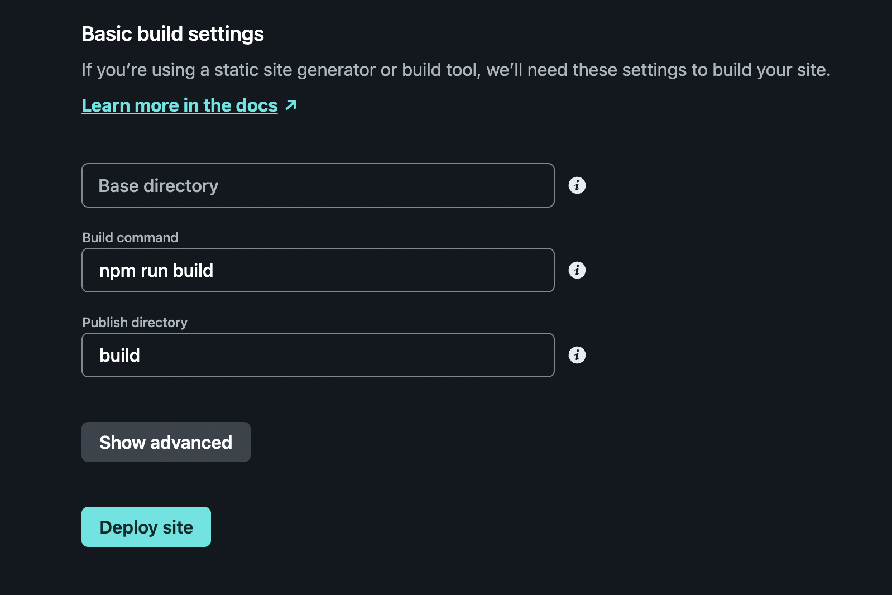
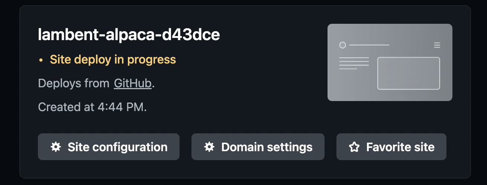
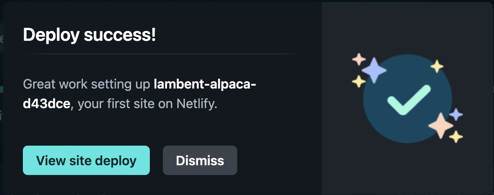
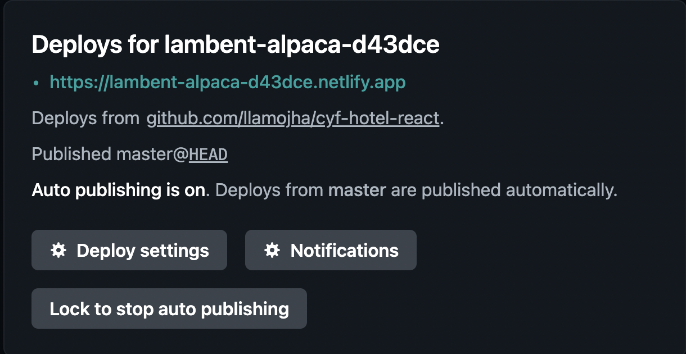

1. Log into [Netlify](https://www.netlify.com/) (remember that you sign in using GitHub)
2. On your Netlify dashboard, click "Sites" in the left navigation

3. Click on the "Add new site" button, then "Import an existing project"

4. This might be familiar now! Click "GitHub" as your Git provider

5. A pop up will show briefly, but then you'll see a list of your GitHub repos. Click on the relevant one

6. Under "Branch to deploy" choose the "main" branch of your repo, which is usually called `main`. You do not need to change anything under "Customize build settings", Netlify will do this for you

7. Set your settings to build the site. By default it will be build command `npm run build` and publish directory `build`. After that, Click the "Deploy site" button.

8. It may take a few minutes before the deploy is complete.

9. Once the site is deployed, a pop up will appear saying that the deploy was sucessful. Click on `View site deploy`.

10. Click on the `.netlify.app` url to visit your site.

