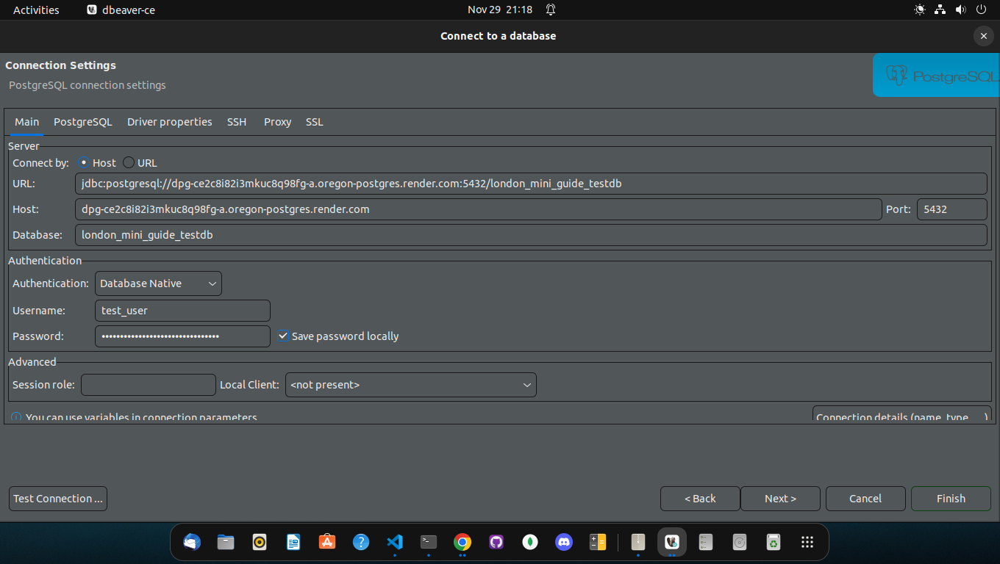
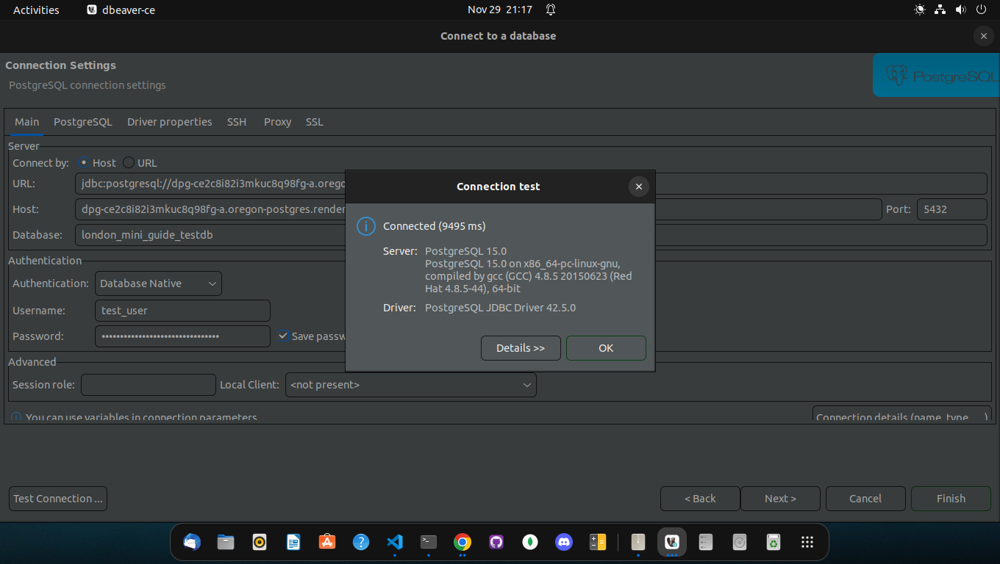

:::tip

This guide uses a database management system (DBMS) called [DBeaver](https://dbeaver.io/), but the ideas still apply if you are using another DBMS. If you are using another piece of software, try looking for similarly named controls.

:::

1. Navigate to the Database tab and select New Database Connection

2. Select PostgreSQL then click the Next button

3. Often, after the first installation or use of a specific database type, you may encounter the download of relevant drivers modal. This is perfectly normal, just click Download and proceed to the next step. DBeaver will download and install the relevant drivers needed for using your specific database type

4. To the right of Main tab, Click on PostgreSQL tab. Check the Show all databases checkbox and return to Main tab

5. Enter your database credentials into the form:
   1. URL: the External Database URL from your Environment Variables section on Render
   1. Host: the same External Database URL, **except** remove everything up to and including the `@` sign then remove everything after `.com`. It should look something like: `dpg-...-a.oregon-postgres.render.com`
   1. Database: the name you used for the Database field when [creating the database](./creating-a-postgres-db.md)
   1. Username: your username
   1. Password: your password

6. Click the Test Connection… button. You should see a modal displaying Connected message. Click OK, and then the Finish button

7. You are now connected to your Render PostgreSQL database on DBeaver!

## Warning/Failure messages

- You may see warning/failure messages like the one below (I did!)
- Not to worry, calmly step through the entire process slowly.
- After a few tries, if you don’t succeed, ask for help in the relevant communication channels

