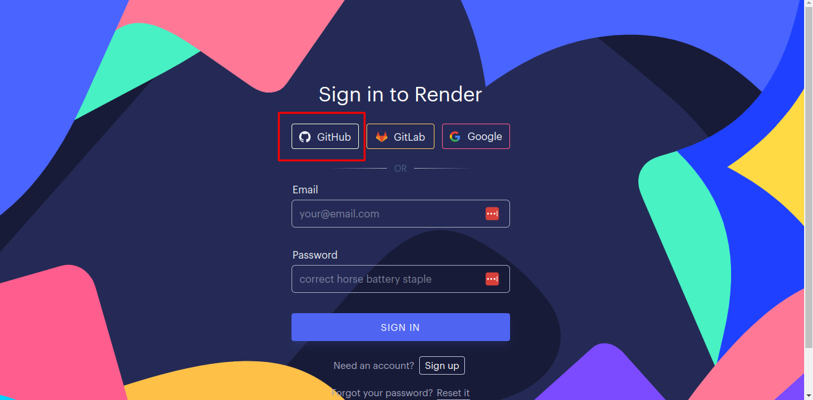
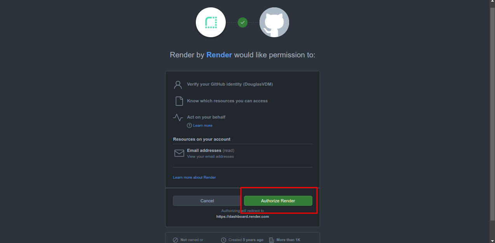
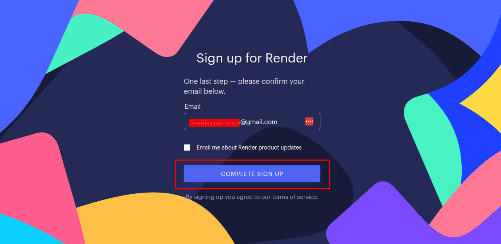
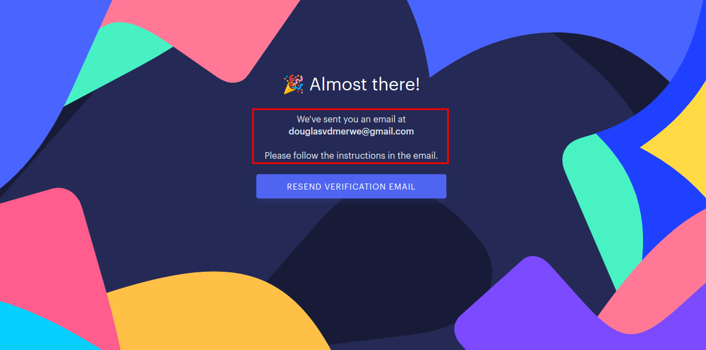
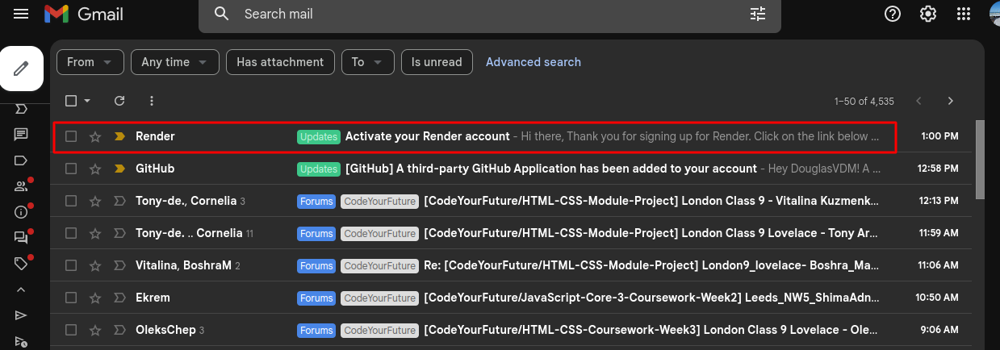
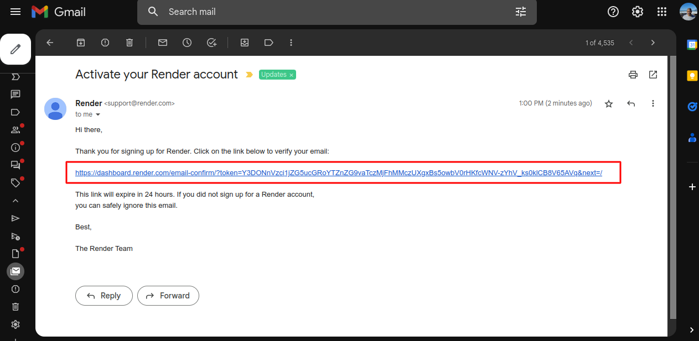
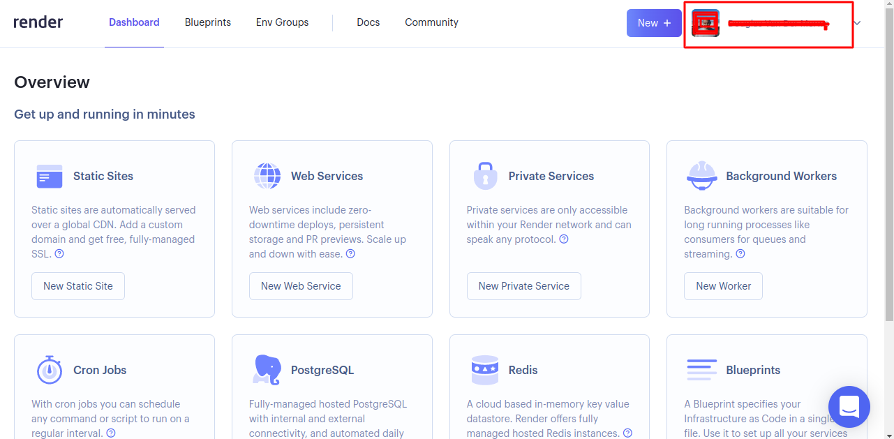

1. Click SIGN IN button

2. Choose Github as your sign in method

3. Click Authorise Render button

4. Click COMPLETE SIGN UP button

5. Head on over to your mailbox

6. Check your inbox for Activation request

7. Click the link to verify your email address

8. Taadaaaa! You’re in!

