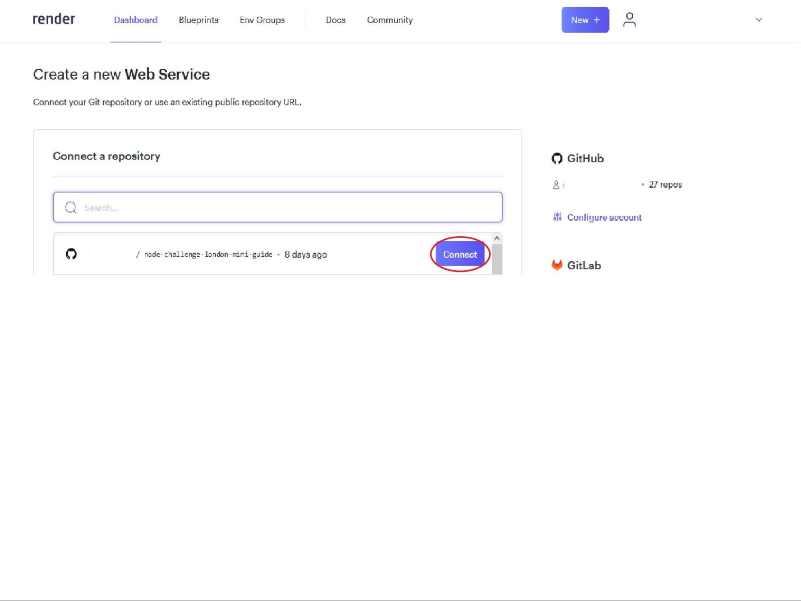
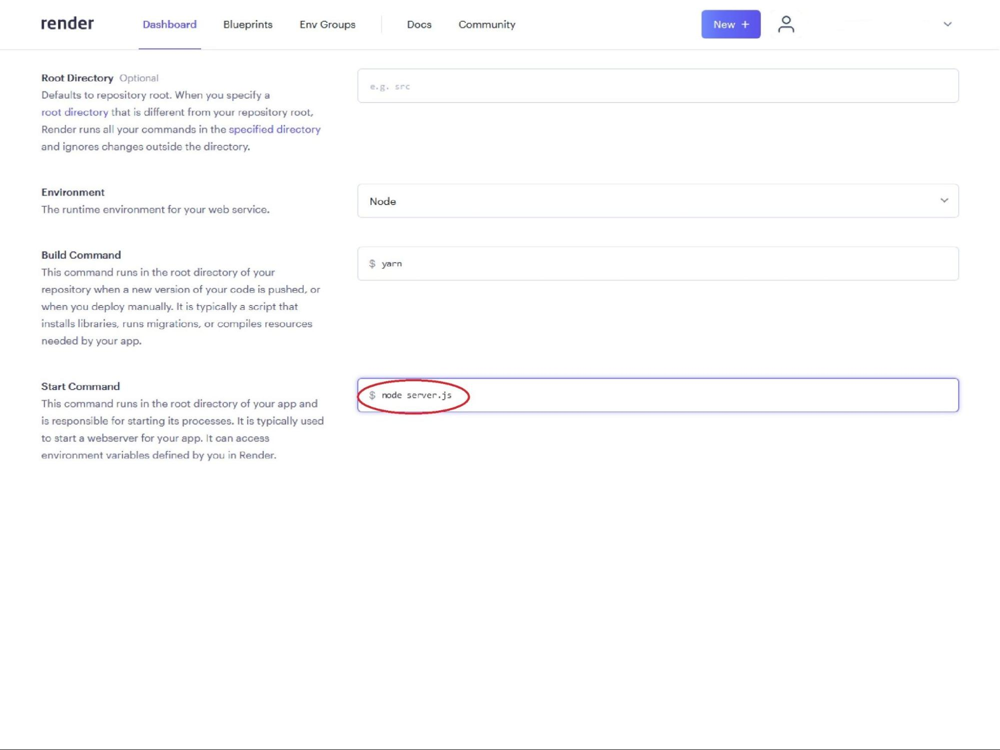

1. Make sure you have connected your GitHub account to Render (see [How to connect your GitHub to Render](./connecting-github.md))
2. Log into the Render dashboard

3. Click on the New + button

4. Click on Web Service from the dropdown list

5. Select your repo to connect to Render by clicking on the Connect button

6. Fill out the Name field, which will be used to label the server within Render

7. Provide a Start Command field. This should be in the format `node YOUR_FILENAME.js`, it is likely `node server.js`

8. Create your new server by clicking on the Create Web Service button

9. You should have been taken to the Build page for your new server
10. Wait for the build to complete (it may take a couple of minutes). It should display "Build successful" as well as "Live"

11. You can view your newly deployed server by clicking the URL at the top of Web Service page

