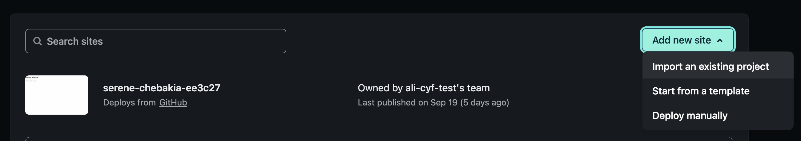

1. Log into [Netlify](https://www.netlify.com/) (remember that you sign in using GitHub)
2. On your Netlify dashboard, click "Sites" in the top navigation

3. Click on the "Add new site" button, then "Import an existing project"

4. This might be familiar now! Click "GitHub" as your Git provider

5. A pop up will show briefly, but then you'll see a list of your GitHub repos. Click on the relevant one

6. Under "Branch to deploy" choose the "main" branch of your repo, which is usually called `main`. You do **not** need to change anything under "Basic build settings", Netlify will do this for you

7. Click the "Deploy site" button
8. It make take a few minutes before the deploy is complete. Try refreshing your browser, when a `.netlify.app` URL appears then the site is live

<!-- 06-site-is-live.png -->

