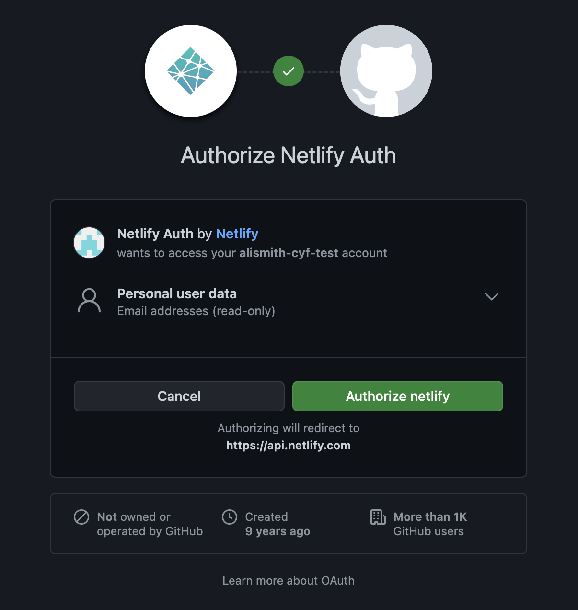
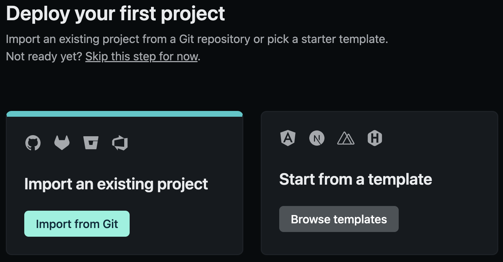
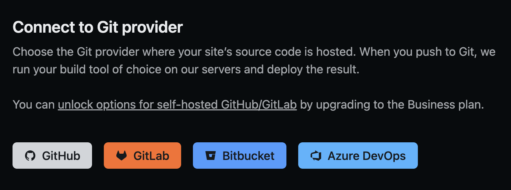
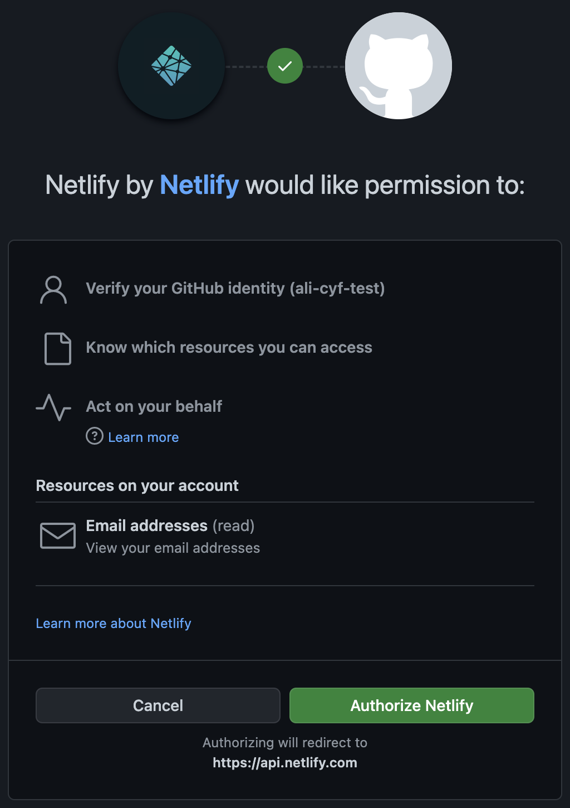
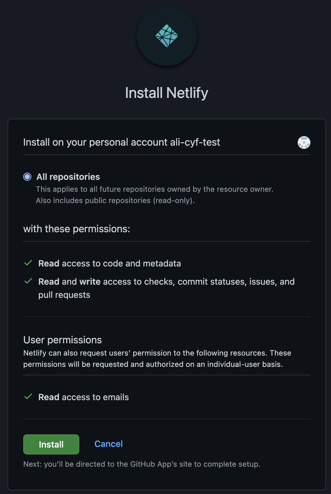

1. Visit https://www.netlify.com/ and click the "Sign up" button in the top navigation

2. Choose "GitHub" on the sign up page

3. If you are logged out of GitHub, then log in
4. Read the permissions and click the "Authorize netlify" button

5. If prompted to "Tell us about yourself", fill out the information. Note: only the "I'm using Netlify for" question is required, so you can skip everything else if you want
6. Click the "Import from Git" button

7. When asked to connect a Git provider, click the "GitHub" button

8. A pop-up window will ask for some more GitHub permissions. Click the "Authorize Netlify" button

9. You will be asked to "Install Netlify". If you are prompted "Where do you want to install Netlify", choose _your personal_ GitHub username. Do **NOT** choose Code Your Future's account, as this won't work!

10. Select the GitHub repo which you would like to create a site from

11. Under "Branch to deploy" choose the "main" branch of your repo, which is usually called `main`. You do not need to change anything under "Customize build settings", Netlify will do this for you

12. Click the "Deploy site" button
13. It make take a few minutes before the deploy is complete. Try refreshing your browser, when a `.netlify.app` URL appears then the site is live

