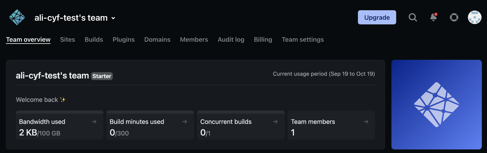
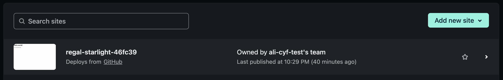
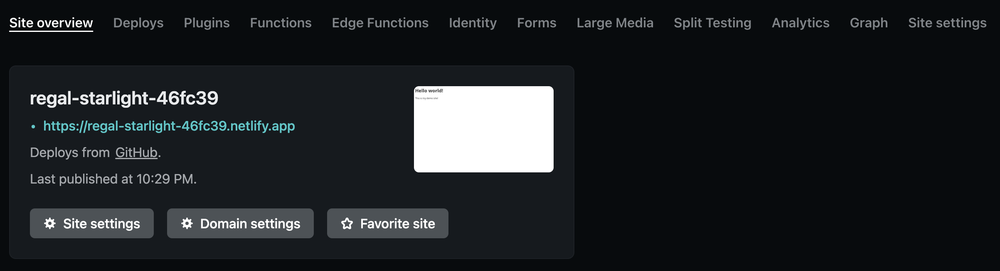

Once you have a site deployed, you may notice that Netlify has created a randomised `.netlify.app` URL to access it.

You may want to change this to a "friendlier" URL so that it is easier to remember and share. We also ask you to change the URL of sites you create for coursework, so that it is easier to for volunteers to find your site and give feedback. See [website naming conventions](./site-naming-conventions) for rules to name your site.

:::tip
If you already have the site open in Netlify, you can skip the first few steps!
:::

1. Log into [Netlify](https://www.netlify.com/) (remember that you sign in using GitHub)
2. On your Netlify dashboard, click "Sites" in the top navigation

3. Click on the site that you want to rename in the list of all of your sites

4. On the site overview page, click on "Site settings"

5. Scroll down to the "Site information" section and click "Change site name"

6. Enter your new site name and click "Save"

7. Your site should now be renamed! If you scroll to the top, the URL should be `NEW_NAME.netlify.app`. Try clicking to make sure that the URL still works
