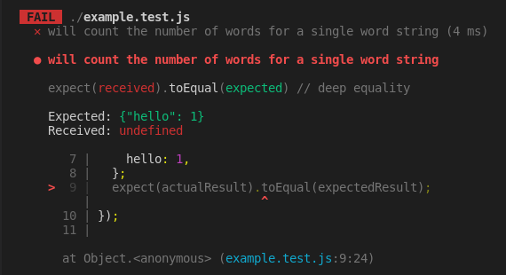

# Introduction to tests

## What does this cover

This introduction is designed to give you a high-level overview on the basics of testing, which you'll need when you're tackling the problems in your coursework at Code Your Future.
In this introduction to testing we'll cover the following things:

- Code specification
- What is a test ?
- Anatomy of a test ( using Jest )
- Understanding test feedback ( using Jest )

## Code specification

`createWordCount` 🧮

Let's consider a function called `createWordCount` that needs to work as follows:

- it takes one argument - a _string_ of words separated by spaces, e.g. `"hello world"`
- returns an _object_ with a count of each word in the string

The points above form a **specification** of how the function `createWordCount` should behave - in other words, the specification is a **description of how the function should work**. Once we have a specification for how the function should work we can create a number of cases showing how we expect the function `createWordCount` to behave when it is called with certain inputs.

### Case 1 🖊️

```js
const input = "hello";
const result = createWordCount(input);
```

In example 1, `input` stores a string `"hello"` which we pass as an argument to `createWordCount`.
We then store the return value of `createWordCount` in a variable called `output`.
In this case, we would expect the `output` to be:

```js
{ "hello" : 1 }
```

Remember that `createWordCount` needs to return an object with a count of each word in the string. In the case where the input is `"hello"` we only have a single word string and therefore a count of 1 for `"hello"`.

### Case 2 🖊️

```js
const input = "north by north west";
const result = createWordCount(input);
```

In example 2, `input` stores a string `"north by north west"` which we pass as an argument to `createWordCount`.
We then store the return value of `createWordCount` in a variable called `output`.
In this case, we would expect the `output` to be:

```js
{
    "north" : 2,
    "by" : 1,
    "west" : 1
}
```

## 🧪 What is a test ?

We can now define what a test is in software engineering.

> 🔑 A **test** is any piece of code that **checks a certain unit of code** ( typically a function ) **behaves in a particular way**.

For example, we could write a test to check that `createWordCount` behaves in the way we described above when passed a string containing a single word. For this example, we're using a popular JavaScript testing framework called [Jest](https://jestjs.io/docs/getting-started) to write the test code. We'll examine the example below written using Jest, and then break down the different parts of the test code to understand how it all works.

```js
test("will count the number of words for a single word string", function () {
  const input = "hello";
  const actualResult = createWordCount(input);
  const expectedResult = {
    hello: 1,
  };
  expect(actualResult).toEqual(expectedResult);
});
```

Let's break down the different parts of this test code.

## Anatomy of a test

#### 1. Test description

```js
test("will count the number of words in a single word string", function () {});
```

We use a function in Jest called `test` to write a test description - `"will count the number of words for a single word string"` which describes the behaviour we expect in this particular test. There is also a function `function () {}` in which we will write our test code.

#### 2. Test setup

```js
const input = "hello";
const actualResult = createWordCount(input);
const expectedResult = {
  hello: 1,
};
```

In this section, we're declaring some important values that we will need to compare later on in the test.
We declare an `input` variable that stores a value that we will pass to the function we are testing - `createWordCount`.
We declare an `actualResult` variable that stores the **return value** of our function `createWordCount`.
We declare an `expectedResult` which stores what we **expect** the `actualResult` to be when our function is behaving according to the test description.

❗ Note: The test setup will vary from test to test - so you can expect to see different variable names altogether in different tests. The setup here is done in order to make it clearer what values will be compared later on in the test.

#### 3. Assertion

```js
expect(actualResult).toEqual(expectedResult);
```

The assertion is the part of the test code that actually checks to see if something is true. In this example, we are claiming that the following is true:

> "We expect `actualResult` **to equal** `expectedResult`"

Notice that the statement above is very similar to the syntax used in the test code.

The function [`toEqual`](https://jestjs.io/docs/expect#toequalvalue) ( which is part of the Jest framework ) is used to check that `actualResult` ( `createWordCount`'s return value ) and `expectedResult` are equal to each other. There are [many other functions](https://jestjs.io/docs/using-matchers) like `toEqual` which we can use to make different assertions.

### Pass ✅ or Fail ❌

Finally, our test can either pass or fail.

- If `actualResult` is equal to `expectedResult` then the test has passed ✅.
- If `actualResult` is _not_ equal to `expectedResult` then the test has failed ❌.

## Understanding test feedback

Consider the extract from the test file `example.test.js`


After the test has run ( we'll learn how to run the test code in a separate guide later on), we will get some feedback from Jest depending on whether the test passed or failed.
If the test passes then we should expect to see something like this:


If the test fails, then we should get some feedback that looks like this:



Jest aims to give feedback that makes it simple to see why test has failed. It shows us several things:

- the line number for the failing test (line 9)
- shows us `expected` - which corresponds to our `expectedResult`
- shows us `received` - which corresponds to our `actualResult`

We can see the test feedback is telling us that `received` is `undefined`. In other words, `actualResult` ( `createWordCount`'s return value) is `undefined`.

## Further reading

Find out more about Jest by visiting the documentation [here](https://jestjs.io/docs/getting-started)
