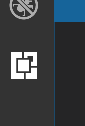
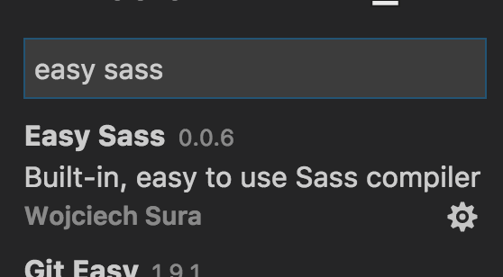

# Building SCSS with VS Code

* Create a file with a `.scss` extension. For example, `skin.scss`.
* Open the VS Code Extension manager, on the left.

  

* Search for the `Easy SASS` extension and install it. Click the "Reload" button.

  

* Edit your `.scss` file and save it.

* After saving your file, `Easy Sass` will create another file next to it, with a `.min.css` extension. This is the compiled code, ready to include in index.html.

  

* In your html, include the compiled code using a `link` tag. In the case of `css-skin`, replace `skin.css` with `skin.min.css` and remove the `skin.css` file, in order to avoid confusion.

  
