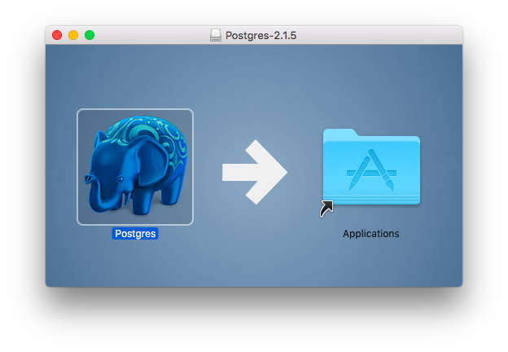

# Install PostgreSQL
## Let's Get Started
We shall be using PostgreSQL - a widely used relational database. It's open-source and free to use. If you haven't already installed it then follow the instructions below:

* If you use Ubuntu then see [here](#ubuntu-install).
* If you use Windows then see [here](#windows-install). Note: Strongly recommended NOT to use Windows!
* If you have Mac-OS then see [here](#macos-install).

If you get stuck at any stage please post a message requesting help on #nw*x*-entire-cohort channel.

If you don't use any of the above operating systems then please talk to a mentor about how to proceed.

---
## Ubuntu Install
---

If you have Ubuntu as your operating system you can install PostgreSQL using the following commands in the terminal (note: the `$` is the system prompt):
```
$ sudo apt-get install postgresql postgresql-contrib
```

Enter your ubuntu password when asked for it (it's needed for the `sudo` command).

For this command you must confirm that you are happy to install the packages and any needed dependencies that the package manager identifies. Generally just type `Y` or `y` to proceed.

To verify your installation enter the following commands:
```
$ sudo -u postgres psql --version
```
Again, enter your Ubuntu user password when prompted. The command should display something like this:

    psql (PostgreSQL) 12.2 (Ubuntu 12.2.4)

### Create Your User and Database
Create the database user with the same name as your Ubuntu username (this makes logging in a bit easier):
```
$ sudo -u postgres createuser -P --createdb <username> 
```
This will ask for your Ubuntu login password to run the sudo command. The other parts of the line are:

    -u postgres       tells sudo to run createuser as user postgres (set up when you installed postgres)

    createuser        the shell command to create a PostgeSQL user

    -P                (upper case) tells createuser to ask for the new user's password

    --createdb        grants the user the privileges to create databases

    <username>        the new username (hint: make it the same as your o/s username)

You'll be asked for the new database user's password (twice) - you'll need this later for when we connect to the database from Node.

***Remember the new username and password details - you will need them later.***

### Creating a new database

In a terminal, create a new database named `cyf_hotel` with the following command:

```
$ createdb cyf_hotel
```

Then connect to your database with:

```
$ psql cyf_hotel
```
Note that if you chose to use your Ubuntu username for the database you don't need it (or the password) to log in to `psql`. If you used a different username then you'll need to log in with:
```
$ psql -U <username> cyf_hotel
```
and you'll be prompted for the password.

The output from this command should look something like this:
```
    psql (12.2 (Ubuntu 12.2.4))
    Type "help" for help.

    cyf_hotel=>
```
The last line (`cyf_hotel=>`) is the `psql` command prompt, made up of your database name plus '=>'.

Note that to exit psql back to the terminal prompt use the command `\q`.

### Ubuntu Install Complete
---
## Windows Install
---
**Note that you must be logged in as a user with Administrator privileges on Windows for all these steps.**

If you have Windows as your operating system you can install PostgreSQL from the installer executable. Download this from https://www.postgresql.org/download/windows/ but make sure you choose PostgreSQL version 12 for 64-bit or version 10 for 32-bit. Once you have downloaded the installer then run the file (postgresql-12.3-2-windows-x64.exe or similar). The installer prompts for various information as it initialises and you can mostly take the default values. Make a note of the installation folder when prompted for it - you don't need to change it. You must, however, provide a password for the postgres user - make sure you remember this password!

If prompted to configure StackBuilder at the end of installation, just click Cancel - we won't need it.

Before you can use any of the command line tools you must first add the PostgreSQL software to your PATH variable.  This is a bit convoluted on Windows so please go carefully:
1.  In the File Explorer find This PC and right-click on it.
2.  In the menu select Properties
3.  In the properties dialog (Control Panel) click on the Advanced system settings option (on left hand side)
4.  In the System Properties dialog, Advanced tab, click the Environment Variables button near the bottom of the window
5.  In the Environment Variables window, in the top half (User variables for ...) select the Path variable then click Edit
6.  In the Edit environment variable window first check that the PostgreSQL pathname hasn't been added already by the installer (if it has you can cancel out of all these dialogs)
7.  To add the PostgreSQL pathname you must click the New button on the right then type (or paste) the path `C:\Program Files\PostgreSQL\12\bin` into the new entry space. (Note: if you installed version 10 or 11 then the pathname will be slightly different - check using File Explorer)
8.  Click the OK button in each dialog to exit back to the Control Panel window, which you can just close normally

If the next step (trying the `psql` command) fails you may need to log out and log back in again to apply the new PATH variable.

The default installation provides only one user and no databases. To verify your installation open the Command Prompt and enter the following command:
```
    C:\...> psql -U postgres --version
```
Enter the password for user `postgres` (defined during installation) when prompted. The command should display something like this:

    psql (PostgreSQL) 12.2

### Create a User and the Database
PostgreSQL initially uses an authorisation mode that depends on the operating system username; that is why we had to switch to user `postgres` to verify our installation because the installer only creates this user.

You must create a user that you can use to access PostgreSQL, one that is not `postgres` (which we shouldn't use for normal work). You can use your operating system (Windows) username and this makes access to the database easier. To find your Windows username start a command prompt session and you should see your username in the prompt, for example:
```
C:\Users\keith>
         ^^^^^ is my username
```
Now create the PostgreSQL user that you'll use for the lessons
```
C:...> createuser -U postgres -P --createdb <your user name>
```
You must supply the password for the `postgres` user for this command.

Obviously you substitute your own username for `<your user name>`, so for me (keith) I would use:
```
C:\Users\keith> createuser -U postgres -P --createdb keith
```
To create a database you can now use your new username:
```
C:\...> createdb -U <your user name> cyf_hotel
```
On Windows you'll need to enter your password for the new account each time you use the username. To access your new database you just need to enter:
```
C:\...> psql -U <username> cyf_hotel
```
then enter your password when prompted.

Windows users need to change the console character code page for each new session. Issue the command:
```
C:\...> chcp 65001
```
to set the current code page to use UTF-8 encoding. You will see a warning message when you enter `psql` as follows:
```
WARNING: Console code page (65001) differs from Windows code page (1252)
         8-bit characters might not work correctly. See psql reference
         page "Notes for Windows users" for details.
```
Please ignore this - your setting will allow psql to display customer names, etc., which are stored in UTF-8 format, correctly.

### Enabling Passwordless Logins
If you have chosen your username as the same as your windows user you can allow passwordless logins from your own PC. To do this you need to modify a configuration file. Locate the file `pg_hba.conf` in the installation directory's `data` subdirectory. For example, if the installation directory is:

    C:\Progam Files\PostgreSQL\12

then look for `pg_hba.conf` in `C:\Program Files\PostgreSQL\12\data`.

Open this file using your favourite text editor (Visual Studio should work OK). Scroll down past all the comment lines (starting with `#`) until you find the header line:

    # TYPE  DATABASE        USER            ADDRESS                 METHOD

You should find a number of non-comment lines below this - these define login methods for different situations. Enter the following line just below the header line:

    host    cyf_hotel       all             ::1/128                 trust

Save the changes.

Finally you must restart the PostgreSQL service so that the configuration changes are used. To do this right click in the taskbar at the bottom of the screen and choose Task Manager. Click the Services tab and locate the postgresql service (named `postgresql-x64-12` or similar). Right click and choose Restart.

From here onwards you shouldn't need to switch to the postgres user again nor enter a password. You can get into the PostgreSQL command-line tool using just:
```
C:\...> psql cyf_hotel
```
This connects you to the database named cyf_hotel and connects as the same username as your Windows user.

The output from this command should look something like this:
```
    psql (12.4)
    Type "help" for help.
    WARNING: Console code page (65001) differs from Windows code page (1252)
         8-bit characters might not work correctly. See psql reference
         page "Notes for Windows users" for details.
         
    cyf_hotel=>
```
Note that to exit psql back to the terminal prompt use the command `\q`.

### Windows Install Complete

---
## MacOS Install
---
### Two Methods to Install on Mac OSX
With the Apple Mac you can choose either a graphical installation or a command line method. The graphical method mostly involves dragging and dropping icons with a little bit of command line to configure the tools we need. The command line method uses only command line but is fairly simple.

### Graphical Installation
**Note that you must be logged in as a user with Administrator privileges on OSX for all these steps.**

From the Macintosh OSX system you can install PostgreSQL from the Postgres.app package. Download this from https://postgresapp.com but make sure you choose the latest stable version of PostgreSQL and the appropriate platform for your Mac. Once you have downloaded Postgres you can open the disk image from your Downloads folder. Drag the Postgres icon to the Applications folder.



Open Applications in the Finder and start Postgres. When you receive the alert **"Postgres" is an application downloaded from the internet...** then click on the Open button. You may be prompted for other options (e.g. auto update, ...) and you can choose your own preference.

When the PostgreSQL window appears then click on the Initialise button to create your local PostgreSQL database and user - they will both have the same name as your OSX username.


PostgreSQL initialises itself, creating the initial databases (`template1`, `postgres` and `<your user name>`) along with corresponding users. These should then be displayed in the PostgreSQL window, as below:


### Configure the Command Line Interface (CLI)
To use the PostgreSQL command line tools you need to add the directory to your path (used to find commands in the terminal). There are several ways to do this but the simplest is to create a file containing the directory path name. Open the terminal and enter the appropriate commands from the list below (note: you may not need to create the directory):
```
    # First check the destination directory exists:
    ls /etc/paths.d/
    # If the directory doesn't exist then create it:
    sudo mkdir /etc/paths.d
    # Create the path entry for Postgres:
    echo /Applications/Postgres.app/Contents/Versions/latest/bin | sudo tee /etc/paths.d/postgresapp
```
From the terminal you can now type the simple command:
```
    psql
```
and this should produce something like the following:
```
    psql (12.4)
    Type "help" for help.

    keith=#
```
The final line is the psql command prompt, waiting for you to enter a command. It comprises your database name (created with the same name as your username, in the example this is 'keith') followed by '=#'. 

You are going to rename the database to `cyf_hotel` for the purposes of this course, so from the psql prompt (as above) first disconnect from your database by connecting to database `postgres`:
```
keith=# \connect postgres
```
Now, still at the psql prompt, rename the database:
```
keith=# alter database keith rename to cyf_hotel;
```
Clearly, you'll use your own name as the name of the database to be renamed.

Note that to exit psql back to the terminal prompt use the command `\q`.
### MacOS Graphical Install Complete
---
### MacOS Command Line Installation
You need Homebrew installed on your Mac to use this approach. If you don't yet have it then you should probably use the graphical method. If you already have Homebrew installed then the following command installs PostgreSQL:
```bash
brew install postgresql
```
This will install the software, set up the postgres user and a user with the same name as your Mac OS user and create some databases. It should leave the PostgreSQL server running on your Mac but if you power off the machine you'll need to restart it. To restart the server, type:
```bash
brew services start postgresql
```
This starts the server and ensures that it will be started each time you power up your Mac. Note you can stop the server at any time by using:
```bash
brew services stop postgresql
```

