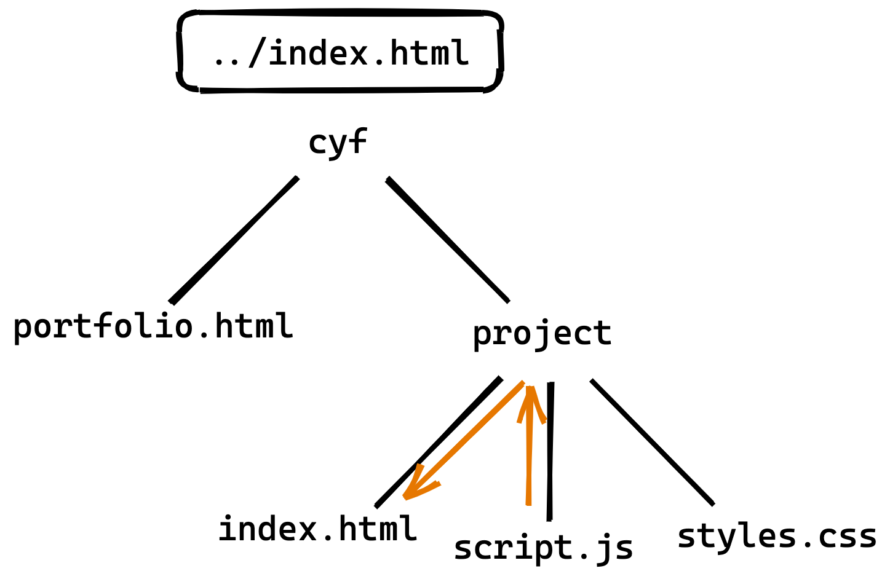

# Module systems in JavaScript

## Learning objectives

- The learner can explain why a module system is useful
- The learner can use CommonJS to import a module
- The learner can use relative file paths to import a module
- The learner can use CommonJS to export from a module
- ~The learner can use NPM to install all packages in a cloned repo~ I think we would have already covered this
- The learner can use NPM to install a package in an existing repo
- The learner can use ECMAScript Modules to import and export a module
- The learner can identify when to use CJS and when to use ESM

## Why do we need a module system?

### Separating our code into understandable chunks

As our code gets more complex, it becomes more difficult to manage and understand. Real-life programs may have tens of thousands or millions of lines of code. At this scale, it is impossible for people to remember everything about how the code works.

To help with this problem, we can divide our codebase into _modules_, bundling together specific functions and variables. Each of these modules usually has a specific purpose, which allows us to "forget" how some parts of the whole system work, focusing our understanding on a few pieces.

Let's imagine we're working on a codebase that has 1 million lines of code and we need to update the user payments system and how "widgets" in this imaginary system are updated or deleted. This diagram shows how much of the codebase you would need to understand to make those changes with and without a module system:


As you can see, a module system is very helpful when trying to make changes to a large system.

:::tip
We sometimes call this _separation of concerns_.
:::

### Using third-party libraries

Another reason we use a module system is that it allows us to use code written by other programmers. We can be lazy and let others do the work for us!

There are a **huge** number of modules written by other programmers (usually called _packages_) available for us to download and use in our applications. This gives us superpowers to solve complex problems more quickly, since many common problems have already been solved for us. We'll look later at how we can do this in our own applications.

## How does a module system work?

As we've just seen, a module system helps us to split our code into smaller modules.

:::tip
In nearly every module system, a "module" is really just another name for a file. So we'll just call a "module" a "file" from now on.
:::

Once we've divided our code into separate files, we need some way of accessing code in another file. We do this by _importing_ and _exporting_ variables/functions. Let's look at how this works in a very popular module system.

## Using CommonJS

The first module system we'll look at is called CommonJS (or CJS for short). It's not really important to know the name to be able to use it, but we'll use the names to compare it with another module system later.

### The `require` function

The `require` function is how we import code from another file into our current file.

```js
const findWidget = require("./widget-finder");

findWidget({ id: 1 });
```

Let's break this example down into separate pieces.

First, we declare a new (constant) variable, `findWidget`. There's nothing special about this variable. It works just like any other `const` variable.

Next we call the `require` function. This function is provided automatically for you, so you don't need to write it, It's always available to you in your code.

We pass a string as the only parameter to the `require` function. This string contains what is know as a _file path_, which we'll talk more about in a bit.

Finally, we call the imported function as we would with any "regular" function.

### File paths

File paths are used to describe where to find a file in your file system (the files & folders on your computer). This is really useful for lots of different things and so is a common concept in many programming languages.

When building file paths, we must always know two "locations", a starting location and a destination location. In this case, a "location" means a file in your file system.

Once we know our two locations, a file path is made up of a list of folder or file names needed to "navigate" from the starting location to the destination location. Each folder or file name is separated by the slash character (`/`).

:::tip
File paths work a bit like signposts next to a path: based on where you are currently, which folders do we navigate through to get to our destination?
:::

Let's look at an example. For this example, we'll imagine the folders on our computer look like this:

```
mycomputer
└── cyf
    ├── portfolio.html
    ├── project
    │   ├── index.html
    │   ├── script.js
    │   └── styles.css
    ├── coursework
    │   ├── exericse1.js
    │   └── exercise2.js
    └── notes
        └── js3
            └── week1.txt
```

:::info
This style of "drawing" folders comes from a command line program called `tree`. The name refers to the idea that your file system is structured like a bit like a family tree.
:::

As mentioned above, we need a starting location and a destination location to build a file path. For this example, we'll say that:

- The starting location is the `script.js` file inside the `project` folder
- The destination location will be the HTML file in the same folder

Based on this, we can build a file path:

```
./index.html
```

Let's break this down into pieces:

- We start off with a dot character (`.`). This has a special meaning in file paths. It is a shortcut that means the folder of the starting location. So in this example, it means the JS3 `project` folder
- Next there's a slash character (`/`). This separates the current folder that we just saw from next piece, the `index.html` file
- Finally we have the name of the destination location, in this case `index.html`



In "plain English", we could say: `

> Starting in the folder of the starting location, look for a file named `index.html`

This is the most simple file path, now let's look at something more complex. Again, using our imaginary file system above, let's say:

- The starting location is the `script.js` file inside the `project` folder
- The destination location will be the `portfolio.html`

The file path will therefore be:

```
../portfolio.html
```

This file path looks quite similar, we have some folder or file names separated by slashes. The main difference is the two dots at the start, which also has a special meaning for file paths. a shortcut to the **parent** folder of the starting location.


In "plain English", we could say:`

> Starting in the folder of the starting location, move one level "up" the tree, then look for a file named `portfolio.html`

For our final example, we'll say:

- The starting location is the `script.js` file inside the `project` folder
- The destination location will be the `exercise.js` file inside the `coursework` folder

The file path will therefore be:

```
../coursework/exercise1.js
```

Now we're using multiple slashes to move between the `project` folder and the `coursework` folder.


In "plain English", we could say:

> Starting in the folder of the starting location, move one level "up" the tree, then move into a folder named `coursework`, then look for a file named `exercise.js`

| Exercise A                                                                                                                |
| ------------------------------------------------------------------------------------------------------------------------- |
| If the starting location is the `script.js` in the `projects` folder, what is the file path when the destination file is: |
| 1. `styles.css` in the `projects` folder                                                                                  |
| 2. `exercise2.js` in the `coursework` folder                                                                              |
| 3. `week1.txt` in the `js3` folder                                                                                        |

You might start to recognise the file path patterns! You've actually already used file paths when using the `git add` command, although you might not have realised it. File paths are used in many other commands too.

As we looked at earlier, we can also use file paths when importing files in JavaScript. We can now explain what this code does:

```js
const findWidget = require("./widget-finder");
```

Now we know that the `./widget-finder` file path refers to a file in the same folder called `widget-finder.js`. We can write out the `.js` bit if we want, but if you leave it off, then the module system will assume that you mean `.js`.

So when we run this code, the module system will look for the `widget-finder.js` file and import it into the current file.

### `module.exports`

We've seen how we import code into our files, but we also need to see how we _export_ code too.

To understand why we need to export as well as import, let's think about shipping products between countries in real-life. Some products we want to remain in the country, and some we want to export. With our code, we also want to choose what should only remain in the file, and what should be exported.

Now, let's look at how we export code using the CommonJS module system:

```js
function findWidget(id) {
  // ...
}

module.exports = findWidget;
```

Here, we've defined a `findWidget` function just like any other function. The important bit here is that we've then assigned a special `module.exports` variable to the `findWidget` reference. Remember that when we define a function like this, we also create a reference that can be used like any other variable.

In this example, we're exporting only one "thing". This is often useful, but sometimes we may want to export multiple things. We can still do this with `module.exports` by instead exporting an object, which then contains the things we want to export:

```js
function findWidget() {
  // ...
}
function findAllWidgets() {
  // ...
}

module.exports = {
  findWidget: findWidget,
  findAllWidgets: findAllWidgets,
};
```

Then when we import this file, we get access to the object that was exported, from which we can then get access to the things inside it:

```js
const widgetFinderExports = require("./widget-finder");

const findWidget = widgetFinderExports.findWidget;
const findAllWidgets = widgetFinderExports.findAllWidgets;
```

## NPM

_Node Package Manager_ - or NPM for short - is a massive collection of JavaScript code that you can download and use in your apps (for free!). This is extremely helpful for us, as we can concentrate on the specific problem we want to solve, which helps build our apps faster.

As the name implies, NPM is a tool for managing _packages_. So what is a package? Packages aren't anything special really! They're made up of JavaScript files, just like any other file that you've written. A developer has then uploaded those files into the NPM collection, allowing any one to dowload them and use them for free.

### Installing packages

You might remember that you have already used NPM in earlier modules to run tests on your coursework. This is because the teachers are using some packages to help us write the tests!

:::info
Testing libraries are a good example of why you might want to install a package. Instead of writing lots of code to write and run useful tests, we can install someone else's code that does this for us. We can focus instead on building our apps.
:::

As you might remember, before we can run the tests, we must first run `npm install` in the repo. The first thing that this command does is work out which packages we need to install for this particular repo. It does this by looking in a file called `package.json`.

Let's take a look inside this file to see how NPM figures out the packages.

```json
{
  ...

  "dependencies": {
    "cowsay": "^1.5.0"
  }

  ...
}
```

There's often quite a lot of information in `package.json`, but for now we're going to focus on one part. The `dependencies` object lists the names of all of the packages that are used by our application. For this example we only have one package, called `cowsay`, but you can have as many as you'd like.

The string after the `cowsay` part isn't important to fully understand right now, but it does tell you which version of the package is supposed to be installed.

If you look at your coursework repos, you might notice that there is also a `devDependencies` section. This works exactly the same as `dependencies` but is for packages that are only used by developers. Again it's not really important to understand the difference at this point.

Now we know where to look, we can understand that running `npm install` will mean that NPM looks in the `package.json` file for the `dependencies` section and downloads all the files for those packages so that you can use them on your computer.

| Exercise B                                                                               |
| ---------------------------------------------------------------------------------------- |
| 1. Clone [this repo](https://github.com/40thieves/module-systems-exercises) from Github. |
| 2. Run `npm install` in the repo.                                                        |
| 3. Run `npm run cowsaying`.                                                              |
| 4. What happens? Discuss with a classmate what you think happens and why.                |

### Using packages in our apps

Now that we've looked at how NPM installs packages on our computers, how do we get access to them in our apps? Let's take a look at an example:

```js
const cowsay = require("cowsay");
```

It's the `require` function again! This is why NPM is so useful: it does all the hard work needed so that we can import the package just like any other file.

You might have noticed that the argument given to `require` is a bit unusual. There's no `./` or `../`. This is because it's not actually a file path!

When we `require` a package, we can use a special syntax that is just the name of the package. Since there are no dots at the start, the module system knows it needs to look for a package and not a file that we've written.

### Installing a new package

We've just seen how we can install packages that are specified for us by someone else. But we can also use NPM to install new packages ourselves!

If we run:

```
$ npm install my-package
```

This will do a couple of things:

1. NPM downloads the files, just like we've seen `npm install` do already
2. Adds `my-package` to the `package.json` file

This means that not only will you able to use the `my-package` package in your code, but if someone clones your repo, then they would also download the package when they run `npm install`. This is really helpful when writing applications in teams: we can guarantee that anyone who clones and installs your repo will have the packages available on their computer.

| Exercise C                                                                                                      |
| --------------------------------------------------------------------------------------------------------------- |
| 1. In the repo that we cloned in Exercise B, run `npm install figlet`.                                          |
| 2. Open up `exercise-c.js` in VSCode. Take 5 minutes to read the code and discuss what it does in small groups. |
| 3. Add `const figlet = require("figlet");` at the top of the file.                                              |
| 4. Run `npm run ascii`.                                                                                         |

## Using ECMAScript Modules

In some code that you see on the internet, you may find a different module system being used. Don't panic! It is very similar to the CommonJS system that you just learned about.

This new module system is typically called ECMAScript Modules, or ESM for short.

Why are there 2 module systems? Unlike `require` & `module.exports`, which use bits of JS that use already know (functions, variables and objects), the ESM system introduces some new syntax. ESM is built into the language itself.

### The `import` keyword

Let's look at how we import code using ESM. Instead of calling the `require` function, we instead use the `import` keyword:

```js
import findWidget from "./widget-finder";

findWidget({ id: 1 });
```

Let's break this down into pieces:

- First we write the `import` keyword to tell JS that we want to import some code
- Next, we declare a variable called `findWidget`. Although it doesn't look like it, this is basically the same as writing `const findWidget`
- Then we have the `from` keyword which tells JS where we want to import the code from
- Finally we use another file path to describe where the file is

### The `export` keyword

Exporting using the ESM system is also very similar to CJS. We just swap `module.exports` with the `export` keyword:

```js
function findWidget(id) {
  // ...
}

export default findWidget;
```

Similar to CJS, we've defined a `findWidget` function just like any other function. The important bit here is the `export` keyword, which tells JS that we want to export the `findWidget` reference. Remember that when we define a function like this, we also create a reference that can be used like any other variable. We can now import the `findWidget` function into the rest of our app.

You might notice we also added another keyword, `default` when exporting `findWidget`. This tells the module system that this is the "main" export from this file. If you only have one thing that you'd like to export, then we tend to make it a `default` export.

Sometimes you might see the export shortened to this:

```js
export default function findWidget(id) {
  // ...
}
```

Here, we're defining the function and exporting it (as the `default`) in same line.

If we want to export more than "main" thing from a file, then we can leave off the `default` keyword:

```js
export function findWidget() {
  // ...
}

export function findAllWidgets() {
  // ...
}
```

In this code, we've marked both the `findWidget` and `findAllWidgets` with the `export` keyword, which means they'll both be available as exported functions.

Then when we import this file, we can use some slightly different syntax with the `import` keyword:

```js
import { findWidget, findAllWidgets } from "./widget-finder";
```

We now have access to both the `findWidget` and `findAllWidget` functions.

:::tip
You can think of this `import` syntax like destructuring an object.You can imagine that we are importing an object from the `widget-finder` file, then destructuring the exported references out of that object.
:::

## Using module systems in your code

Unfortunately, deciding which module system to use is currently quite complicated. Both systems are actively being used in different apps, but often they are **incompatible** with each other 😕

The main reason for this is that ESM was created after CJS and so a lot of older code has not been moved away from CJS. To make things worse, in some cases, it is currently impossible to move code to ESM.

For example, when running code in Node, then CJS will tend to work much better than ESM. Similarly when running code in a browser, then CJS will not work at all, but ESM will work.

:::tip
The rule of thumb is when your code will run in Node then you should use the CJS module system. And when your code will run in the browser, use the ESM module system.
:::
