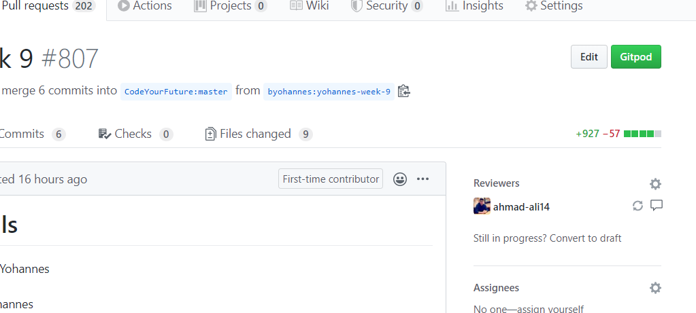

# Feedback Guide

In this document you will find the feedback guide for the TV-Show project.

Whenever we do work we can always make it better and pointing out ways that somebody else project can be improved is always good! You should never feel bad about suggesting improvements to other peoples code - it's how we improve!

## Viewing The Code To Review

You can retrieve other peoples code by

1. Cloning their project on Github
2. Switching to the branch that they have been working on
3. Opening in VSCode

You can find the branch that they have been working on inside the small blue area

If you have any problems getting setup - ask the person that you're reviewing as they will be able to help you.

## Leaving Feedback

We give feedback to people by adding comments on their pull requests.

You can do this by

1. Open the person's pull request
2. Go to the `Files changed` tab
3. Move your cursor to the line number you want to comment on
4. Click the blue `+` symbol
5. Write your comment
6. Click submit

You can find an example of the blue `x` here:

## Review Guidelines

### Positive Feedback

When giving feedback it is also very important to comment on anything that is cool or that you really like!

- Did the person add extra functionality which is really cool?
- Did the person make their website look extra nice?
- Did the person do something cool in their code that you haven't seen before?

Add a comment in their Pull Request to let them know that you like what they've done!

### Code Style

Code style is about finding writing code that is easy to understand.

- Does code use variable names that are related to what the variable does?
  - `let fruit = "apple"` is good
  - `let xyd = "apple"` is bad
- Does code use function names that are related to what the function does?
  - `function getFilms()` is good
  - `function doWork()` is bad
- Is the code well indented?
  - See [here](https://courses.cs.washington.edu/courses/cse154/18au/resources/styleguide/js/spacing-indentation-js.html) for an example
- Does the code use comments to explain what is happening on parts that are hard to understand?
- Does the code use `functions` well to break up the code into easy to understand parts?
- Is the same code duplicated in multiple places through the project?
  - They should use a function instead the code is easy to understand
  - This is something called a [Code Smell](https://sourcemaking.com/refactoring/smells)
- Is the code easy to understand?
  - If there are any parts you don't understand - ask them to explain to you!
- In places where they use a `for` loop, could they have used an array method instead?
  - `array.forEach()` is good
  - `for(let i = 0; i<length; i++)` might be good to improve
- Does the code use `Scope` well?
  - Wherever possible variables should be inside functions when they can be - it's bad to put LOTS of variables at the top of your javascript when they don't need to be.

Find some other ideas on how people can improve their code in [AirBnB's Style Guide](https://github.com/airbnb/javascript)

### Functionality

Before starting this section, check which `Level` the student has completed up until. We don't want to ask them to change functionality that doesn't work yet!

- Does the website do everything that it is meant to?
- Is the website easy to use?
  - The first time you open the website - is it obvious where everything is
- Does the website load quickly and respond quickly when you use it?
  - If people write too much or too complex JavaScript your browser can slow down

### Bugs

When using the website you might find some bugs that they did not notice when making the website

- If you have noticed a bug in their code - you can suggest a fix for it
- If you find a bug when using their website - leave a comment on their Pull Request with instructions of
  - What happened to make bug happen
  - What the bug is
  - Ideas on how to fix it

### Design

In this section we want to evaluate if the project is nice too look at and to use.

- Are the colours they use on their website nice to look at?
  - Can you suggest any changes in colour?
- Is all the text easy to read?
  - Make sure they haven't put dark text on a dark background as this is hard to read for some people
- Are images the right size in each card?
  - Sometimes images can look distorted if they've been loaded incorrectly
- Is the text on the website the correct size?
  - Is the text too large?
  - Is the text too small?

You should also thing of other ways that the design could be improved and suggest them!
