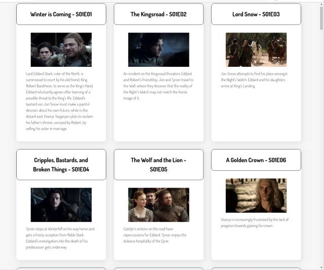

# Level 100 - Minimal features:

1. All episodes must be shown
1. For each episode, AT LEAST following must be displayed:
   1. the episode's name
   1. the season number
   1. the episode number
   1. the episode's medium-sized image
   1. the episode's summary text
1. You should combine season number and episode number into an **episode code**:
   1. Each part should be zero-padded to two digits.
   1. Example: `S02E07` would be the code for the 7th episode of the 2nd season. `S2E7` would be incorrect.
1. Your page should state somewhere that the data has (originally) come from [TVMaze.com](https://tvmaze.com/), and link back to that site (or the specific episode on that site). See [tvmaze.com/api#licensing](https://www.tvmaze.com/api#licensing).

## Screenshot of minimal version

Note: Provided your project meets the above requirements, it can **look** however you want.

Here is one example layout.

[top](./readme.md) - [level 200 >>](./level-200.md)
