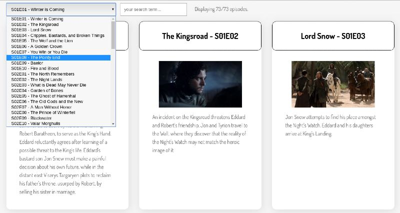

# Level 300 - Add an Episode Selector

1. Complete all requirements from level 200
1. Add a `select` input which allows you to jump quickly to an episode:
   1. The select input should list all episodes in the format: "S01E01 - Winter is Coming"
   1. When the user makes a selection, they should be taken directly to that episode in the list
   1. Bonus: if you prefer, when the select is used, ONLY show the selected episode. If you do this, be sure to provide a way for the user to see all episodes again.

### Example screenshot of Episode Selector

Note: Provided your project meets the above requirements, it can **look** however you want.

Here is one example layout.

[<< level 200](./level-200.md) - [top](./readme.md) - [level 350 >>](./level-350.md)
