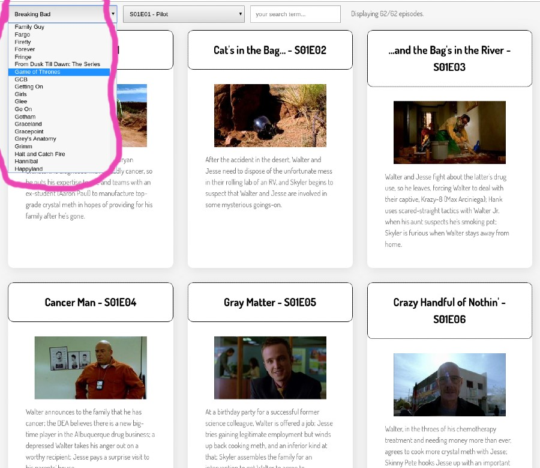

# Level 400 - Add a Show Selector

**Pre-req**: For this level you will have to have learned to use fetch() to `GET` JSON content from an API.

1. Complete all requirements from level 300
1. Add a `select` input which allows you to choose which show you are interested in
   1. When a show is selected, your app should display the episodes for that show as per the earlier levels of this challenge, except that it should first `fetch` the episode list from the API - see below
   1. You can get the list of shows by loading `shows.js` in your `index.html` and using the provided function: `getAllShows()`
   1. Ensure that your search and episode selector controls still work correctly when you switch shows.
   1. This show select must list shows in alphabetical order, case-insensitive.

### Note on fetching episode lists

Once the user selects a show you should `fetch` the episodes list using URLs of the following pattern:

`https://api.tvmaze.com/shows/SHOW_ID/episodes` where `SHOW_ID` should be replaced with the numeric id of the selected show.

For example, `https://api.tvmaze.com/shows/82/episodes` will return the episodes for show `82` ("Game of Thrones").

### Example screenshots of Show Selector

Note: Provided your project meets the above requirements, it can **look** however you want.

Here is one example layout.

### Play nice - a note on using `fetch` during development

Be _careful_ when developing with fetch. By default, every time you make a small change to your app it will be restarted by live server - if you are fetching JSON on page load, the JSON will be downloaded again and again. These frequent HTTP requests may lead to the API permanently banning your IP address from further requests, or "throttling" it for some time. Worse, if they don't, they may cause performance issues for the API service we are using.

[<< level 350](./level-350.md) - [top](./readme.md) - [level 500 >>](./level-500.md)
