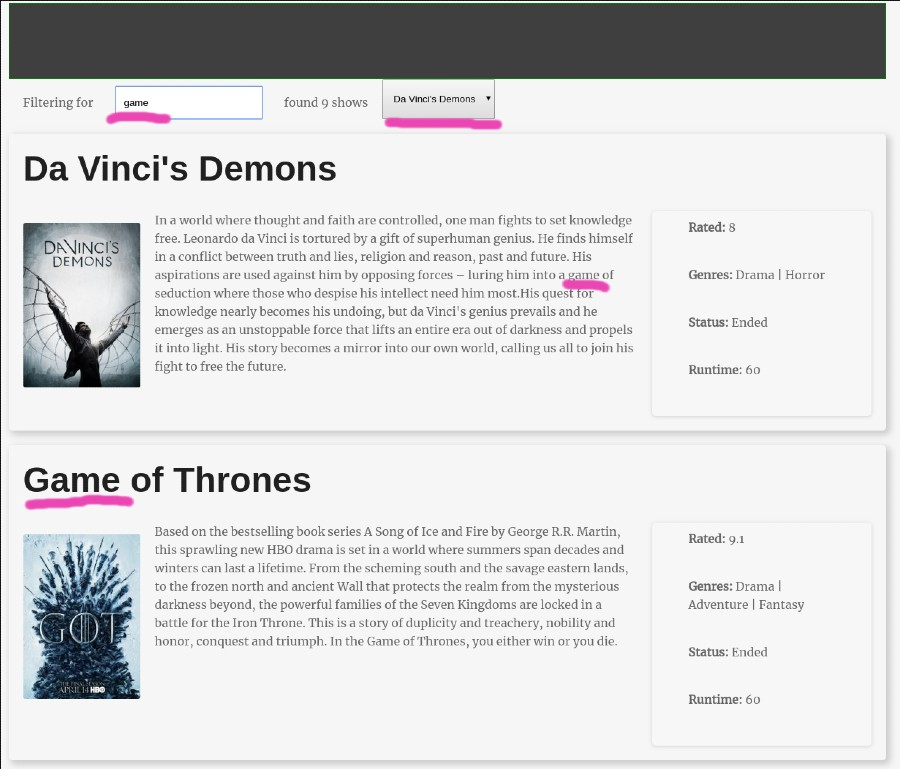

# Level 500 - Add a shows list and search

1. Complete all requirements from level 400
1. When your app starts, present a listing of all shows ("shows listing")
   1. For each show, you must display at least name, image, summary, genres, status, rating, and runtime.
1. When a show name is clicked, your app should:
   1. fetch and present episodes from that show (enabling episode search and selection as before)
   1. hide the "shows listing" view.
1. Add a navigation link to enable the user to return to the "shows listing"
   1. When this is clicked, the episodes listing should be hidden
1. Provide a free-text show search through show names, genres, and summary texts.
1. Ensure that your episode search and episode selector controls still work correctly when you switch from shows listing to episodes listing and back.

Continue to get the list of shows the same way you did in level 400. (You do not need to fetch it.)

### Example screenshots of Shows Listing

Note: Provided your project meets the above requirements, it can **look** however you want.

Here is one example layout.

[<< level 400](./level-400.md) - [top](./readme.md) - [level 999 >>](./level-999.md)
