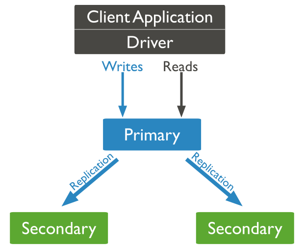

import Feedback from "@theme/Feedback";

## Outline

- Lesson 2 review
- Indexing
  - indexing a collection
  - indexing a collection using a collated index
  - implementing full text search in MongoDB
- Role based authentication
  - cluster based roles
  - backup and restoration roles
- Aggregation
- Replication
- Transactions
- A project in MongoDB
- Next steps

## Review

In the last lesson, we learned

- Signing up for MongoDB Atlas
- Making a local Express server
- Connecting to a MongoDB server from a local Node server
- Creating and dropping databases and collections in Atlas
- Reading documentation
- BSON types
- Creating documents
- Creating a document in Atlas
- Creating a document with the MongoDB Node Driver
- Updating a document
- Deleting a document

Now that we know how to read databases, collections, and documents, we are ready to move on to more advanced tasks.

### Use the sample database in MongoDB Atlas

We are going to use the sample cluster that we have already connected to in MongoDB Atlas.

Let's use the Atlas GUI to:

1. Create a new database
2. Create a new collection
3. Import sample data (we are interested in the AirBnB listings and reviews sample database)

We now have a pretty extensive dataset that we will use for the rest of the class.

### Insert a document with accent

The first task here is to insert a document in sample_airbnb.listingsAndReviews with the following fields found <a target="_blank" href="/json/fields.json" download="fields.json">here</a>.

You can use the code that we developed in lesson 2, or the GUI Hint: you can use clone in GUI

This document is useful for the next tasks.

## Indexing

Let's start by visiting the official documentation: <https://docs.mongodb.com/manual/indexes/>

The most interesting index properties are:

- Default id index
- Let's take a look in the indexes that we have in Atlas GUI sample database.
- Index Types
- Index Properties
- Collation
- Covered queries

### Create an index

Let's create a new index using the Atlas GUI.

**Index prefixing and how it affects querying**

### Create a collated index

From the documentation: "Collation allows users to specify language-specific rules for string comparison, such as rules for lettercase and accent marks."

In our case, we have inserted a document with french accents, so we want to create an index that will take it into account.

To create a collated index supporting the French language in the shell we would: `db.listingsAndReviews.createIndex( { name: 1 }, { collation: { locale: "fr" } } )`

Now, let's do the same using the Atlas GUI.

### Implementing full text search using MongoDB

One of the special types of indexes is the text index.

To create a text index in the shell: `db.listingsAndReviews.createIndex( { name: "text", summary: "text" } )`

Now, let's do the same using the Atlas GUI.

#### Exercise 1

:::note Exercise

Search for the document using the index.

How can we be sure that we use the index? Can we create a covered query?

Hint: `db.collection.find().explain()`

:::

## Role based authentication

Built in roles: _ read _ readWrite _ dbAdmin _ dbOwner \* userAdmin

### Cluster based roles

- clusterAdmin
- clusterManager
- clusterMonitor

### Backup and restoration roles

- backup
- restore

... many more

Let's update our MongoDB Atlas database to use roles.

First, we are going to add a built in role using the MongoDB Atlas.

Now, let's add a custom, read only in AirBnB DB role using the MongoDB Atlas.

### Aggregation

Why aggregation framework?

Aggregation framework in MongoDB is modelled after the familiar concept of data processing pipelines. Documents enter the pipeline with the MongoDB structure and exit the other end transformed into BSON documents with calculated fields. Commands in a pipeline are executed sequentially and in the order that they appear in the array [].

There are 3 ways to perform aggregation in MongoDB: 1. Aggregation pipeline 2. Map-reduce function 3. Single purpose aggregation methods

In this module, we will focus on the aggregation pipeline.

Some of the most important operators and how they relate with Structured Query Language (SQL):

| SQL             | Aggregation framework |
| --------------- | --------------------- |
| WHERE / HAVING  | \$match               |
| GROUP BY        | \$group               |
| SELECT          | \$project             |
| ORDER BY        | \$sort                |
| LIMIT           | \$limit               |
| sum() / count() | \$sum                 |
| average()       | \$avg                 |
| join            | \$lookup              |

```js
db.listingsAndReviews.aggregate([
  { $match: { name: { $regex: /^aA/ } } },
  { $group: { _id: "$name", average: { $avg: "$price" } } },
  { $sort: { average: -1 } },
  { $project: { name: 1, average: 1 } },
]);
```

What does the pipeline above do?

1. matches all documents with a name starting from aA
2. groups them by average price
3. sorts them by average price
4. projects(selects) name and average price in the output

What's the output like?

```js
{_id: .., name: .., average: ..}

```

More information: <https://docs.mongodb.com/manual/aggregation/>

#### Exercise 2

:::note Exercise

Now, let's do the same using the Atlas GUI.

:::

## Replication

Replication in MongoDB is used to increase redundancy and data availability. In its essence it's a way for 3 or more (or even 2 with some caveats..) servers to keep the same copy of data.



Writes always go to the primary and get propagated *asynchronously* to the secondaries.

Reads can go to the primary or any of the secondaries.

Election process:

Replica sets implement by default automatic failover. If a primary server fails, the remaining secondaries will elect the new primary. This will by default be the secondary that is most "up to date" with the primary but we can affect (rig) the election process by assigning different votes to each server.

More information: <https://docs.mongodb.com/manual/core/replica-set-elections/>

Using replication we can perform a few interesting tasks:

- delayed replica for backup. Delay backups by an hour, enabling us to recover from dropping a database in production
- hidden replicas for reporting. These replicas will never become primaries so we can safely apply read load to them for reporting purposes
- replicas in different location for disaster recovery
- replicas in different location to be closer to our users

## Transactions

MongoDB introduced multi-document ACID transactions in version 4.0 which was released on July 2018. Transactions are an integral part of relational databases. Every RDBMS from the very early days relied on transactions to achieve Atomicity, Consistency, Isolation and Durability. Getting these in a non-relational database is a breakthrough that can fundamentally change the way developers and database architects design software systems.

### ACID

Atomicity refers to the concept that a transactions needs to be atomic. It either successes and its results are visible to every subsequent user reading them or it fails and every change is rolled back to the point it was right before it started. It's either that all actions in a transaction occur or nothing at all.

Consistency refers to the database always being in a consistent state. Every database operation may complete successfully, fail or abort but in any case in the end our database must be in a state that its data is consistent.

Isolation refers to the visibility of transaction operations to other operations happening in parallel.

Durability in relational database systems refers to the property that every transaction that has successfully committed will survive in the face of failure. This usually refers to writing the contents of the committed transaction in persistent storage (hard disk or SDD).

Let's create a new database `mongo_bank` with a collection `accounts`:

`{"collection": "accounts", "account_id": "1", "account_name": "Alex", "account_balance":100}`

`{"collection": "accounts", "account_id": "2", "account_name": "Mary", "account_balance":50}`

This way, we have 2 users with accounts in our bank.

We can now transfer money between th accounts. We will do this using the Mongo shell:

```js
session = db.getMongo().startSession({ readPreference: { mode: "primary" } });

accountsCollection = session.getDatabase("mongo_bank").accounts;

session.startTransaction({
  readConcern: { level: "snapshot" },
  writeConcern: { w: "majority" },
});

try {
  accountsCollection.update(
    { account_id: "1" },
    { $inc: { account_balance: -70 } }
  );
  accountsCollection.update(
    { account_id: "2" },
    { $inc: { account_balance: 70 } }
  );
} catch (error) {
  print("error:", error);
}
source_balance = accountsCollection.findOne({ account_id: "1" })
  .account_balance;
target_balance = accountsCollection.findOne({ account_id: "2" })
  .account_balance;
if (source_balance < 0 || target_balance < 0) {
  session.abortTransaction();
}
session.commitTransaction();
session.endSession();
```

To which the output should be similar to:

```js
WriteCommandError({
  errorLabels: ["TransientTransactionError"],
  operationTime: Timestamp(1561207870, 4),
  ok: 0,
  errmsg: "Transaction 0 has been aborted.",
  code: 251,
  codeName: "NoSuchTransaction",
  $clusterTime: {
    clusterTime: Timestamp(1561207870, 4),
    signature: {
      hash: BinData(0, "1x7oLuNzWehAWylVA/E9tdXLuFA="),
      keyId: NumberLong("6655324027294318593"),
    },
  },
});
```

Database operations need to be inside our session if we want to benefit from transactions

#### Exercise 3

:::note Exercise

Transfer 40 monads from account 1 to account 2. Observe how it works perfectly fine.

:::

## MongoDB Project

:::note Exercise

Based on the data from the AirBnB listings and reviews collection, we want to create a front end for it.

Functions:

1. Search for rooms by name or summary
2. Filter by price
3. Show the top superhosts in the page. On click through, show a list of their apartments

You can use Node/Express and the Aggregation framework if you see fit.

Please use this index.html file as a starting point: <https://github.com/agiamas/cyf-mongodb-2019/blob/master/index.html>

:::

## Next Steps

If you have time and interest, please register to either of these classes or any other class in MongoDB university. All classes are free and on average require 6-10 hours of time per week.

<https://university.mongodb.com/courses/M220JS/about>

<https://university.mongodb.com/courses/M220P/about>

## Feedback

Please spend two minutes reviewing this lesson to help us improve it for the future. This feedback will be shared with volunteers.

<Feedback module="MongoDB" week="Week 3" />
