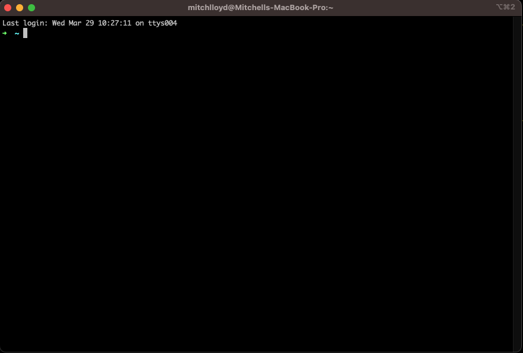
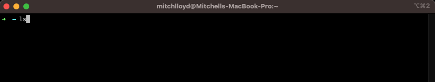
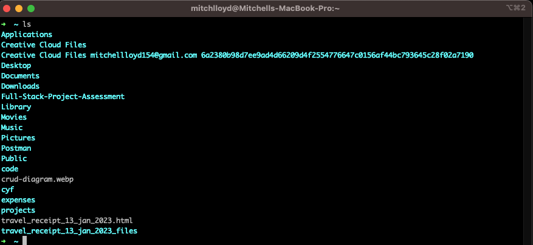
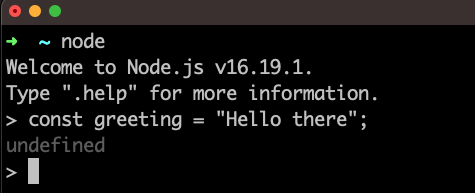
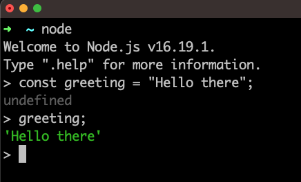
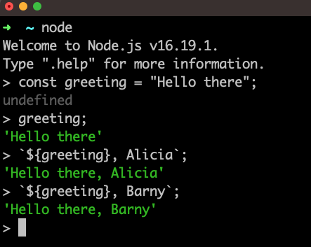
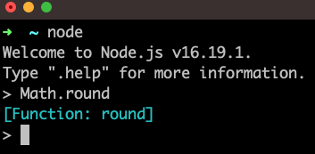
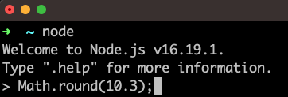

# JavaScript Core 1 Week 1

## Prerequisites

- Basic arithmetic
- Access to a Linux/MacOS terminal

## Learning objectives

- Define a terminal
- Define a function
- Define a function call
- Describe the purpose of VSCode
- Define the Node REPL
- Define an expression
- Identify the syntactic features of a variable declaration
- Explain why we use variable declarations
- Define the term “implementation opaque”
- Describe what template literals do
- Create strings using variables and template literals
- Explain how we use basic arithmetical operators
- Evaluate basic JavaScript expressions using the Node REPL
- Predict the result of evaluating an expression in JavaScript
- Identify the key features of a function call expression: identifier; parentheses, argument
- Execute a JavaScript file using NodeJS
- Log JavaScript expressions to the terminal
- Predict the console output when a basic JS program is executed using Node

## Key vocabulary

terminal, console, function, call, invoke, argument, parentheses, REPL, evaluate, implementation, opaque

### Understanding the computer 💻

Modern computers are highly complex devices. It would be too difficult to summarise all the components that make up a modern computer. Instead, we can form a useful abstraction to make sense of what a computer is and what it does. An **abstraction** is a simplification that we use to focus on certain key aspects of a particular thing. In other words, we can form an **abstraction** of a computer that can give us some limited understanding of it. At the same time, we don't need to delve into the complex inner workings of the computer itself. So we begin with the following abstraction:

:::note

Abstraction: A computer is a device used to store and process data. Computers have the capacity to store data through their memory and the ability to change this data through its processing capacity.

:::

### Interacting with the computer

As a user, we don't need to understand the complexities of the computer's inner workings. As users we will often need to harness the computer's memory and processing ability to perform some task. For this purpose, we can issue commands or instructions to the computer for it to carry out some tasks. A computer terminal is an application where users can enter commands to a computer. On a Mac, the terminal looks like this:


The terminal appears as a window on the computer. The terminal prompts users for inputs. So we can input a command into the prompt and hit enter for the computer to execute this command. For example, we can input the `ls` command into the terminal:



We can then press enter to issue this command to the computer and get a response:



### Writing computer instructions

We've seen we can issue commands to the computer using the terminal. These commands are instructions that the computer knows how to interpret. Given the `ls` command, the computer knows this is an instruction to list the files and directories in the current directory.
However, we can make use of different programming languages. A programming language is a particular set of rules for writing computer instructions.

A computer will store data in memory, which will be modified during the execution of a program.
So we can think of a programming language as allowing us to describe **data** and **operations** on that data.

:::note
**Data** consists of information in different forms: for example, numbers and text could be different forms of data.
:::

:::note
**Operations** are anything that take data and modify existing data or create new data from the current data in the program.
:::

In other words, any computer program will specify what data we've got and how it will be processed.

### Classifying data

. Any programming language will have different forms of data that we call **data types**.

:::note
A **data type** is a grouping of data with some particular properties.
:::

In this course, we’re going to focus on the JavaScript programming language. In JavaScript, we have several different data types, like **numbers** and **strings**.

For example, `10` is part of the number data type.  
`3.14` is also part of the number data type, as we include both integers non-integers in this data type.

We also have the string data type in JavaScript. A string is a sequence of characters. In JavaScript a string is denoted using opening quotation marks and closing quotation marks.

### Creating expressions

Let's consider the numbers 10 and 32. Given these 2 numbers, we might want to ask several questions about these numbers:

a) What is the **sum** of 10 and 32?  
b) What is the **product** of 10 and 32?  
c) What is the **remainder** when 32 is divided by 10?

From question a), instead of saying "the sum of 10 and 32" we can rewrite this description using numbers and a symbol. So “the sum of 10 and 32” can be written as `10 + 32` in symbolic form.

```raw title="written form"
the sum of 10 and 32
```

```raw title="symbolic form"
10 + 32
```

In symbolic form, `+` is an operator: an **operator** is a symbol that is used to represent some kind of operation. In this example, `+` is used to represent the add operation “add the 2 numbers together”.  
The actual combination of symbols `10 + 32` we say is an **expression**.

:::info
An **expression** is a value or any combination of values and operators that results in a single value.  
We say that expressions **evaluate** to a single value.  
So we say that `10 + 32` **evaluates** to the value `42`.
:::

### Evaluating expressions

So we can look at an expression like `36 * 45` and ask: what does this expression evaluate to? If we understand what the `*` operator represents ( in this case multiplication ) and if we understand some basic rules of arithmetic we can evaluate this expression.  
However, we can use computers to evaluate expressions. For this purpose, we can make use of NodeJS,
which is a JavaScript runtime - it is an application that enables us to run JavaScript programs.

Node can be used in a number of different ways; however, one particular mode is the REPL. The Node REPL enables us to input expressions which are then evaluated by NodeJS and printed to the terminal. The REPL will print out the result of this evaluation.

:::note

ℹ️ Definition: REPL is a special type of program that stands for
**Read**  
**Evaluate**  
**Print**  
**Loop**

:::

The Node REPL allows us to write expressions and evaluate them.
We can type each of the following expressions into the REPL and then press enter to check the result.

```bash
10 + 32
```

```bash
32 / 10
```

```bash
3 ** 4
```

### Saving expressions

Often in programming we may want to reuse a particular expression in our program. In this case, we need a way to refer back to a particular expression. Let’s consider the following string:

```js
"Hello there";
```

Suppose we want to reuse this greeting in several different parts of a our program. For example, we may want to create different greetings for different users, like:

```bash
"Hello there, Alicia";
```

```bash
"Hello there, Barny"
```

We can use a **variable** to store this string value so it can be referenced and used again.

:::info

A **variable** is a label for a piece of data in our program. We can assign a piece of data to a particular label and then refer back to this label in our program.

:::

We can create a variable in our program by writing a **variable declaration**, in the following way:

```js title="variable declaration"
const greeting = "Hello there";
```

We can break down the different syntactic elements of this variable declaration:

- `const` is a keyword used to indicate we're creating a variable.
- `greeting` is the variable name - like the name of the label for our piece of data.
- `=` this is the assignment operator. It means assign to the label `greeting` the expression on the right hand side.
- `"Hello there"` - this is the value we're assigning to the label `greeting`.

We can type this variable declaration into the REPL:



Now we can refer to the label `greeting` again in the REPL:



Now we have the `greeting` variable stored in memory we can reuse it to build more expressions:



:::note

In the example above, we're using backticks to create a template literal. With template literals, we can insert expressions into strings to produce new strings. Any time we want to reference a variable inside a template literal we use a dollar sign and a set of curly braces. The variable name itself is then placed inside the curly braces. The value this variable holds is then placed inside the string.

:::

### Reusing instructions

Let’s consider another scenario. Instead of adding or multiplying numbers, we’ll consider a number like `10.3`.  
Given the number `10.3`, we could ask:

> 🤔 "What is the nearest whole number to `10.3`?"

The process of finding the nearest whole number to 10.3 is called **rounding**. So we could rephrase the previous question to be:

> 🤔 "What does the number `10.3` **round** to?”

Again we can use Node REPL in order to round the number 10.3 to the nearest whole number. However, in this case, there is no arithmetical operator for rounding the number 10.3 in JavaScript.
However, we will often want to carry out some kind of operation or series of operations repeatedly. For example, we will often want to round numbers again and again. So in this case we can use a **function**.

:::note

Definition: A function is a reusable set of instructions.

:::

In particular, we can make use of a function called `Math.round`. Recalling the definition, a function is a reusable set of instructions: so in the case of `Math.round` it contains instructions for rounding any number. Functions will often take **inputs** and then **apply their set of instructions to the inputs** in order to produce an **output**.

Let’s see how we can use `Math.round` in the Node REPL.

So we can write `Math.round` in the Node REPL:


After we've hit enter to evaluate, we then get the following:



So in this case, the REPL output `[Function: round]` is indicating that `Math.round` is a function.

### Calling a function

Once we have the name for a function, we need to get Node to read the function's instructions and execute them. Execution here means the computer reading the instructions contained in the function and then performing the tasks defined in that function. So we can write the following in the REPL:



Notice now we have `(` and `)` parentheses after the name of the function and a number inside the parentheses. The parentheses indicate that we are calling the function. The number inside the parentheses is the **input** we're passing to the function.

:::note

Calling a function means the computer is going to read the function's instructions and carry out any instructions defined in the function.

:::

`Math.round(10.3)` is a call expression: it can be thought of as saying apply the set of instructions for `Math.round` to the number 10.3.

If we type `Math.round(10.3)` then again we get the result 10. So once more we can say that `Math.round(10.3)` evaluates to 10.

:::note
Important to note that `Math.round` is **implementation opaque**. **Implementation opaque** means we can’t read the set of instructions for `Math.round`. This is because `Math.round` was authored by the developers that created NodeJS.
:::

### Running scripts

So far we’ve seen how expressions can be evaluated when using the NodeJS REPL. However, at some point, we need to write more complex programs that consist of many lines. So we need to write our program in a file. Instead of using the Node REPL, we can use NodeJS to execute the instructions in a file.

We can use the node command to run a JavaScript file. A JavaScript file ends with `.js` - this is known as the file extension.

Let’s suppose we have a file `index.js` like this:

```js title="index.js"
10 + 3;
10 * 3;
10 / 3;
```

In this case, we can write the command `node sums.js`.

This command is an instruction to execute the program written inside index.js. Our program consists of 3 lines, each line an expression. So the machine will start:

`10 + 3;` the computer will evaluate this expression  
`10 * 3;` the computer will evaluate this expression  
`10 / 3;` the computer will evaluate this expression

Once the computer has evaluated these values the execution of the program is finished.  
However, we’re left with a problem. With the REPL, an expression is inputted by the user and the computer evaluates this and then immediately prints the result. It then loops back and prompts the user for another input. However, in the new example, the computer will go through and execute each line sequentially till it's finished.

So this new problem can be expressed as a question:

> #### ❓ Problem
>
> "How can we inspect the state of our program during runtime?"
> In other words: "how can I print values to the terminal when my program is being executed?"

In order to do this, we can use another function.

### Printing to the terminal

In order to print an expression’s result to the terminal we can make use of a function called `console.log`.  
`console.log` will allow us to print expressions to the console. We also say that we log values to the console. This is very useful for complex programs when we need to inspect the result of certain expressions.
Let's see how to use `console.log`

In a file called `example.js`, we can write name of the function `console.log`.

```js title="example.js"
console.log;
```

However, if we run this file with Node, we won't be able to see anything in the terminal.
As with `Math.round` we need to use the syntax for calling this function.
So we can add parentheses after the function name to indicate we're calling this function:

```js title="example.js"
console.log("hello there!");
```

Now if we our terminal, we should see the string "hello there!" logged out in the terminal.

### Saving function output

Often in programs we may want to refer to a particular expression over and over again.

With our knowledge of functions and variables, we can use variables to store the output from a function.
Let’s consider the following file, `arithmetic.js`;

```js title="arithmetic.js"
const result = Math.round(10.3);
```

When this program is executed, it creates a variable called result and assigns to it **the output of the function**, in this case the rounded number.
So `result` will evaluate to `10`.

Let’s consider what happens with the following file, `log.js`:

```js title="log.js"
const result = console.log("hello world");
```

When this program is executed, the variable `result` will evaluate to `undefined`.

:::info
`undefined` is a data type in JavaScript often used to represent the absence of a specific value
:::

We could add another log to our program in order to verify this claim. Essentially, console.log’s output will always be undefined.

:::note
Key fact: `console.log` is used to print its inputs to the terminal. It doesn’t produce an output in the running program.
:::

### Further reading
