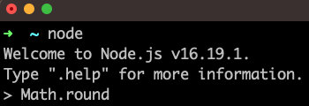

# JavaScript Core 1 Week 1

## Prerequisites

- Basic arithmetic
- Access to a Linux/MacOS terminal

## Learning objectives

- Define a terminal
- Define a function
- Define a function call
- Describe the purpose of VSCode
- Define the Node REPL
- Define an expression
- Define the term “implementation opaque”
- Explain how we use operators
- Evaluate basic JavaScript expressions using the Node REPL
- Predict the result of evaluating an expression in JavaScript
- Identify the key features of a function call expression: identifier; parentheses, argument
- Execute a JavaScript file using NodeJS
- Log JavaScript expressions to the terminal
- Predict the console output when a basic JS program is executed using Node

## Key vocabulary

terminal, console, function, call, invoke, argument, parentheses, REPL, evaluate, implementation, opaque

### Elements of a computer program

What is a computer program? A computer program is a set of instructions that can be executed by a computer. However, we could also view a computer program as something that consists of data and operations. In other words, a computer program is a set of instructions that defines data and operations on the data.

ℹ️ Data consists of information in different forms: for example, numbers and text could be different forms of data.  
ℹ️ Operations are anything that take data and modify existing data or create new data from the current data in the program.

In computer programming, we use different programming languages - a particular set of rules for writing computer programs. Any programming language will have different forms of data that we call data types.

:::note
A **data type** is a grouping of data, which has some particular properties.
:::

In this course, we’re going to focus on the JavaScript programming language. In JavaScript, we have a number data type. Any whole number or decimal number is part of the number data type.

For example, 10 is part of the number data type.
3.14 is part of the number data type.

We also have the string data type in JavaScript. A string is a sequence of characters. In JavaScript a string is denoted using opening quotation marks and closing quotation marks.

### Creating expressions

Let's consider the numbers 10 and 32. Given these 2 numbers, we might want to ask several questions about these numbers:

a) What is the sum of 10 and 32?  
b) What is the product of 10 and 32?  
c) What is the remainder when 32 is divided by 10?

From question a), instead of saying “the sum of 10 and 32” we can rewrite this description using numbers and a symbol. So “the sum of 10 + 32” can be written as “10 + 32” in a symbolic form.

In this example, `+` is an operator: an **operator** is a symbol that is used to represent some kind of action or process. In this example, `+` is used to represent the action “add the 2 numbers together”.

The actual combination of symbols `10 + 32` we say is an **expression**.

:::info
An **expression** is a value or any combination of values and operators that results in a single value. We say that expressions evaluate to a single value. So we say that `10 + 32` evaluates to the value `42`.
:::

### Evaluating expressions with Node

We can look at an expression like this `36 * 45` and ask what this expression evaluates to? If we understand what the `*` operator represents ( in this case multiplication ) and if we understand some basic rules of arithmetic we can evaluate this expression.  
However, we can use a computer program to evaluate some basic expressions.
NodeJS is a JavaScript runtime program - it is a computer program that enables us to run JavaScript programs.

For this purpose we can use the Node REPL.

:::note

ℹ️ Definition: Node is a computer program that enables us to execute JavaScript programs.

:::

:::note

ℹ️ Definition: REPL is a special type of program that stands for
Read
Evaluate
Print
Loop

:::

The Node REPL allows us to write expressions and evaluate them.
Let’s try this out:

```REPL
10 + 32
```

```REPL
32 / 10
```

```REPL
3 ** 4
```

We can evaluate expressions using Node. In addition to this, we can use operators.
So in these questions, we have two numbers, 10 and 32, and some sort of operation in each case sum, product and remainder.  
Instead of writing "sum of 10 and 32", we can write `10 + 32`.
The symbols `10 + 32`, consists of the number `10`, the symbol `+` and the number `32`. So this _group of symbols represents the sum of 10 and 32_.
In JavaScript, we say that 10 + 32 is an **expression**.

An expression is a combination of values and operators that will evaluate to a single value. So we say that 10 + 32 evaluates to 42.

Let’s consider an example to make this more clear

### Saving expressions

Often in programming we want to store an expression for further use. Let’s consider the following string:

```js
"Hello there";
```

We may have a situation where we want to reuse a particular expression in our program.

The variable message now stores a string “hello there”. We can

### Reusing instructions

Let’s consider another scenario. Instead of adding or multiplying numbers, we’ll consider a number like `10.3`.  
Given the number `10.3`, we could ask:

> 🤔 "What is the nearest whole number to `10.3`?"

The process of finding the nearest whole number to 10.3 is called **rounding**. So we could rephrase the previous question to be:

> 🤔 "What does the number `10.3` round to?”

Again we can use NODE REPL in order to round the number 10.3 to the nearest whole number. However, in this case, there is no operator for rounding the number 10.3. Instead this time we must use a **function**.

In programming, we may want to carry out a task many times. For example, we will often want to round numbers again and again. So for this purpose, we can make use of a function called `Math.round`. A function is a reusable set of instructions: so in the case of `Math.round` it contains instructions for rounding any number. Functions will often take **inputs** and then **apply the set of instructions to the input** in order to produce an **output**.

:::note

Definition: A function is a reusable set of instructions.

:::

Let’s see how we can use `Math.round` in the Node REPL.

So we can write `Math.round` in the Node REPL:



After we've hit enter to evaluate, we then get the following:


So in this case, the REPL is telling us that `Math.round` is a set of instructions we can use for rounding numbers.

### Calling a function

Once we have the name for a function, we need to actually get Node to read the function's instructions and execute them. Execution here means the program reading the instructions contained in the function and then performing the tasks in the program. So we can write the following:

`Math.round(10.3)`
This expression is a call expression: it can be thought of as saying apply the set of instructions for `Math.round` to the number 10.3.

If we type `Math.round(10.3)` then again we get the result 10. So once more we can say that `Math.round(10.3)` evaluates to 10.

:::note
Important to note that `Math.round` is **implementation opaque**. **Implementation opaque** means we can’t read the set of instructions for `Math.round`. This is because `Math.round` was authored by the developers that created NodeJS.
:::

We can round this number to the nearest whole number.
However, this task is something we may want to do again and again. It feels reasonable to assume that we’ll need to round a number again in the future. For this purpose we can make use of a function.

A function is a reusable set of instructions. If we have a function with a set of instructions that rounds up we can reuse this function again and again to round any number.

### Running scripts

So far we’ve seen how expressions can be evaluated when using NodeJS REPL mode. However, at some point, we need to write more complex programs that consist of multiple lines. Therefore we need to write our program in a file. Instead of using the Node REPL, we can use NodeJS to execute the instructions in a file.

So we can write `node <name-of-file>`

Let’s suppose we have a file `index.js` like this:

```js title="index.js"
10 + 3;
10 * 3;
10 / 3;
```

We can write node sums.js

This command is an instruction to execute the program written inside index.js. Our program consists of 3 lines, each line an expression. So the machine will start:

`10 + 3;` the computer will evaluate this expression  
`10 * 3;` the computer will evaluate this expression  
`10 / 3;` the computer will evaluate this expression

Once the computer has evaluated these values the execution of the program is finished.  
However, we’re left with a problem. With the REPL, an expression is inputted by the user and the computer evaluates this and then immediately prints the result. It then loops back and prompts the user for another input. However, in the new example, the computer will go through and execute each line sequentially till it's finished.

So this new problem can be expressed as a question:

:::problem
"how can we inspect the state of our program during runtime?"
In other words: "how can I print values to the terminal when my program is being executed?"

:::

In order to do this, we can use another function.

### Printing to the terminal

In order to print an expression’s result to the terminal we can make use of a function called `console.log`.  
`console.log` will allow us to print values and expressions to the console. We also say that we log values to the console. This is very useful for complex programs when we need to inspect the result of certain expressions.
Let's see how to use `console.log`

In the file, we can write name of the function `console.log`

```repl
console.log;
```

However, if we run this file with Node, we won't be able to see anything in the terminal.

### Saving function output

Often in programs we may want to refer to a particular expression over and over again.

With our knowledge of functions and variables, we can use variables to store the output from a function.
Let’s consider the following file, `arithmetic.js`;

```js title="arithmetic.js"
const result = Math.round(10.3);
```

When this program is executed, it creates a variable called result and assigns to it **the output of the function**, in this case the rounded number.
So `result` will evaluate to `10`.

Let’s consider what happens with the following file, `log.js`:

```js title="log.js"
const result = console.log("hello world");
```

When this program is executed, the variable `result` will evaluate to `undefined`.

:::info
`undefined` is a data type in JavaScript often used to represent the absence of a specific value
:::

We could add another log to our program in order to verify this claim. Essentially, console.log’s output will always be undefined.

:::note
Key fact: `console.log` is used to print its inputs to the terminal. It doesn’t produce an output in the running program.
:::
