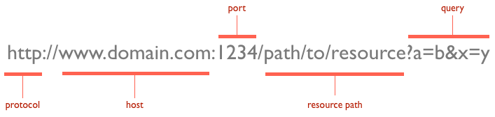

> This class is based on the [Node Girls Express Workshop](https://github.com/node-girls/express-workshop)

Fork the [express-workshop repository](https://github.com/CodeYourFuture/express-workshop)

```sh
git clone https://github.com/YOUR-USERNAME/express-workshop
```

# Step 1 - Setting up your project

When creating a Node.js project, you will be installing a lot of different
things along the way. If you want to share your project with others, you need to
have a list of the things you installed, so that other people know what to
install in order to run the project.

In Node.js, this 'list' file is called a `package.json`. The 'things you've
installed' are referred to as **dependencies**. Creating this file is the first
step in setting up your Node.js project.

## 1. Make a `package.json` file

Let's start by creating the `package.json` file. We can add things to it as the
project grows. The `package.json` file is easy to create from the command line.
Type the following command into your terminal to get started:

```sh
$ npm init
```

This command will initialise a step-by-step process for creating the
`package.json`. You should see something like this:


It will ask you a bunch of questions.

> You can skip most of the questions but change the `entry point` from
> `(index.js)` to `server.js`.

> The wizard asks you for the following information: `name`, `version`,
> `description`, `main`, `test`, `repository`, `keywords`, `author`, `license` -
> do you understand all of them?

At the endo of the wizard, you should see a new file called `package.json` in
your project's folder.

Here is an example `package.json` file for a project called
[Passport](https://github.com/jaredhanson/passport/blob/master/package.json).

# What is JSON?

JSON is a type of file for structuring data in a readable way. It is also a
really popular format for sending data across the web. JSON is a string
representation of a Javascript object. JSON objects convert really easily to
Javascript objects, and vice versa, with `JSON.parse()` and `JSON.stringify()`.

```js
{
  "firstName": "John",
  "lastName": "Smith",
  "isAlive": true,
  "age": 25,
  "address": {
    "streetAddress": "21 2nd Street",
    "city": "New York",
    "state": "NY",
    "postalCode": "10021-3100"
  },
  "phoneNumbers": [
    {
      "type": "home",
      "number": "212 555-1234"
    },
    {
      "type": "office",
      "number": "646 555-4567"
    },
    {
      "type": "mobile",
      "number": "123 456-7890"
    }
  ],
  "children": [],
  "spouse": null
}
```

# Step 2 - Installing Express

Before we write any code, you'll need to install the Express library. We're
going to use the **[Node Package Manager (npm)](https://www.npmjs.com/)** to
download it using the **`npm install`** command.

NPM is the place to go to download other Node code written by other people.
There are thousands of open-source, 3rd-party Node modules (also known as
"packages") by other people that you can download and use in your own projects.

As we install Express, we'll need to update the `package.json` to add Express as
a dependency. We do this so that other people working on the project will know
to install Express before running any of the code. This can be done by adding
**`--save`** to the end of your command.

Run the following command in your terminal:

```sh
npm install express --save
```

Express should now be installed. Check your `package.json` file to make sure it
has been added as a dependency. It will look like this:


# Step 3 - Building the server

The first thing we need to do is build our server. You will always need to build
a server when writing back-end code. A server can be built in pure Node.js, but
Express gives us simpler syntax to work with.

## 1. Create a `server.js` file

Let's build our server! Before we do anything, let's create a new file called
`server.js`. This is where all our server code is going to live.

## 2. `require` the `express` library

We already installed Express in Step 2, but we need to make sure it is included
in this file specifically so we can make use of its methods. In Node.js, when
you want to access the functionality of a library or module in another file, you
`require` it.

To import Express, write the following inside `server.js`:

```js
const express = require("express");
```

> We will try and get used to ES6 syntax - so use `const` and `let` instead of
> `var`.

## 3. Initialise the server

To initialise our server, we just need to call the `express()` function. This
will create an Express application for us to work with.

Add the second line of code to your `server.js` file:

```js
const express = require("express");
const app = express();
```

## 4. Start 'listening' for potential requests

One more step left, we need to set a **port** for our server to listen to. Think
of a port as a door number; any requests that come to the server will come via
that door. Setting a port will allow us to find where our server is running.

We use the **`app.listen`** method to do this. This method takes two arguments:
a **port** and a **callback function** telling it what to do once the server is
running. Need clarification? Read more about the `app.listen` method in the
[Express documentation](https://expressjs.com/en/4x/api.html#app.listen).

We're going to run our server on port `3000`, and run a simple `console.log` as
our callback function. Update your `server.js` file, calling the `app.listen`
method:

```js
const express = require("express");
const app = express();

app.listen(3000, function () {
  console.log("Server is listening on port 3000. Ready to accept requests!");
});
```

> Try to use ES6 arrow functions instead of `function`.

## 5. Switch the server on!

You've built your server, but it isn't running yet. We need to run a command in
the terminal to do this. We are going to use the `node` keyword to run the
server file.

Type the following command in your terminal:

```sh
node server.js
```

If you see this, congratulations! You have built yourself a server!


# Step 4 - Communicating with the server

Now that we've built the server, we need to communicate with it. We're going to
control the server with **handler functions**.

### What is a handler function?

When a request reaches the server, we need a way of responding to it. In comes
the handler function. The handler function is just a function which receives
requests and handles them, hence the name.

The handler function always takes a `request` and `response` object, and sends
the response back to the client along with some information. You can decide what
to send back in your response.

### What does a handler function look like in Express?

The `get()` [method](https://expressjs.com/en/api.html#app.get.method) is used to
define a handler function in Express. It takes two parameters: the **endpoint**
at which to trigger an action (we'll explain more about this in the next step),
and the handler function that tells it exactly what to do. Here's a simple
"Hello World!" example:

```js
// req is the Request object, res is the Response object
// (these are just variable names, they can be anything but it's a convention to call them req and res)
app.get("/", function (req, res) {
  res.send("Hello World!");
});
```

Here, we are telling our server to respond with "Hello World!" when someone
tries to access the webpage.

## 1. Create your own handler function.

We are now making a handler function with a custom message in our response. You
can write any message you want.

Update your `server.js` file with an empty `app.get()` function:

```js
const express = require("express");
const app = express();

app.get("/", function (req, res) {});

app.listen(3000, function () {
  console.log("Server is listening on port 3000. Ready to accept requests!");
});
```

> Exercise: Try to `console.log` the `request` object inside the handler
> function. Restart your server, refresh the browser, then go to your terminal
> to see what it looks like. You should see a lot of data come through.

## 2. Tell your handler function what to do

We want our handler function to send back a message to the client. To do that,
we're going to use the Express `send()`
[method](https://expressjs.com/en/api.html#res.send). This will update the
response object with the message.

Update your handler function like so:

```js
const express = require("express");
const app = express();

app.get("/", function (req, res) {
  res.send("Yay Node Girls!");
});

app.listen(3000, function () {
  console.log("Server is listening on port 3000. Ready to accept requests!");
});
```

## 3. Check it out in your browser

Quit your server in the terminal with `ctrl + c`. Then restart it to run your
new changes.

```sh
node server.js
```

Now, open your favourite browser (we like Chrome), and navigate to
`http://localhost:3000`. If you see your message in the browser,
congratulations! You just sent your first response from the server.

# Step 5 - Routing

At the moment our server only does one thing. When it receives a request from
the `/` endpoint, it sends back the same response: "Yay Node Girls!".

> Try typing http://localhost:3000/nodegirls and see what happens.

However by making use of endpoints, we can make the server send different
responses for different requests. This concept is called **routing**.

### What is an endpoint?

An endpoint is the part of the URL which comes after `/`. For example:
`/chocolate` is the "chocolate" endpoint. It's the URL to which you send a
request.

### What is URL?



## 1. Create your own endpoints and send different responses

We're going to try sending different responses at different endpoints. Remember
the `app.get()` method? To set up routing in your server, we just need to repeat
this method with different endpoints.

For example:

```js
app.get("/", function (req, res) {
  res.send("Hello World!");
});

app.get("/chocolate", function (req, res) {
  res.send("Mm chocolate :O");
});
```

> **Exercise:** Add some code so that your server sends one message when the
> endpoint is `/node` and another one when it's `/girls`.

### Step 6 - Serving static files

So we know how to send back a simple message. But what if you want to send back
a whole HTML page, or an image?

Things like HTML files, images etc are known as **static assets**. If you want
your server to "serve" static assets back to the browser, you need to do
something different than just using the `res.send()` method.

To be able to send any file from the server we need a special, built-in
**middleware** function that comes with Express: `express.static()`. Read more
about it [here](https://expressjs.com/en/starter/static-files.html).

Say we want to serve all the static assets in our "public" folder. The
`express.static()` function will look like this:

```js
app.use(express.static("public"));
```

## 1. Serve static files from your server

Delete all your `app.get` endpoint functions, and replace them with the line of
code above. Restart your server, refresh your browser and see what happens! If
you see a Node Girls CMS, then your static assets have been successfully served.

### HTTP request methods

All requests use one of the `HTTP methods`. The main ones are: `GET, POST, PUT, DELETE`.

`app.get` deals with requests that use the `GET` HTTP method.

> We will go into these Methods into more details, but for now, think of `GET`
> as a method for Getting data. `POST` is for POSTing/inserting new data. `PUT`
> is for updating. `DELETE` is for deleting data.

### The `POST` http request method

When sending data to the server, we use the `POST` http request method, instead
of `GET`.

Let's try `POST`ing some text to the server.

We're going to add a form to the `index.html` page, so that you can write your
blogposts from there.

Open up the `index.html` file in your text editor. If you have a look, you
should see this:

```html
<div class="entry-container">
  <!--PASTE YOUR CODE HERE!! -->
</div>
```

**Replace the greyed-out comment with this code snippet:**

```html
<h3>Create a blog post</h3>
<form action="/create-post" method="POST">
  <textarea name="blogpost" rows="10" cols="14"></textarea>
  <button type="submit">Send</button>
</form>
```

- This form has a text area and a Send button.
- The `action` attribute is the endpoint form data will be sent to.
- The `name` attribute will be used later to reference the data.

When you hit Send, the form will send a `POST` request to the server, using
whatever is in the `action` attribute as the endpoint. In our case it's
`/create-post`.

> **Exercise:** Open Chrome Developers tool, click the button and see what
> happens.

### Receiving the blog post on the server

- Data doesn't come through the server in one go; it flows to the server in a
  **stream**. Think of a stream as water flowing from a tap into a bucket. Your
  job is to collect this water in the server.

- If we were writing a pure Node server, we would have to think about how to
  collect the stream of data properly. But luckily for us, Express handles all
  of that stuff under the hood.

- All you need to do is define a route to deal with requests that come through
  on the `/create-post` endpoint.

Let's remind ourselves of a simple `GET` route in Express:

```js
app.get("/hello-world", function (req, res) {
  res.send("Hello there!");
});
```

> **Exercise:** This time we want to define a route to deal with a `POST`
> request not a `GET`. What do you think you would need to do differently?
> Experiment and see if you can define a route for the `/create-post` endpoint!
>
> For now, make your `/create-post` handler simply do this: `console.log('I am /create-post endpoint')`.

---

### Extracting the blog post

Now the contents of your blogpost is hidden in your `req` object somewhere.
Normally you would extract it using `req.body`. Try to console.log `req.body`
now.

Getting `undefined`? Not to worry, that's normal. When data has been `POST`ed to
the server as `FormData`, we need to do things slightly differently to access
the data that's come through in the request.

We need another middleware function. Something that can get extract the contents
out of the special `FormData` object. For this we will use `express-formidable`.
`express-formidable` is another Express middleware. It will extract the form
data from the request and make it available to you when you do `req.fields`.

This time though, `express-formidable` is not built-in, we need to explicitly
install it.

**In your terminal, install express-formidable**

```bash
npm install express-formidable --save
```

`require` `express-formidable` so you can use it in your code. You can't use
dashes in JavaScript variable names, so just call it `const formidable`.

```js
const formidable = require("express-formidable");
```

Now add this towards the top of your server, after your `require`s and
`app.use(express.static('public'))`, but before your `/create-post` endpoint:

```js
app.use(formidable());
```

Now inside your `/create-post` function, add:

```js
console.log(req.fields);
```

Refresh your server and have another go at writing a blogpost.

You should now see an object in the console. The key should be `blogpost`, just
like the name attribute in the form on the HTML page. The value of `blogpost`
will be your message!

> **Exercise**: Try putting `app.use(formidable());` at the end of the file
> (after the `create-post` but before starting the server)

> **What is a middleware in Express?** Middleware functions are functions that
> have access to the request object (req), the response object (res), and the
> next function in the application’s request-response cycle. The next function
> is a function in the Express router which, when invoked, executes the
> middleware succeeding the current middleware. Read more on
> [the Express documentation](https://expressjs.com/en/guide/writing-middleware.html)

### Step 8 - Saving your blog post

Right now, your precious blog posts aren't being saved anywhere, which is a bit
of a shame. Let's do something about that.

You'll note that in the data folder there's a new file called `posts.json`.

If you look at `posts.json` will see there's already one blog post there. The
format is:

```js
{
    [timestamp]: [blog post message]
}
```

We've used a timestamp as the key so that the blog posts are listed in
chronological order. Also, it's a record of when the blog post was created.

### Writing to your hard drive

Anytime a blog post comes through to the server, we want to save the data on
your computer's hard drive. To do this, we need to use a built-in Node module:
`fs`, which stands for 'file-system'.

Built-in Node modules - **core Node modules** - are rather like the built-in
Express middleware functions. Only difference is that where you need to have
installed Express to use Express middleware functions, the core Node modules
come automatically with Node itself.

To use `fs`, you'll need to require it at the top of your server file:

```js
const fs = require("fs");
```

The method we need to write to your hard drive is `fs.writeFile`.

```js
fs.writeFile("path/to/file", yourData, function (error) {
  // do something
});
```

- Argument 1: the location of the file you want to write to
- Argument 2: the data you want to write
- Argument 3: the callback function

The 'path/to/file' will be replaced with the actual path to the file you want to
write to. If it doesn't exist, `fs.writeFile` cleverly creates one for you. But
we already have `posts.json`, so not to worry.

### Reading from your hard drive

To read data that's already there, you would use `fs.readFile`. The way to use
`fs.readFile` is very similar to `fs.writeFile`:

```js
fs.readFile("path/to/file", function (error, file) {
  // do something
});
```

- Argument 1: the location of the file you want to read from
- Argument 2: the callback function

You'll notice that `fs.readFile`'s callback function takes a second argument.
That argument would be the file you're reading.

Let's read the data from the `posts.json` file. Make sure you've `require`d the
`fs` core Node module at the top of your server file somewhere.

Add this code to your server (put it anywhere after the `require`s for now):

```js
fs.readFile(__dirname + "/data/posts.json", function (error, file) {
  console.log(file);
});
```

(`__dirname` is a Node global object that gives you a path to current working
directory. It's handy if we want to avoid writing the whole path out in full.)

If you restart the server, you'll probably see something like this:

```bash
<Buffer 7b 0a 20 20 20 20 22 31 34 36 37 33 39 30 33 35 36 32 39 31 22 3a 20 22 54 68 69 73 20 69 73 20 6d 79 20 76 65 72 79 20 66 69 72 73 74 20 62 6c 6f 67 ... >
```

This is actually the contents of your `posts.json` file, but in a format called
a **buffer**. To make it a bit more human-readable, you can console.log the file
to a string, like this:

```js
console.log(file.toString());
```

`file` is in JSON format right now. If we want to access the blog post message
inside `file`, we need to parse it from JSON back to a JavaScipt object.

Add this next bit of code to your `fs.readFile`'s callback function:

```js
const parsedFile = JSON.parse(file);
```

Now `parsedFile` is a normal JavaScript object, and we can access the data
inside it.

Ok, so we've talked about JSON and we've talked about reading and writing files.
You now have the power to save new blog post data to your hard drive! Work with
your partner and your mentor to see if you can figure the next steps out on your
own.

Here's a breakdown of what you want to achieve:

- When new blog post data comes through, read from `posts.json` to access its
  contents
- Add your new blog post data to the old ones.
- Write your new combined data back to the `posts.json` file.

### Things to remember

- `fs.writeFile()` normally overwrites the target file you've given it. Chances
  are you don't want to lose all your old blog posts every time you get a new
  one, so think about how you can combine `fs.readFile()` and `fs.writeFile()`
  to prevent overwriting.

- You will need to convert between JSON and a JavaScript object several times.
  `JSON.parse()` and `JSON.stringify()` are what you need.

Oh by the way, if you want to get the current timestamp, use the JavaScript
`Date.now()` method.

### Step 9 - Displaying your blog posts

So now we're saving the blog posts to the server. Time to get them and display
them on the page!

If you look inside `public/script.js`, there's a whole bunch of JavaScript code
in there. Don't worry about what all the code means, just know that it's
responsible for sending a request to GET old blog posts and display them on the
page underneath "Recent Posts".

`script.js` is trying to load existing posts by making a GET request. Look
inside `script.js` and see if you can find any useful endpoints.

Your `script.js` file will want to receive the JSON containing your blog posts.
Your job is to make that happen!

Express has a handy method called `res.sendFile()` that makes it easy to send
files back to the client. Feel free to use this with your JSON.

If all goes well, you should have a fully functional CMS!
