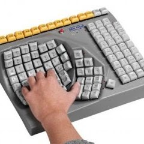

This is the second part of courses about accessibility.

You can [acccess the first part here](intro-to-accessibility).

## Projected Time

- Lesson: 100 minutes
- Exercises: 80 minutes

## Prior Knowledge

Here are areas that you will need to have before starting this training. Students should have

- Need to know HTML, CSS and the DOM - ideally, should also be familair with Chrome Devtools

## Motivation

It is important to learn about this because

- Students should understand why considering accessibility is important when they are working
- Many employers will look for an understanding of common accessibility patterns
- We should all endeavour to make websites that everyone can use

## Learning Objectives

Participants will be able to:

- Identify accessibility issues when basic recommendations relative to text, colours, size and motion are not followed
- Use contrast checkers to make sure colour choices are accessible
- Apply simple tests
- Identify accessibility issues for keyboard only users and those using magnifying tools
- Use an html checker to make sure html tags are correctly nested and valid
- Create good page titles
- Create good alt texts
- Identify alternative practice to provide content to screen reader users only
- Illustrate good and bad use of links vs buttons
- Identify accessibility issues like incorrect heading structure, bad tab order, undescriptive link text

## Presentation

You can find the slides for this presentation _**to add later**_

---

## Homework

Try this website from the GOV.UK government and see if you can find most of the issues: [record-a-goose-sighting.herokuapp.com/](https://record-a-goose-sighting.herokuapp.com/)

This website was created for training purposes and great to reinforce all we’ve learned today.

We’ve covered most of it, but not the labels and inputs of forms or the focus which are for next classes.

---

## Workshop

### Contents
- Introduction
- Text, colours and size
- Ways of hiding / adding content using HTML and CSS
- Simple tests to do every time you develop a new feature
- Semantic tags
- Images and other media
- Links vs buttons
- What next?

---

### Introduction

**People might use your website or app in a way you did not expect**

For example:
- Someone with dyslexia might use a screen reader even though they can see
- Someone with a motor  impairment might be using a switch or their voice to interact instead of a keyboard, or a mouse
- Some will change the colours of your website because clear text on dark background works better for them (dyslexia, migraine, light sensitivity for example)
- Scrolling or motion might make a person physically sick (vestibular issues)
- A person with a low vision might be zooming to see or use a large mouse pointer. They might need to scroll horizontally as well as vertically

**Don’t interfere with people’s adaptations**

Because people interact in different ways, you need to make sure your code won’t  interfere with the adaptations they use to improve their digital experience.

**Reminder: Assistive technologies are not just screen readers**

### Text, colours and size

#### Font size
16px  is the usual default text size for desktops for browsers.

In the CSS, use relative sizes like `rem` or `em` instead of explicit sizes in pixels `px`

Some users will have changed their browsers preferences, using relative sizes is best for them.

`rem` calculates size relative to the `<html>`  element, where `em` is calculated by the sizing of its own element.

#### Line length and height

A line of text **shouldn’t be longer than 80 characters**. 

Some people with reading or visual impairments have trouble keeping their place when reading long lines of text. 

An easy way to do this is using `max-width: 70em` in the CSS
Ideally, give **at least 1.5 for line height**.

#### Text alignment

Main body text should be **aligned to one side of the page**, usually left in left-to-right languages. 

This makes the text easier to discover for people using text resizing or zoom.

**Do not justify the text** as it adds spaces and makes it harder to read for people with dyslexia for example.

#### Avoid capitals letters and italic

Even when you use: 
`text-transform: uppercase;`

Some screen readers might **read the text letter by letter**, assuming it’s an acronym.

**Italic is harder to read** for a lot of people, best to avoid it too.

#### Colours

Poor contrast between the text colour and the background can make the text extremely difficult or impossible to read. 

This applies to text on images, gradients, buttons and other elements.

**Ensure that the colours used offer a good contrast**. 
Colours can be checked using tools such as [Tanaguru contrast finder](https://contrast-finder.tanaguru.com/). (also offer alternatives)  

Another  tool to get an accessible colour palette: [toolness.github.io/accessible-color-matrix/](https://toolness.github.io/accessible-color-matrix/)

Make sure the colours contrast also work:

- in dark mode if you have one on your website/app
- for buttons on ‘hover’, but also for ‘active’ and ‘visited’ links 
- focus states should be contrasted enough too

Don’t convey something using colour only (error message for example)

#### Buttons and Links

Are they large enough to click or tap? 

Is there enough space between them? 

Imagine you have tremor, could you select the right component or link?

#### Let the user make changes and scroll as they wish

**Allow scrolling horizontally and vertically**
Don’t prevent scrolling by using: `overflow: hidden`

**Allow resizing**
Don’t put: `maximum-scale` or `user-scalable= no` in your header. 

For example: `<meta name="viewport" content="width=device-width, initial-scale=1.0, maximum-scale=1.0, user-scalable=no" />`
Would prevent a user from magnifying the screen.

####

Your users might have selected  “reduced motion” in their browser or system settings.

There is a media query you can use to check this `@media (prefers-reduce-motion: reduce)`

#### More on motion

[alistapart.com/article/designing-safer-web-animation-for-motion-sensitivity/](https://alistapart.com/article/designing-safer-web-animation-for-motion-sensitivity/)

[developer.mozilla.org/en-US/docs/Web/Accessibility/Seizure_disorders](https://developer.mozilla.org/en-US/docs/Web/Accessibility/Seizure_disorders)

Video from Manuel Matuzovic: Writing even more CSS with Accessibility in mind (screenshot above comes from that video):

<iframe width="560" height="315" src="https://www.youtube.com/embed/o6ssu5oKyaU" frameborder="0" allow="accelerometer; autoplay; clipboard-write; encrypted-media; gyroscope; picture-in-picture" allowfullscreen></iframe>

> **Exercise 1**:
> Check this website and look for the various accessibility problems you can spot:
> 
> [www.digitaloffice.scot/](http://www.digitaloffice.scot/)
> 
> Remember: 
> - font size, line length and height, text alignment, 
> - avoid capital letters and italic, colour contrast, buttons, links, 
> - let the user make changes and scroll, avoid motion 
> - Contrast checker: [accessible-colors.com/](https://accessible-colors.com/)

### Ways of hiding / adding content 

... using HTML and CSS

####

####

####

### Simple tests 
... to do every time you develop a new feature
### Semantic tags
### Images and other media
### Links vs buttons

### What next?

