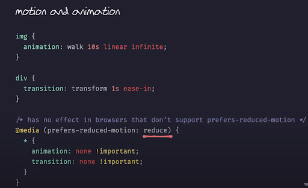
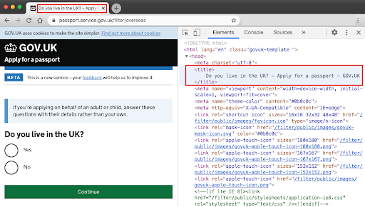
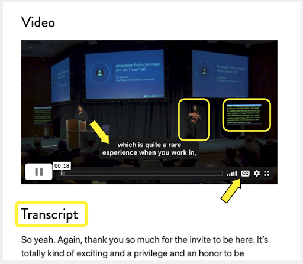

This is the second part of courses about accessibility.


## Projected Time

- Lesson: 100 minutes
- Exercises: 80 minutes

## Prior Knowledge

Here are areas that you will need to have before starting this training. Trainees should have

- Need to know HTML, CSS and the DOM - ideally, should also be familiar with Chrome Devtools

## Motivation

It is important to learn about this because

- Trainees should understand why considering accessibility is important when they are working
- Many employers will look for an understanding of common accessibility patterns
- We should all endeavour to make websites that everyone can use

## Learning Objectives

Participants will be able to:

- Identify accessibility issues when basic recommendations relative to text, colours, size and motion are not followed
- Use contrast checkers to make sure colour choices are accessible
- Apply simple tests
- Identify accessibility issues for keyboard only users and those using magnifying tools
- Use an html checker to make sure html tags are correctly nested and valid
- Create good page titles
- Create good alt texts
- Identify alternative practice to provide content to screen reader users only
- Illustrate good and bad use of links vs buttons
- Identify accessibility issues like incorrect heading structure, bad tab order, undescriptive link text

## Presentation

You can find the slides for this presentation [here](https://docs.google.com/presentation/d/15PG1w766J_EJGSVOnrjrn6ti_-K_7hdRjXZzA-sxTQ4/edit?usp=sharing).

<iframe src="https://docs.google.com/presentation/d/e/2PACX-1vRspAgwY9wv-zuLfOBLptkreKZjVmZTnFlfTP57gD2XBSHtBf1YbLyQbh3pMstLFYJmy1hSDVACEXwi/embed?start=false&loop=false&delayms=3000" frameborder="0" width="560" height="315" allowfullscreen="true" mozallowfullscreen="true" webkitallowfullscreen="true"></iframe>

---

## Coursework

Try this website from the GOV.UK government and see if you can find most of the issues: [record-a-goose-sighting.herokuapp.com](https://record-a-goose-sighting.herokuapp.com/)

This website was created for training purposes and great to reinforce all we’ve learned today.

We’ve covered most of it, but not the labels and inputs of forms or the focus which are for next classes.

---

## Workshop

### Contents

- Introduction
- Text, colours and size
- Ways of hiding / adding content using HTML and CSS
- Simple tests to do every time you develop a new feature
- Semantic tags
- Images and other media
- Links vs buttons
- What next?

---

### Introduction

**People might use your website or app in a way you did not expect**

For example:

- Someone with dyslexia might use a screen reader even though they can see
- Someone with a motor impairment might be using a switch or their voice to interact instead of a keyboard, or a mouse
- Some will change the colours of your website because clear text on dark background works better for them (dyslexia, migraine, light sensitivity for example)
- Scrolling or motion might make a person physically sick (vestibular issues)
- A person with a low vision might be zooming to see or use a large mouse pointer. They might need to scroll horizontally as well as vertically

**Don’t interfere with people’s adaptations**

Because people interact in different ways, you need to make sure your code won’t interfere with the adaptations they use to improve their digital experience.

**Reminder: Assistive technologies are not just screen readers**


### Text, colours and size

#### Font size

16px is the usual default text size for desktops for browsers.

In the CSS, use relative sizes like `rem` or `em` instead of explicit sizes in pixels `px`

Some users will have changed their browsers preferences, using relative sizes is best for them.

`rem` calculates size relative to the `<html>` element, where `em` is calculated by the sizing of its own element.

#### Line length and height

A line of text **shouldn’t be longer than 80 characters**.

Some people with reading or visual impairments have trouble keeping their place when reading long lines of text.

An easy way to do this is using `max-width: 70em` in the CSS
Ideally, give **at least 1.5 for line height**.

#### Text alignment

Main body text should be **aligned to one side of the page**, usually left in left-to-right languages.

This makes the text easier to discover for people using text resizing or zoom.

**Do not justify the text** as it adds spaces and makes it harder to read for people with dyslexia for example.

#### Avoid capitals letters and italic

Even when you use:
`text-transform: uppercase;`

Some screen readers might **read the text letter by letter**, assuming it’s an acronym.

**Italic is harder to read** for a lot of people, best to avoid it too.

#### Colours

Poor contrast between the text colour and the background can make the text extremely difficult or impossible to read.

This applies to text on images, gradients, buttons and other elements.

**Ensure that the colours used offer a good contrast**.
Colours can be checked using tools such as [Tanaguru contrast finder](https://contrast-finder.tanaguru.com/). (also offer alternatives)

Another tool to get an accessible colour palette: [toolness.github.io/accessible-color-matrix](https://toolness.github.io/accessible-color-matrix/)

Make sure the colours contrast also work:

- In **dark mode** if you have one on your website/app
- For **buttons** on ‘hover’, but also for ‘active’ and ‘visited’ links
- **Focus states** should be contrasted enough too
- **Selected text** (some people use it to follow what they read)

Don’t convey something using colour only (error message for example)

#### Buttons and Links

Are they large enough to click or tap?

Is there enough space between them?

Imagine you have tremor, could you select the right component or link?

#### Let the user make changes and scroll as they wish

**Allow scrolling horizontally and vertically**
Don’t prevent scrolling by using: `overflow: hidden`

**Allow resizing**
Don’t put: `maximum-scale` or `user-scalable= no` in your header.

For example: `<meta name="viewport" content="width=device-width, initial-scale=1.0, maximum-scale=1.0, user-scalable=no" />`
Would prevent a user from magnifying the screen.

####

Your users might have selected “reduced motion” in their browser or system settings.

There is a media query you can use to check this `@media (prefers-reduce-motion: reduce)`



#### More on motion

[Designing safer web animation for motion sensitivity](https://alistapart.com/article/designing-safer-web-animation-for-motion-sensitivity/) (Alisapart)

[Seizure disorders](https://developer.mozilla.org/en-US/docs/Web/Accessibility/Seizure_disorders) (By Mozilla.org for developers)

Video from Manuel Matuzovic: Writing even more CSS with Accessibility in mind (screenshot above comes from that video):

<iframe width="560" height="315" src="https://www.youtube.com/embed/o6ssu5oKyaU" frameborder="0" allow="accelerometer; autoplay; clipboard-write; encrypted-media; gyroscope; picture-in-picture" allowfullscreen></iframe>

> **Exercise 1**:
>
> _Need about 10 minutes for the exercice and 5 minutes to recap together._
>
> Check this website and look for the various accessibility problems you can spot:
>
> [digitaloffice.scot](http://www.digitaloffice.scot/)
>
> Remember:
>
> - Font size, line length and height, text alignment,
> - Avoid capital letters and italic, colour contrast, buttons, links,
> - Let the user make changes and scroll, avoid motion
> - Contrast checker: [accessible-colors.com](https://accessible-colors.com/)

### Ways of hiding / adding content

... using HTML and CSS

#### Hiding content - Why?

Sometimes, some content might be **for screen reader users only** and you may not want sighted users to see it.

It’s worth thinking if this really is the case though; if the content is important enough for some users, why not for others?

Beware: your extra content might actually be annoying for people using a screen readers. And some people using a screen reader can see your screen too - **always test with real users!**

#### Bad solutions to hide content visually

**If you want screen readers to access it, never use**

`Display: none` or `visibility : hidden`

These will remove the content from all “displays” including screen reader “displays”.

Similarly, giving an element a height or width of 0 will remove it from the content flow and most screen readers will ignore it.

#### Right way to hide content

Create a CSS class for text to be read by screen readers only

In your CSS:

```css
.sr-only {
  clip: rect(1px, 1px, 1px, 1px);
  height: 1px;
  width: 1px;
  overflow: hidden;
  position: absolute !important;
}
```

In your HTML:

`<span class=”sr-only”>message just for screen reader users</span>`

#### Avoid using the ‘title’ attribute to explain your content

Title attributes are used as tool tip.

`<a href=”#” title=”this is my title”>My link text</a>`


But in terms of accessibility, they are usually not very good because a lot of users will never see them:

- Keyboard only users
- Touch devices user
- Might not be voiced by a screen reader
- Or might be announced twice if your screen reader do pick it up

### Simple tests

... to do every time you develop a new feature

You would always test your code before you deploy a new feature.

Add the following tests each time:

- No mouse, keyboard only, tabbing through - can you access everything? Does the order make sense?
- 400% zoom - can you still use your website or app?
- Use on a small screen
  - Can you still select a link, use all the components
  - Are tables, images and graphics still visible?

Just like automatic checkers, this is good but not enough.

**The best way to test is always with real people with diverse needs!**

> **Exercise 2**:
>
> _Need about 10 minutes for the exercice and 5 minutes to recap together._
>
> - Try using LinkedIn without a mouse or zooming up to 400%
> - Do you have a website or portfolio? Try these tests too.
> - Note all the things that become harder to do, we will discuss after.

### Semantic tags

#### HTML gives your content a structure and a meaning

Native elements/tags have accessibility features built in.

Your browser and other user agents (screen readers for example) will know what functionality and basic style is needed for them:

- Add the expected bullet points if you use `<ul>` and `<li>`
- `<a>` will be a link
- Text between `<p>` tags will be a paragraph of normal text
- `<h1>` will a bigger text for heading
- The code between `<header>` tags will have the role of a banner

#### How it works for a screen reader

When we visit a webpage, the browser generates an AOM (Accessibility Object Model), like the DOM but for accessibility information.

The browser can send this accessibility information to the Operating System's accessibility framework using the APIs.

Assistive technologies like screen readers get that information and learn about each element, their current state, and how to interact with them.

#### How a screen reader treats a link

For example, this line of code:

`<a href="https://tink.uk">Tink UK</a>`

The screen reader:

- Identifies the element’s role as “link”
- Uses the text content inside it to give the link an accessible name
- Makes this information available in synthetic speech

You hear: **_“Tink UK . Link.”_**

#### Don’t make everything a `<div>`!

Writing semantic code means choosing the most appropriate element to define the structure you want to create.

Don’t use a `<div>` if there is a more appropriate tag with a well defined role attached to it.

For example:

```html
<div class="”row”">
  <div class="”item”"><span>item 1</span></div>
  <div class="”item”"><span>item 2</span></div>
</div>
```

With some CSS styling it might end up looking like a bullet point list on screen, but **it will make no sense to a screen reader**.

Just use the appropriate element:

```html
<ul>
  <li>item 1</li>
  <li>item 2</li>
</ul>
```

#### Main semantic tags

- Headings `<h1> <h2> <h3> <h4> <h5>` and `<h6>`
- Links `<a>` and buttons `<button>`
- Header: this container element will be commonly placed at the top of the page and it is used to place the logo, name, author information and main navigation of the site
- Main: contains the main content of the web site. A document must not have only one and the content must be unique. Repeated elements like sidebars, footer, site logo,should not be in `<main>`
- Footer: this is the element that we use at the end of the page (navigation, copyright information, contact information)
- Nav: has the main navigation links that map the content of the website
- Section: contains a section of the document that groups content that is related one to others
- Article: should be used to contain standalone content. For example, inside a section element that lists blog posts, every single post would be enclosed by an article element
- Aside: container for a section of the document that is not directly related to the main content.Usually located on the right or left part of the webpage as sidebars or interesting notes
- Marks your list properly `<ol>` or `<ul>` and then `<li>`

#### Mark your page structure with landmark roles

Use role attribute with `<div>` or HTML5 elements to make sure assistive technology will work with them.

Some don’t support HMTL5 elements like `<section>` or `<main>`


#### Content order must be logical

Assistive technologies will usually interact with the content in the order it appears within the HTML, and recreate the path that visually impaired users will cross.

**Screen readers need all elements on the page to be correctly identified to provide a smooth user experience.**
→ most common problems for a person using screen reader.

**Be careful how you nest elements.** Validate your HTML using tools like [validator.w3.org](http://validator.w3.org/) for example.

#### Proper header stepping

Headings communicate the organisation of a page. Screen readers will pick up your structure and **a lot of screen readers users are using this to create a mental image of your page.**

- headings are ranked from `<h1>`, the most important, to `<h6>` the least.
- A `<h1>` tag on each page which contain the most important information
- Short and meaningful heading text which describes what the section is about - will also improve your SEO (= Search Engine Optimisation)
- Headings should separate content into meaningful sections
- Don’t use bold, italicise, underline or bigger font only in your style to define sections
- Don’t skip headings, for example having an `<h4>` following an `<h2>`

#### Skipping heading is confusing

Using the [Wave plugin](https://chrome.google.com/webstore/detail/wave-evaluation-tool/jbbplnpkjmmeebjpijfedlgcdilocofh) on the homepage of Lush, you can see that they don’t respect the heading levels. They have skipped h2.


#### Language

If the page is all in one language, mark this in your html tag:
`<html lang=”en”>`

Screen readers will be using the correct language this way, this will also informed browsers and search engines.

If some parts of your page are in a different language, then use the lang attribute for this part:
For example.
`<span lang=”fr”>Bonjour! Je m’appelle Stéphanie</span>`

[List of the codes for the languages](https://www.w3schools.com/tags/ref_language_codes.asp)

#### Give good titles to your pages

Use the `<title>` element. This will be displayed in the tab of your browser and is read first by a screen reader when the page loads.

If your title is meaningful, people will know they are at the right place.

Be brief and precise. **Start with the most specific to the most general**.

If you are reloading a page where there is an error, **start the title with ‘Error’** and then the rest of the title, so it’s the first thing a screen reader user will hear.

#### Good example of title



#### Bad example


> **Exercise 3**:
>
> _Need about 10 minutes for the exercice and 10 minutes to recap together._
>
> - From the page link below, check the title of the next 5 pages when applying for a provisional licence.
> - To check the title, inspect the code in the `<head>`. If the title is not good, find a better one:
>   [Applying for a provisional driving licence](https://www.gov.uk/apply-first-provisional-driving-licence)
> - If time, use this link [validator.w3.org](http://validator.w3.org/)to see if some errors are spotted (Do this on the same pages)

### Images and other media

#### Alternative (alt) text

All images and diagrams must have alternative text ([alt text](https://webaim.org/techniques/alttext/)) describing the information or function of the image.

**A simple trick**: imagine you are reading the page to someone over the phone. What would you say to them about the image?

You can also check:
[Axess Lab guidance about alt text](https://axesslab.com/alt-texts/) or [How to write alt text and image descriptions for photo journalism images](https://veroniiiica.com/2020/05/31/how-to-write-alt-text-and-image-descriptions-for-photojournalism-images/)

#### Decorative vs informative images

If the image isn’t important to understand the content, then it’s decorative.
Give the alt text an empty string value `alt=””`
**Screen readers will ignore it.**

If you are unsure, the W3C Web Accessibility Tutorials have a useful [alt decision tree](https://www.w3.org/WAI/tutorials/images/decision-tree/) to help you decide what alternative text you need to include.

If the image is important, then the extra information you get visually must be given in the alt text.

Keep it to 50 characters long max. Don’t say 'image' or ‘photo’.
It’s also important for more effective SEO.

#### Diagram, icons and logos

For **a diagram**, you might want to have a textual alternative available and provide a link to it as well as a shorter description in the alternative text.
More here: [w3.org/WAI/tutorials/images/complex](https://www.w3.org/WAI/tutorials/images/complex/)

For **icons and logos**, depending on their use, you might want to just say what they do.
For example: if the top left logo of a website takes the user back to the homepage, then your alt text could be: “go to homepage” instead of describing the logo.

#### SVG need a description too

This is a format that allows to scale images without losing the quality. They don’t become pixelated when magnified.

This is still relatively new and browsers and assistive technologies are improving their level of support for SVG.

#### SVG image (your_file_name.svg)

It’s very similar to other formats, add an alt text:

```html

```

If your image is a logo that takes you back to the homepage:

```html
<a href=”link-to-your-home-page”
    
</a>
```

#### Inline SVG

Add a role attribute. You can use the title element:

```html
<svg version="”1.1”" width="”340”" height="”150”" role="”img”">
  <title>your description of the svg image</title>
  <path d="”....”"></path>
</svg>
```

Some screen readers might still not work properly with this and it’s best to mark the relation between the svg tag and the title:

```html
<svg
  version="”1.1”"
  width="”340”"
  height="”150”"
  aria-labelledby="”title-text”"
  role="”img”"
>
  <title id="”title-text”">your description of the svg image</title>
  <path d="”....”"></path>
</svg>
```

Using `<title>` creates a tooltip effect to your image
If you don’t want this to happen, you can use `<desc>` instead:

```html
<svg
  version="”1.1”"
  width="”340”"
  height="”150”"
  aria-labelledby="”desc-text”"
  role="”img”"
>
  <desc id="”desc-text”">your description of the svg image</desc>
  <path d="”.......”"></path>
</svg>
```

#### Inline SVG for decorative images

You can add `aria-hidden="true"` like you would use `alt=””`
But you need to make sure that there are no child HTML elements under it as it would not be read by screen readers either.

```html
<svg
  version="”1.1”"
  width="”340”"
  height="”150”"
  role="”img”"
  aria-hidden="true"
>
  <path d="”" ......”></path>
</svg>
```

We will learn more about aria next time.

#### More on SVG

[Sara Soueidan - Implementing Accessible Data Charts](https://www.sarasoueidan.com/blog/accessible-data-charts-for-khan-academy-2018-annual-report/)
[css-tricks.com/accessible-svgs](https://css-tricks.com/accessible-svgs/)
[tink.uk/accessible-svg-line-graphs](https://tink.uk/accessible-svg-line-graphs/)
[simplyaccessible.com/article/7-solutions-svgs](https://simplyaccessible.com/article/7-solutions-svgs/)

> **Exercise 4**:
>
> _Need about 10 minutes for the exercice and 10 minutes to recap together._
>
> **Check these pages, can you do better?**
>
> For example: any image on this page: [digitaloffice.scot](http://www.digitaloffice.scot/) > ``
>
> Good example: [bbc.co.uk](https://www.bbc.co.uk/)
>
> Bad example: [theguardian.com](https://www.theguardian.com)
> Could not find alt text for images.
> Check how they dealt with the Guardian logo (inline svg at the top), and the weather icons at the top (look for `<span class=”u-h”>`) - Do you understand how this is used?
>
> [metoffice.gov.uk](https://www.metoffice.gov.uk/)
> Enter a place and then check the icons, logo and photos and see what you can find
>
> If you have time, check [Morrisons](https://groceries.morrisons.com/webshop/startWebshop.do)
> A lot of images won’t have an alt tag (image is a background CSS property) but look around and you might find some good and bad examples

#### Videos or audio files

Avoid using Autoplay, unless you have warned the user and they can control this.

You need to provide an alternative for people who can’t hear or see it.

This will also be used by many people who are not native speakers, or are in a noisy environment or don’t want others to hear what they are watching for example.

#### Captions

Videos with audio require captions synchronised with the audio track.
Everything said in the video should be included in the captions.
It should include names, sounds and descriptions.

2 types of captions:

- **Open caption**: is embedded into the video itself, and cannot be turned off
- **Closed captioning**: can be turned on and off

**Auto-generated captions** are better than nothing but usually not great: Often inaccurate, especially if the speaker has an accent or when captioning names (people, brand, places etc...)

#### Transcripts / audio description

Ideally, **provide a transcript** of your media, so users can either read it or use a screen reader to hear it.

- Allow users to scan the content and see if they want to engage with it
- Can be searched by people and search engines so better for SEO

**Audio descriptions** speak out what is happening in the video so that it’s accessible to people with low vision. There are two ways to create audio descriptions:

1. A narrator describes all the visual information
2. Add a separate audio track that describes the visual information

#### Example of good practice

A video, with closed captions and a transcript.

On the day of the event you also had BSL interpreters you can see on the video as well.

[Accessibility Scotland Conference - one of the video pages](https://accessibility.scot/accessible-public-services-are-we-there-yet/) where you can see this.


### Links vs buttons

#### Don’t mix them!

**If it goes somewhere → use a link**
**If it does something → use a button**

They should be easy to spot:
A **link** should look like all the rest of the text around it, but underlined.
Or different colour, but not ideal as some people don’t see colours well enough to spot them - prefer the underlined convention.

A **button** usually has a different colour from the background, with or without rounded corners or have an outline that makes it stand out.

#### Good practice for links

They should be meaningful and describe the destination or what will happen when you follow that link.

Warn users if the link will take them out of your website or open a new tab or window.

If the link is to download a file, inform your user of the file type and the size of it.

Example:

Find out if you are eligible (opens in a new tab)

#### Skip to main content link

A link at the top of each page that takes users directly to the main content

- Must be one of the first items on the page
- Becomes visible on focus (using the tab key)
- Benefits keyboard & screen reader users to navigate quickly & bypass repeated content

```html
<body>
  <a href="#main-content" class="govuk-skip-link">Skip to main content</a>
</body>
```

...
...

```html
<main
  id="main-content"
  class="govuk-main-wrapper govuk-main-wrapper--auto-spacing"
  role="main"
></main>
```

> **Exercise 5**:
>
> _Need about 10 minutes_
>
> Quiz: Good / bad examples of links and buttons: [**take the quiz**](https://forms.gle/TQpmH1FstLyZJ55j9)
>
> Warning: Ironically, this quiz is not accessible as there is no way to add alt text to images. Sorry!
>
> Some of these images might be hard to read for some: there are screenshots of screens with the code for it in a Devtool window on the right.
> You can see for yourself instead, on the [B&Q homepage](https://www.diy.com/) and on the [Halford homepage](https://www.halfords.com/).

### What next?

#### Don't just stop here

- Start applying what you have learned in everything you do
- On twitter or other social media, connect or follow diverse people so you can learn from what they share
- Go to accessibility meet-ups, we will post them on Slack
- There will be two other courses, about making your code accessible
- You won’t get it right every time, but you learn and do better next time

#### Where to learn more

**Follow disabled people**on Twitter and / or bookmark these:

- [a11y project](https://a11yproject.com/resources)
- [Heydonworks](http://www.heydonworks.com/)
- [Adrian Roselli - blog](https://adrianroselli.com/)
- [Scott O'Hara - blog](https://www.scottohara.me/)
- [Leonie Watson](https://tink.uk/)

**Good checklist with links to WCAG resources**:

- [wuhcag.com/wcag-checklist](https://www.wuhcag.com/wcag-checklist/)

**GOVUK**

- [gov.uk/service-manual/technology/accessibility-for-developers-an-introduction](https://www.gov.uk/service-manual/technology/accessibility-for-developers-an-introduction)
- [gov.uk/service-manual/technology/using-progressive-enhancement](https://www.gov.uk/service-manual/technology/using-progressive-enhancement)

[Udacity has a great course](https://www.udacity.com/course/web-accessibility--ud891) that lets you try some examples and tasks

**Screen readers**

- NVDA (Windows - free)
- VoiceOver (Mac and iPhone - built in)
- Voice Assistant (Android devices - built in)

**More resources**

- [Writing CSS](https://medium.com/@matuzo/writing-css-with-accessibility-in-mind-8514a0007939)
- [Writing even more CSS with accessibility in mind](https://www.matuzo.at/blog/writing-even-more-css-with-accessibility-in-mind-progressive-enhancement/)
- [Writing HTML](https://medium.com/alistapart/writing-html-with-accessibility-in-mind-a62026493412)

**Guidelines for developers on mobile devices**

- [support.google.com/accessibility/android/answer/6376570](https://support.google.com/accessibility/android/answer/6376570)
- [developer.apple.com/accessibility/ios](https://developer.apple.com/accessibility/ios/)
