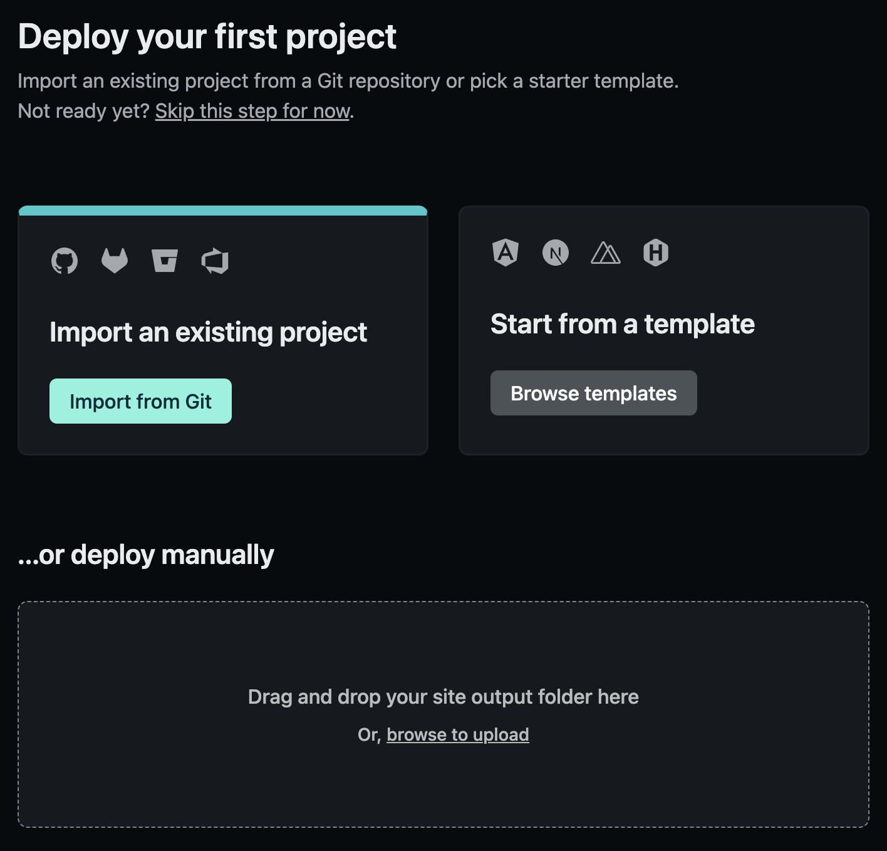
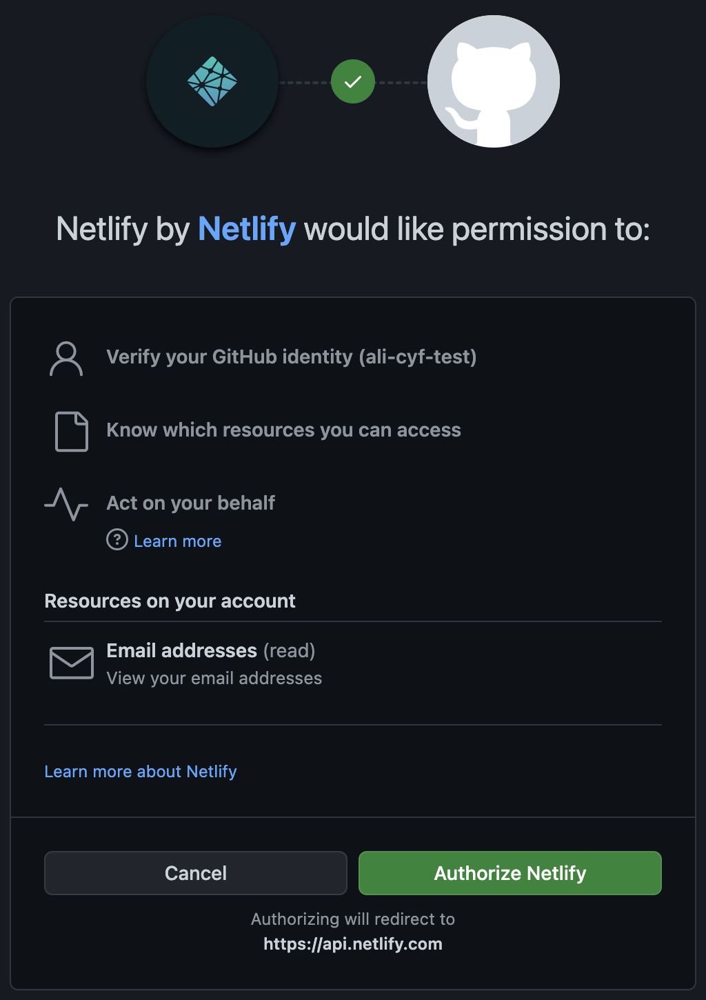
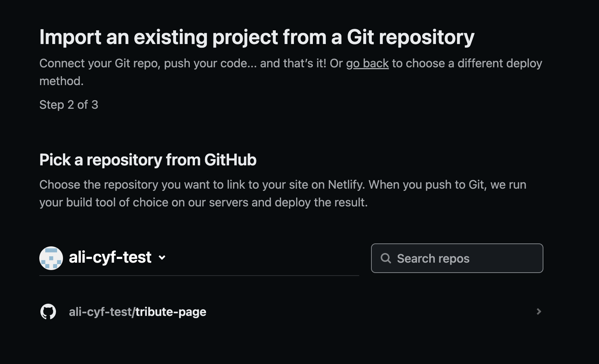
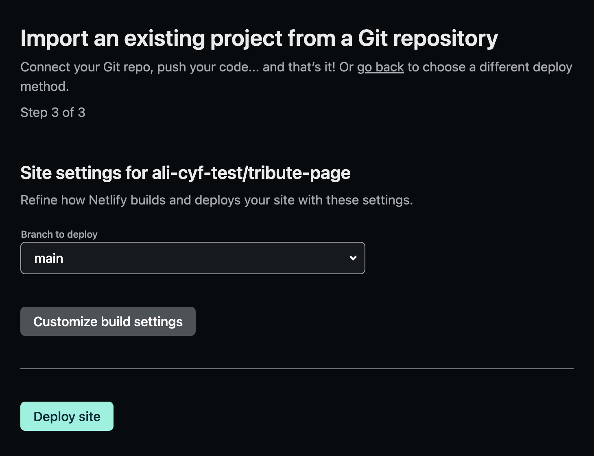

## Instructions

1. Visit https://www.netlify.com/

2. Click the "Sign up" button in the top navigation

3. Choose "GitHub"
4. Log in to GitHub (if you are logged out)
5. Read the permissions and click the "Authorize netlify" button

7. If prompted to "Tell us about yourself", fill out the information. Note: only the "I'm using Netlify for" question is required, so you can skip everything else if you want
8. Click the "Import from Git" button

9. When asked to connect a Git provider, click the "GitHub" button

10. A pop-up window will ask for some more GitHub permissions. Click the "Authorize Netlify" button

11. You will be asked to "Install Netlify". If you are prompted "Where do you want to install Netlify", choose _your personal_ GitHub username. Do **NOT** choose Code Your Future's account, as this won't work!

12. Select the GitHub repo which you would like to create a site from

13. Under "Branch to deploy" choose the "main" branch of your repo, which is usually called `main`. You do not need to change anything under "Customize build settings", Netlify will do this for you

14. Click the "Deploy site" button
15. Your site is now deploying!

## Changing your site name

- Click site settings, and scroll to site details,site information
- Click "change site name".
- Enter a new site name and press save
- Scroll to the top and click the new link (something.netlify.com)
- Check your site is accessible via that new url
- Test by committing and pushing new changes to your branch.
