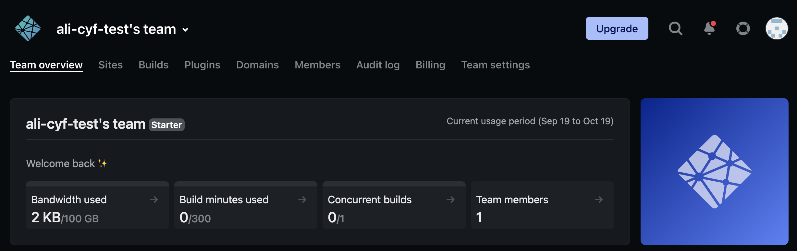
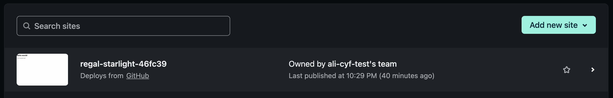

## Introduction

In this guide, we'll learn how to set up automatic website _deployment_.

Deploying is the process of making your site available to everyone on the internet. This is important otherwise you won't be able to share your site with the world!

Using GitHub and Netlify we can set up **automatic** deployment, so that every time you update your site it is deployed!

## Deploying your first site

1. Visit https://www.netlify.com/ and click the "Sign up" button in the top navigation

2. Choose "GitHub" on the sign up page

3. If you are logged out of GitHub, then log in
4. Read the permissions and click the "Authorize netlify" button

5. If prompted to "Tell us about yourself", fill out the information. Note: only the "I'm using Netlify for" question is required, so you can skip everything else if you want
6. Click the "Import from Git" button

7. When asked to connect a Git provider, click the "GitHub" button

8. A pop-up window will ask for some more GitHub permissions. Click the "Authorize Netlify" button

9. You will be asked to "Install Netlify". If you are prompted "Where do you want to install Netlify", choose _your personal_ GitHub username. Do **NOT** choose Code Your Future's account, as this won't work!

10. Select the GitHub repo which you would like to create a site from

11. Under "Branch to deploy" choose the "main" branch of your repo, which is usually called `main`. You do not need to change anything under "Customize build settings", Netlify will do this for you

12. Click the "Deploy site" button
13. It make take a few minutes before the deploy is complete. Try refreshing your browser, when a `.netlify.app` URL appears then the site is live

## Deploying another site

1. Log into [Netlify](https://www.netlify.com/) (remember that you sign in using GitHub)
2. On your Netlify dashboard, click "Sites" in the top navigation

3. Click on the "Add new site" button, then "Import an existing project"

4. This might be familiar now! Click "GitHub" as your Git provider

5. A pop up will show briefly, but then you'll see a list of your GitHub repos. Click on the relevant one

6. Under "Branch to deploy" choose the "main" branch of your repo, which is usually called `main`. You do **not** need to change anything under "Basic build settings", Netlify will do this for you

7. Click the "Deploy site" button
8. It make take a few minutes before the deploy is complete. Try refreshing your browser, when a `.netlify.app` URL appears then the site is live

<!-- 06-site-is-live.png -->

## Changing your site name

Once you have a site deployed, you may notice that Netlify has created a randomised `.netlify.app` URL to access it.

You may want to change this to a "friendlier" URL so that it is easier to remember and share. We also ask you to change the URL of sites you create for coursework, so that it is easier to for volunteers to find your site and give feedback. See [website naming conventions](../site-naming-conventions.md) for rules to name your site.

:::tip
If you already have the site open in Netlify, you can skip the first few steps!
:::

1. Log into [Netlify](https://www.netlify.com/) (remember that you sign in using GitHub)
2. On your Netlify dashboard, click "Sites" in the top navigation

3. Click on the site that you want to rename in the list of all of your sites

4. On the site overview page, click on "Site settings"

5. Scroll down to the "Site information" section and click "Change site name"

6. Enter your new site name and click "Save"

7. Your site should now be renamed! If you scroll to the top, the URL should be `NEW_NAME.netlify.app`. Try clicking to make sure that the URL still works
