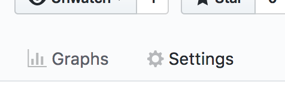
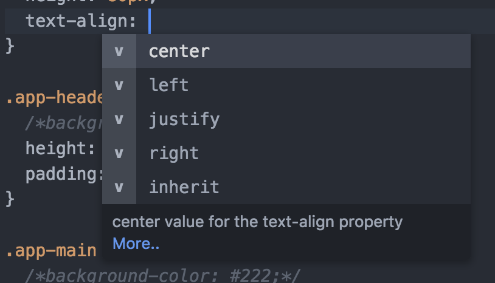
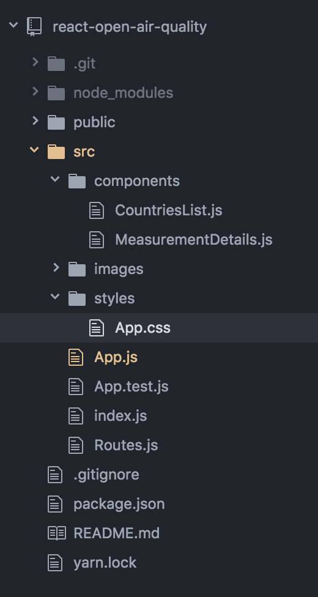

**What we will learn today?**

- [CodeYourFuture](#codeyourfuture)
- [Welcome task](#welcome)
- [Terminal](#terminal-basics)
- [Git](#git)
- [IDEs](#ide)
- [Airtame](#airtame)
- [Homework](#homework)

---

## CodeYourFuture

- Who we are?
- What will we learn?
  - Read this Technology Survey from
    [Stack Overflow](https://insights.stackoverflow.com/survey/2019).
    Pay particular attention to the technologies we'll be teaching you
    (JavaScript, React, NodeJS)
- [House Rules](https://docs.codeyourfuture.io/organisation/agreements-and-rules/house-rules)
  - How we work?
  - How we treat each other?
- Standup

## Welcome

Welcome to CodeYourFuture and to the world of Web Development! Now that you have
built a website in CodePen and learned the basics of HTML and CSS, it's time to
learn about the tools that web developers use in their everyday job. These tools
will be used during the course, so it is important that you become familiarised
with them.

In order to get started, we would like you to try to complete a task at home:
move your CodePen website to a web address under
`https://your-username.github.io/your-site-name`.

In the process, you will learn how to store your code outside CodePen's website,
in a location where other developers can make changes to it and view a history
of all the updates that you have made.

If you wish to learn more about the concepts behind the steps we are suggesting
below, please read the rest of this document.

And remember: it's ok if you are stuck and don't know how to continue. At any
point, please ask for a mentor's help. We will cover these steps again in the
lesson, and will explain them in more detail.

### How to move your website to Github.io

1. [Export your website as a zip from CodePen](https://blog.codepen.io/documentation/features/exporting-pens/)
2. Extract the contents of the zip file to a folder in your computer.
   Keep note of the location of this folder.
3. Read about the [terminal](#terminal-basics).
4. Read about [git](#git).
5. Install [Git](https://git-scm.com/download/).
6. Put the contents of the zip folder in a Gitub repository.
   [How does Github work? (30min) >](https://www.youtube.com/watch?v=E8TXME3bzNs)
7. You should now have a page with your code under
   `http://github.com/your-username/your-repository-name`.
   This is a view of your code, and you should see a list of your files,
   including an `index.html`.
8. Now all that remains is to publish your website! Still under
   `http://github.com/your-username/your-repository-name`,
   find the settings icon in the top right corner.
   

9. Find the section named "Github Pages" and select "master branch" in source,
   then hit "Save".
   

10. Wait a few minutes, then refresh the page and come back to the Github Pages
    section. You should see a green bar saying "Your site is published at
    `http://github.com/your-username/your-repository-name`". Click the link,
    verify that your website is there, then share it with your CYF class!

## Terminal basics

During your course journey and onwards, the **terminal** (also known as
**command line**) will be one of your most valuable tools. It will help you to
interact with you computer faster, by helping you to:

- Create and delete files.
- Install web development tools.
- Start a server.
- Use source control (explained [later in this lesson](#Git)).

All this will make sense as we progress with the lessons. For now, we would like
you to get familiar with it by following this tutorial:

- [Learn the command line](https://www.codecademy.com/learn/learn-the-command-line)

### How do I use it on my computer

So now that you know what the terminal can do for you, how do you use it? Please
find instructions for your operating system below. After you have followed the
instructions, open a terminal and write `ls`, then press the `Enter` key. You
will see something like this:

### Commonly used commands

There's a set of commands you should become comfortable with during the course
to allow you to effectively move around the filesystem
and write software on your laptop.

- `cd` - change directory. To move up into the parent directory use: `cd ..`
- `ls` - list the contents of a directory.
  Can also be used as `ls [directory_name]` to list the contents
  of a specific directory without actually moving (with `cd`) to it
- `pwd` - print the full location of your current directory
- `mkdir [name]` - create a new directory, with the given `name` after a space
- `touch [file_name]` - create a new file, with the given name
  (don't forget to add the extension, like `.css` or `.html`)
- `rm [file_name]` - remove a file
- `rm -r [directory_name]` - remove a directory (**and all files inside that directory**)

#### Linux

The Terminal is already installed.
It should be in the list of applications available in your computer.
[More instructions](https://www.wikihow.com/Open-a-Terminal-Window-in-Ubuntu)

#### macOS (Apple)

The Terminal is already installed.
It should be in the list of applications available in your computer.
[More instructions](https://www.wikihow.com/Get-to-the-Command-Line-on-a-Mac)

#### Windows

Install [Git](https://git-scm.com/download/).
It will bring with it a tool called "Git Bash".
When the mentors ask you to open a terminal or command line,
please open "Git Bash".

## Git

We will use Git as our Version Control System (also known as Source Control).
It's like Dropbox for developers. But much better!

> **What is "version control"?** Version control is a system that records
> changes to a file or set of files over time so that you can recall specific
> versions later.
>
> It allows you to revert files back to a previous state, revert the entire
> project back to a previous state, compare changes over time, see who last
> modified something that might be causing a problem, who introduced an issue
> and when, and more. Using a VCS also generally means that if you screw things
> up or lose files, you can easily recover. In addition, you get all this for
> very little overhead.
>
> Extract from
> [Git Pro book](https://git-scm.com/book/en/v2/Getting-Started-About-Version-Control)

This [answer](https://stackoverflow.com/a/1408464) on Stack Overflow by
si618 explains very well why we use Version Control.

So what is **Git**? Git is one of many Version Control Systems available to use,
and by far
[the most popular](https://insights.stackoverflow.com/survey/2018#work-_-version-control).

What is **Github**? Github is a very popular site where you can publish and
share your Git repositories, share and collaborate with other people.

### Get Started

Follow this tutorial from Github to setup Git:
<https://help.github.com/en/articles/set-up-git>

Then
[learn how to use git from the Terminal](https://www.codecademy.com/learn/learn-git)

Try completing [this tutorial](https://try.github.io/) as well to learn more
intermediate features, like branching.

### A typical workflow

- If you're basing your work from another project,
  the first step is typically to **fork** their repo.
  Read this guide for instructions:
  <https://help.github.com/en/articles/fork-a-repo>

- If you're starting a new project then you should follow these steps
  <https://help.github.com/en/articles/adding-an-existing-project-to-github-using-the-command-line>

### Using Git through the Terminal

- `git init` **_if it is a new project_**, i.e. a project not **cloned** from a
  repo (or a fork of a repo)
- `git add .` to add local files to the **index**
- `git commit -m "Good explanation of your file changes"` to commit files to the
  local repo
- `git remote add origin GitRepoRemoteUrl` **_if it is a new project_** (to
  setup the remote url)
- `git remote -v` to verify that the remote url is set correctly
- `git push -u origin master` to push your commits to the remote url (Github in
  our case)

You will also typically need to set up your email and name once
when you install Git `git config --global user.name <name>` and
`git config --global user.email<email>`.

### Using Git through a graphical interface

If you don't feel comfortable with the terminal just yet, download the
[Github client](https://desktop.github.com/). If possible, however, **we
recommend becoming comfortable with the Terminal commands and understanding the
steps for the different workflows before moving on to visual Git clients.**

[Github client guides](https://help.github.com/en/desktop)

### Pull Requests

You should also learn how to create and work with
[Pull Requests](https://help.github.com/en/articles/about-pull-requests).

### Github

During our course, we will be using [Github](https://github.com) to store our
code. Github is the most popular Git service around, and is used by many large
companies, like Facebook, Airbnb and The Guardian.

[CodeYourFuture's Github page](https://github.com/CodeYourFuture)

### More Resources

- Follow this tutorial to learn the basic Git commands:
  <https://www.pluralsight.com/courses/how-git-works>
- Another good resource: Git - the simple guide:
  <https://rogerdudler.github.io/git-guide/>
- A more detailed tutorial that goes into advanced topics of Git:
  <https://www.atlassian.com/git/tutorials/what-is-version-control>
- You can also check this visual explanation of different commands
  and what they do:
  <http://ndpsoftware.com/git-cheatsheet.html#loc=workspace>
- There are GUI software - Gitkraken is one of them:
  <https://www.gitkraken.com/>
- This Glossary has definitions of the terms normally used with Git:
  <https://help.github.com/en/articles/github-glossary>

## IDE

IDE stands for "Integrated Development Environment". It is the software that you
will be using to write most of your code. It is designed to help you develop
your apps quickly, focusing on the problems that you need to solve instead of
having to search Google for minor details.

### Auto-complete

One of the most important features of an IDE is that it provides
"auto-completion". This means that it will give you suggestions of what you can
can write next, while you are typing something.

For example, when writing a CSS property, it will tell you what values you can
assign it to.

### File tree view

The reason why we call it "Integrated" is that you almost don't need to leave
the window to write your app. For example, creating, renaming and moving files
can be done directly from the IDE. This functionality can be achieved from
something called a "Tree view", which you can usually find on the left side of
your IDE.

### Finding files

When working with big projects, you will often need to find a file quickly,
without having to go through the tree view manually.

Most IDEs will allow you to do this with a sequence of keys.

VSCode sequence: **Windows/Linux** Ctrl + P | **Mac** Cmd + P

### Install an IDE

For this course, we recommend the usage of
[VS Code](https://code.visualstudio.com/). Please go ahead and install it, then
try opening an HTML file with it via File > Open.

[Install VS Code](https://code.visualstudio.com/)

#### Other IDEs

Besides VS Code, the IDEs below are also popular with web developers. Feel free
to check out their websites and see the differences between them and VS Code.

- [Atom](https://atom.io/)
- [Webstorm](https://www.jetbrains.com/webstorm/)

## Airtame

During our classes, Students and Mentors will share their code with the rest of the class using a tool
called [Airtame](https://airtame.com/) to present their laptop screen wirelessly to the projector.
The instructions below were tested on Ubuntu only. Installation will differ on Mac OSX.

To install Airtame:

- Download the Airtame version for Ubuntu [here](https://airtame.com/download/).
- In the Terminal, navigate to the directory you downloaded the file. For example,
  if you downloaded Airtame to your `Downloads` directory:

  `$ cd ~/Downloads`

  The downloaded file should have `.tar.gz` extension. You can see the full name with:

  `$ ls airtame*`

- Extract the file using:

  `$ tar -xzf <filename>` replacing `<filename>` with the name of the downloaded file.

  The command above will extract the contents of the downloaded file into a directory of the same name.

- Launch Airtame with the following command:

  `$ ./<airtame-dir>/launch-airtame.sh` replacing `<airtame-dir>` with the directory created in the previous step.

- Install Airtame with the following command:

  `$ ./<airtame-dir>/install.sh`

  This will create a shortcut (icon) so you can launch Airtame from your Applications

### Common Issues

If you have errors returned when executing `launch-airtame.sh` or `install.sh` you may need to install
one or more missing libraries in your System. Check the error message and:

- If it contains `libgtk-x11` as part of the message, then execute the following command:
  `$ sudo apt-get install libgtk2.0`
- If it contains `libgconf` as part of the message, then execute the following comand:
  `$ sudo apt-get install libgconf2.0`

For any other errors, contact the Mentors on Slack, including the error message from the Terminal.

## Homework

- If you have not yet moved your website from CodePen to Github, do it now.
  Please use the information in this section to complete it.
- When your website is live at `https://your-username.github.io/your-site-name`,
  please send a link to the slack channel of your class.
- Learn how to navigate your computer using a Terminal (view files, copy files).
- Install [VS Code](https://code.visualstudio.com/).
- Open your website with VS Code and add something to it: text, images, update
  CSS. Commit your changes to Github and verify that
  `https://your-username.github.io/your-site-name` has been updated!

It's alright if you are getting stuck or if something doesn't look right! When
it happens, please ask your mentors or classmates for help in Slack.
